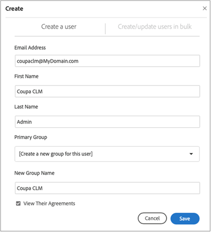
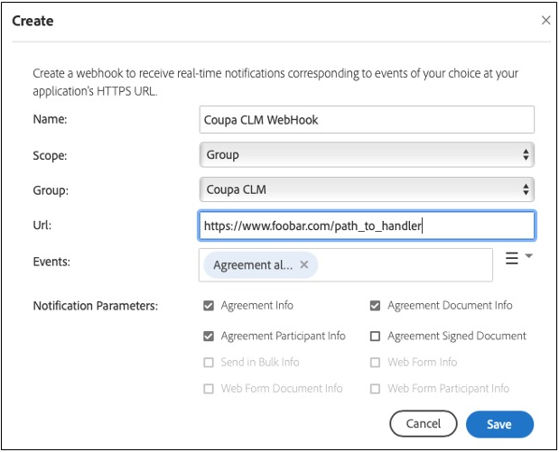
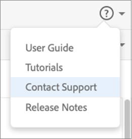

# [!DNL Coupa] 安裝指南{#coupa-installation-guide}

[**連絡 Adobe Sign 支援人員**](https://adobe.com/go/adobesign-support-center_tw)

## 概覽 {#overview}

本檔說明如何設定您的Adobe Sign帳戶，以整合 [!DNL Coupa BSM Suite] 取得簽名的實例。

必要條件:

* 訂閱 Adobe Sign Enterprise、 [ Adobe Sign Developer Edition ](https://www.adobe.com/sign/developer-form.html) 或 [ Adobe Sign Enterprise 試用版](https://www.adobe.com/sign/business.html)
* Adobe Sign管理員存取權
* [!DNL Coupa BSM Suite] 標準或進階實例

完成整合的高階步驟包括：

* 設定要搭配使用的Adobe Sign群組 [!DNL Coupa BSM Suite]
* 連線 [!DNL Coupa BSM Suite] 至Adobe Sign
* 建立Adobe Sign Webhook 來通知您的 [!DNL Coupa BSM Suite] 實例

## 設定 Adobe Sign 群組 [!DNL Coupa BSM Suite] {#configure-adobe-sign-for-coupa}

若要針對組織內的 Adobe Sign 進行專屬使用，管理員必須建立專為 [!DNL Coupa] 使用方式 [!DNL Coupa BSM Suite] 而Adobe Sign群組。 此Adobe Sign群組應具有一個可當做服務帳戶的單一群組管理員使用者帳戶。 由於此服務帳戶用於所有簽名要求，因此應保持匿名，例如， `Legal@xyz.com` `Purchasing@xyz.com` 或 `CoupaCLM@xyz.com` 是個人帳戶，例如 `Bob.Smith@xyz.com` 。

### 在「Adobe Sign中建立群組和使用者 {#create-sign-user-group}

若要在 Adobe Sign 建立用戶：

1. 以帳戶管理員身分登入 Adobe Sign.
1. 流覽至「 **[!UICONTROL 帳戶]** > **[!UICONTROL 使用者」]** 。
1. 若要建立新使用者，請按一下  圖示。
1. 在開啟的對話方塊中，提供新的使用者詳細資料：

   1. 提供功能性的電子郵件，供您存取。

      * 此使用者建立並維護 OAuth 關係。
      * 電子郵件地址必須是實際的驗證位址。
   1. 輸入「名字」和 [!UICONTROL  「姓氏 ] 」 ] 的適當值 [!UICONTROL  。
   1. 在「 [!UICONTROL  主要群組」 ] 欄位中，選 **[!UICONTROL 取「為此使用者建立新的群組」]** 。
   1. 在「 [!UICONTROL  新增組名」 ] 欄位中，提供直覺式組名，例如 *[!DNL Coupa BSM Suite]* 。

   

1. 選取「 **[!UICONTROL 儲存」]** 。

   儲存詳細資料後， [!UICONTROL  「使用者 ] 」頁面會顯示狀態為 [!UICONTROL  「已建立 ] 」的新使用者。

   

   ]建立 [!UICONTROL  的狀態表示使用者尚未驗證其電子郵件地址。

1. 若要驗證電子郵件地址：
   1. 登入新使用者的電子郵件。
   2. 找到名為「歡迎使用 Adobe Sign」的電子郵件. 如有需要，請檢查垃圾郵件資料夾。
   3. 在顯示&#x200B;**[!UICONTROL 「按一下這裡以設定密碼」]**&#x200B;之處按一下
   4. 設定密碼。

   確認電子郵件地址後，使用者的狀態會從 [!UICONTROL  「已建立 ] 」變更為「 [!UICONTROL  ACTIVE」 ] 。

   

### 定義驗證使用者 {#define-authenticating-user}

建立群組和該群組中的使用者後，您必須將該使用者設定為「群組管理員」。

若要提升群組中 [!DNL Coupa BSM Suite] 的新使用者：

1. 導覽至[!UICONTROL 「用戶」]頁面 (若您目前不在該頁面).
2. 按兩下該使用者。

   會開啟 [!UICONTROL  使用者許可權的「編輯 ] 」頁面。

3. 在「群組成員資格」區段下，選取「 **[!UICONTROL 群組管理員]** 」和「 **[!UICONTROL 可以傳送」]** 選項。
4. 取消選取「 **[!UICONTROL 使用者是帳戶管理員]** 」，而 **[!UICONTROL 「使用者可以簽署檔」]** 選項。
5. 按一下&#x200B;**[!UICONTROL 「儲存」]**。

   

## 設定 [!DNL Coupa BSM Suite] 實例 {#configure-coupa}

若要完成例項與Adobe Sign之間的 [!DNL Coupa BSM Suite ] 連線，必須在這些服務之間建立信任關係。

若要設定： [!DNL Coupa BSM Suite]

1. 將您的 [!DNL Coupa BSM Suite] 實例與您在上方建立的 Adobe Sign 服務帳戶連結。
1. 建立 Adobe Sign Webhook 實例，以通知您的 Coupa BSM Suite 實例關於合約更新的資訊。

如需連結 [!DNL Coupa BSM Suite] 和如何建立和註冊 Webhook 的詳細資訊，請參閱 [ Adobe Sign Coupa BSM Suite 實例支援檔 ](https://success.coupa.com/Support/Docs/Power_Apps/CLM_Standard/Signing_and_Approvals/Enable_E-Signatures_Through_Adobe_Sign_and_DocuSign) {target=&quot;_blank&quot;}。

## 在Adobe Sign中創作 [!DNL Webhook] {#create-webhook}

Coupa CLM 整合會使用 Adobe Sign 的 Webhook 通知來傳送合約狀態的相關更新。 必須完成 Webhook 設定，否則傳送供簽署的合約將保持不完整，或已簽署的合約不會傳回 Coupa CLM。

若要在 Adobe Sign 中建立 Webhook：

1. 使用上方建立的群組管理員使用者登入 Adobe Sign，例如 `coupaclm@MyDomain.com` 。

1. 流覽至「 **群組** > **Webhook」** 。

   

1. 若要建立新連線，請選取  圖示。

1. 在開啟的「建立」對話方塊中，填入必要欄位。

   **注意：** 您必須從 Coupa 取得 Webhook 處理常式的 URL。

   

1. 選取所需的通知參數。

1. 選取「 **儲存」** 。

## 支援 {#support}

### [!DNL Coupa BSM Suite] 支援 {#coupa-support}

[!DNL Coupa BSM Suite ] 是整合擁有者，對於整合的範圍、功能要求或整合日常功能的問題，您應該成為第一個聯絡人。

如有任何問題，請聯絡 [ Coupa Support ](https://success.coupa.com/Support/Welcome_to_Coupa_Support) {target=&quot;_blank&quot;}。

### Adobe Sign支援 {#adobe-sign-support}

Adobe Sign是整合合作夥伴，如果整合無法取得簽名，或有擱置中簽名的通知失敗，您應該聯絡此人。

如需使用或設定Adobe Sign的協助，您可以聯絡您的客戶成功經理 （CSM） 或聯絡 [ Adobe Sign支援 ](https://adobe.com/go/adobesign-support-center) 。

Adobe Sign管理員也可以開立票證，並透過「說明」（？） 取得支援 位於Adobe Sign入口網站右上角。

