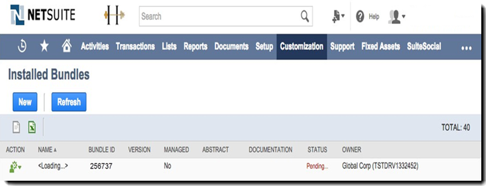
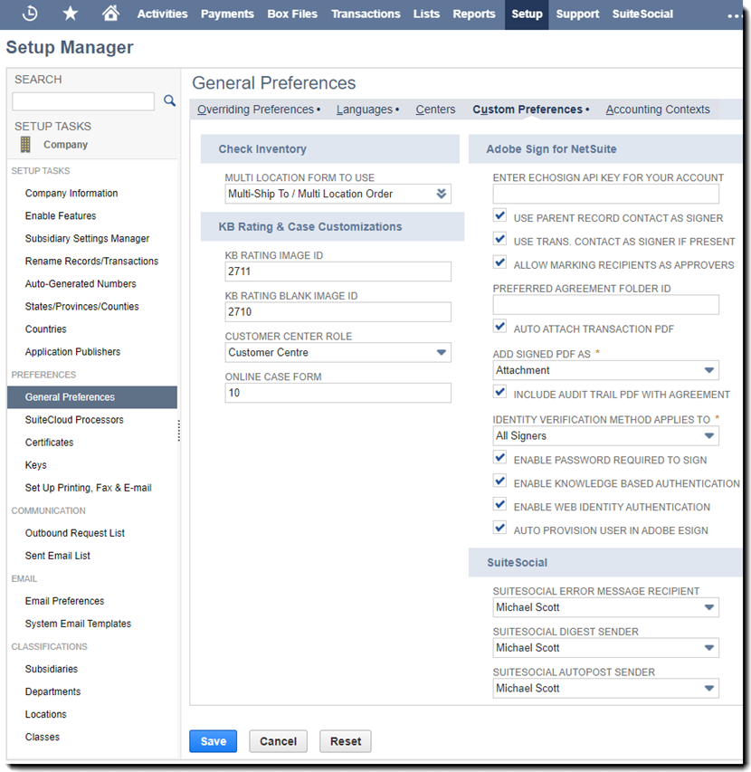
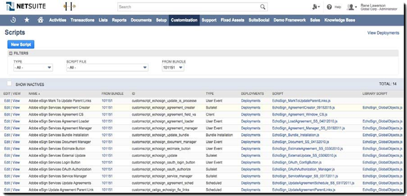
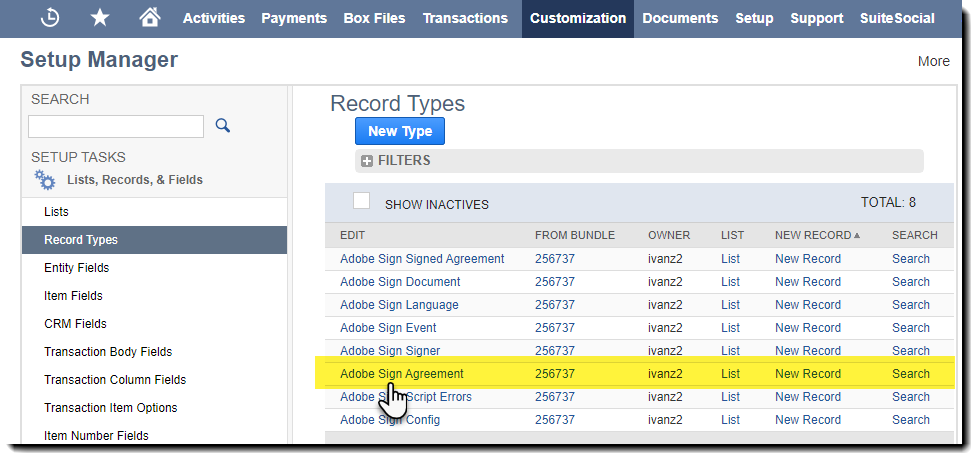
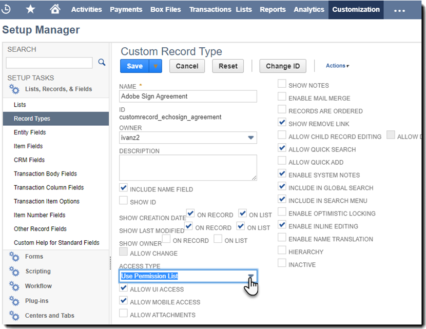
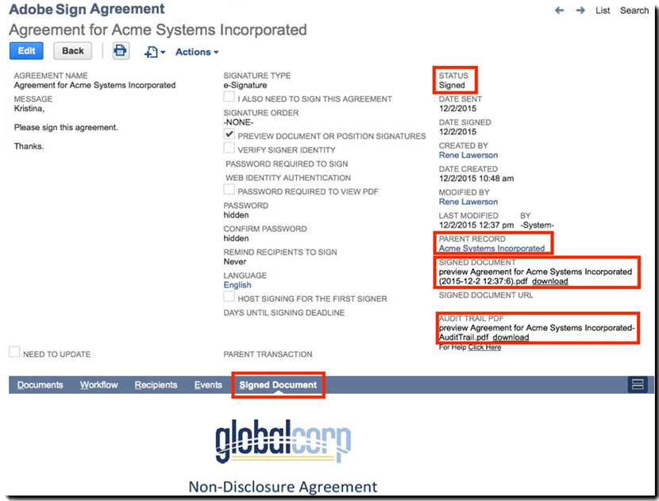

# Adobe Sign For NetSuite 安裝與自訂指南 （v4.0.4）{#install-customize-netsuite}

## 概覽 {#overview}

Adobe Sign For NetSuite 提供與 NetSuite 的完整電子簽名整合。 您可以使用 Adobe Sign 進行 Netsuite 整合，直接從 NetSuite 將合約 （例如合約、報價和其他需要電子簽名的檔） 傳送給收件者。 您可以從客戶、商機、報價和其他 NetSuite 記錄建立及傳送Adobe Sign合約。 Adobe Sign以合約的目前狀態更新 NetSuite，並在合約完整執行後儲存相關 NetSuite 記錄。 您可以檢視從 NetSuite 傳送產品內所有合約的記錄。

如需詳細資訊，請參閱 [ Adobe Sign for NetSuite 版本資訊 ](https://experienceleague.corp.adobe.com/docs/sign-integrations/using/netsuite/release-notes.html?lang=en) 。

## 安裝套裝組合並設定 OAuth {#install}

只有 NetSuite 管理員可以安裝或更新套裝組合。 若要設定 OAuth，NetSuite 管理員必須具有管理員存取Adobe Sign。 安裝「生產」帳戶中的套裝組合之前，您應該先在 NetSuite 沙箱帳戶中安裝套件並加以測試。

如需 [ 測試的詳細資訊，請參閱建立Adobe Sign ](#createagreement) 合約。

>[!CAUTION]
>
>升級至第 4.0.4 版的客戶不應移除現有的API金鑰。
>
>如需  如何使用API鍵的詳細資訊，請參閱「設定自訂偏好設定」。

### 第一次安裝套件套件

1. 流覽至 **「Customization > SuiteBundler > Search &amp; Install** Bundles」。

1. 在 *「Search和安裝套件」頁面上* ，輸入 **** 「Adobe Sign」作為關鍵字，然後選 **取** 「Search」。

1. 選取 **Adobe Sign** 組合名稱。

   

1. 在「 *套件詳細資料」* 頁面上，選取「 **安裝** 」。
1. 在 *「預覽套件安裝* 」頁面中，選取「 **安裝套件** 」。

   （不需要變更頁面上的任何預設值）

   

1. 在顯示的「安裝」對話方塊中，選取「 **確定** 」以繼續進行。

   安裝過程中，套件的狀態會顯示為「 *擱置中* 」。

   

1. 若要顯示更新的狀態，請選取 **「重新整理** 」。

   套裝安裝完成後，「已安裝套裝組合」 *頁面會顯示 Adobe Sign for* NetSuite。 **

   

1. 如果您已是Adobe Sign客戶帳戶，請在  [ 安裝或升級後，按照「設定 OAuth」的步驟進行 ](#oauth) 。

   如果您沒有Adobe Sign帳戶，可以 [ 註冊企業試用 ](https://esign.adobe.com/adobe-sign-netsuite-trial-registration.html) 帳戶以測試系統。 請依照線上註冊步驟啟用您的 Adobe Sign 帳戶。

## 安裝或升級後設定 OAuth {#oauth}

Adobe Sign使用 OAuth 2.0 來驗證 NetSuite 中的Adobe Sign帳戶。

此通訊協定授權您已安裝的 NetSuite 套件可以與Adobe Sign通訊，而無需要求您的密碼。 敏感資訊不會直接在應用程式之間共用，因此降低了帳戶遭盜用的可能性。

此驗證不會影響您的實作，但您必須在安裝或升級生產或沙箱帳戶中的套件後，進行一次性設定。

設定 OAuth 的 NetSuite 管理員還必須有帳戶層級管理員存取Adobe Sign。

1. 在 NetSuite 中，導覽至 *「設定Adobe Sign* 清單頁面。

1. Search使用頁首中的 **「Adobe Sign Search」欄位來設定** （自訂記錄類型）。

1. 在「Search結果」頁面中，選取 **** *「檢視」Adobe Sign設定* 記錄。

   

1. 在「設定清單Adobe Sign中，選取 **** *「使用 OAuth 存取 Adobe Sign API」記錄的「檢視* 」。

   

1. 在「Adobe Sign設定」頁面上，選取「 **使用 Adobe Sign 登入」**

   

1. 在顯示的「Adobe Sign」登入頁面中，輸入您的認證並選取「 **登入** 」。

   

1. 在顯示的「確認存取權」頁面 （針對 OAuth） 中，選取「 **允許存取」**

   

1. 授權完成後，系統會將您重新導向至 NetSuite 中的「Adobe Sign Config」頁面，如下所示。

   

   >[!NOTE]
   >
   >如果您在沙箱帳戶中設定 OAuth，授權完成後，您會遇到「無法判斷客戶構圖」錯誤。
   >
   >
   >若要繼續進行，您必須在瀏覽器中變更URL （system.netsuite.com） 的帳戶網域部分，以指向 NetSuite 沙箱，如下所示：
   >
   >
   >變更:
   >
   >
   >system.netsuite.com/app/site/hosting/scriptlet.nl?script=745&amp;deploy=1&amp;web_access_point=https://echosign.com
   >
   >
   >收件人：
   >
   >
   >系統。**沙箱。**netsuite.com/app/site/hosting/scriptlet.nl？script=745&amp;deploy=1&amp;web_access_point=HTTPs：//echosign.com

## 更新套件組合 （現有使用者）

NetSuite 套件更新會定期由 Adobe 發佈。 Adobe Sign for NetSuite 整合的現有使用者可以更新至最新的套裝組合。

>[!CAUTION]
>
>升級至新版本的客戶不應移除現有的API金鑰。
>
>如需  如何使用API鍵的詳細資訊，請參閱「設定自訂偏好設定」。

### 必要條件 {#prerequisites}

更新至第 4.0.4 版套件所需時間，取決於目前狀態為「傳出進行簽名」的合約數量。 更新 100 份合約通常需要 7 到 10 分鐘。 請注意用來估算更新時間的記錄數。

若要決定要簽署的合約數量：

1. 流覽至 **「自訂>清單、記錄和檔案>記錄類型** 」，然後找到 *Adobe Sign合約」。*

   或在搜尋列中搜尋Adobe Sign合約。

1. 在「合約Adobe Sign記錄中，選取 **** 「Search」。

   

1. 從「 **狀態」** 下拉式清單中，選 **取「傳出進行簽名** 」，然後選取「 **提交** 」。

   

   請注意用來估算更新時間的記錄數。

   

### 更新套件組合 {#updating-the-bundle}

1. 流覽至 **「Customization > SuiteBundler > Search &amp; 安裝>清單** 」，找到您目前的套裝組合，如下所示。

   >[!NOTE]
   >
   >如果套裝套裝推出新版本， *目前套裝組合的「版本」編號右側會顯示一個驚嘆號圖示* 。

1. 在「動作」下拉式選單中，選取「 **更新** 」。

   

1. 在「預覽組合更新」頁面上，選取「 **更新套裝」，** 而不變更頁面上顯示的任何預設值。

   安裝期間，套件的狀態會顯示為「 *擱置中* 」。

    。

   >[!NOTE]
   >
   >更新套裝組合時，您可能會收到如下所示的警告訊息。 如果您尚未自訂 NetSuite 電子簽名記錄，您可以繼續進行。 如果不確定，建議您先在沙箱帳戶上安裝套裝組合以進行測試，再將套裝在生產帳戶中更新。
   

1. 若要顯示更新的狀態，請選取 **「重新整理** 」。

   

   >[!NOTE]
   >
   >如果您有大量「傳出進行簽名」合約，因此更新似乎耗時很久 ** ，您可以查看「執行記錄」子索引標籤中的 **** *「Adobe Sign套裝安裝* 」腳本，以決定更新的進度。 （請參閱 [確認更新進度以 ](#determineprogress) 取得詳細資訊。）

   套裝更新完成後 *，「已安裝的套裝組合」頁面會顯示 Adobe Sign for* NetSuite。 **

   

## 設定套件組合 {#configure}

### 設定自訂偏好設定  {#set-custom-preferences}

您可以使用自訂偏好設定，指定如何在 NetSuite 中建立和儲存合約。 此外 *，「Adobe Sign」偏好設定中的「自動布建使用者」* 可讓您指定 NetSuite 使用者從 NetSuite 傳送合約時，是否已在 Sign 服務中自動布建。

1. 流覽至 **「設定>公司>一般偏好設定** 」。
1. 向下捲動頁面，然後選取「 **自訂偏好設定」** 子索引標籤。

   

1. 視需要啟用和設定您的Adobe Sign偏好設定：

   * **輸入您帳戶的 EchoSign API鍵** ：不要在此欄位中新增或編輯任何值。
   * **以簽署者身分使用父記錄連絡人** ：若啟用此項，父記錄連絡人會在建立合約時預設為第一個簽署者。 傳送者可輕鬆移除或編輯預設簽署者，或在傳送前將其他簽署者新增至合約。
   * **使用 Trans。 如果有「以簽署者身分連絡人** 」：只有 *在同時啟用「以簽署者身分使用上層記錄連絡人」偏好設定時，此* 偏好設定才有效。 若已啟用，從交易記錄 （例如報價） 產生合約時，主要交易連絡人會預設為第一個簽署者。 （請參閱 [如需詳細資訊，請參閱事務記錄 ](#transrecords) 。） 如果沒有主要交易連絡人，或是從 NetSuite 物件記錄傳送 （例如客戶記錄、合作夥伴記錄），預設收件者將成為客戶電子郵件的主要連絡人。 傳送者可輕鬆移除或編輯預設簽署者，或在傳送前將其他簽署者新增至合約。
   * **允許將收件者標記為核准者** ：若啟用此項，傳送者可以將收件者標記為核准者。 標示為核准者的收件者可以檢閱及核准合約，但不需要簽署合約。 核准者可能需要在核准過程中將資料輸入欄位。
   * **偏好的合約資料夾** ID：用來指定將最終簽署合約儲存在其中的檔案夾。 如果您未為此欄位設定值，最終簽署的合約預設會儲存在原始檔案檔案的相同資料夾中。 檔案夾 ID 必須是數位。
   * **自動附加交易** PDF：若啟用此項，交易 PDF 會在從交易記錄建立新合約時自動附加至合約。
   * **將已簽署的 PDF 新增為 （附件或連結）：** 如果 ** 從下拉式清單中選取清單，已簽署的 PDF 會自動新增為檔案的連結。 如果 ** 從下拉式清單中選取附件，已簽署的 PDF 會以附件方式儲存在 NetSuite 中，做為合約記錄上的附件。
   * **包含稽核記錄 PDF 與合約** ：若啟用此項，稽核記錄 PDF 會在合約簽署後自動附加至合約記錄。
   * **「身分驗證方法」適用于** ：啟用任何身分驗證方法，可決定要為誰套用識別驗證方法。 這些選項包括*所有簽署者、僅限外部簽署者、*或 *僅限內部簽署者* 。

   **身分驗證方法** {#identity-verification-methods}

   建立合約時可選取已啟用的身份驗證方法。 若此處啟用一種以上的身分驗證方法，「合約」頁面Adobe Sign會顯示「 **驗證簽署者身分」** 選項。

   * **啟用簽署所需的** 密碼：要求籤署者輸入您指定的一次性密碼。

   * **啟用知識式** Authentication：要求籤署者提供其姓名、位址和 SSN 末四碼的選項，然後回答問題清單來驗證他們提供的資訊。 僅適用于美國。

   * **啟用網頁身分** Authentication：要求籤署者登入以下其中一個網站以驗證其身分：Facebook、Google、LinkedIn、Microsoft Live、Twitter 或 Yahoo！。

   * **Adobe Sign自動布建使用者** ：若啟用此項，則在 NetSuite 中傳送合約的使用者會自動布建Adobe Sign使用者帳戶。

1. 選取 **「儲存** 」以儲存偏好設定。

## 設定自動狀態更新 {#asu}

Adobe Sign整合組合可讓您自動收到 NetSuite 中有關從 NetSuite 傳送合約狀態的更新。 啟用此功能後，NetSuite 一律會反映您合約的目前狀態。 您可以啟用自動狀態更新，如下所示：

1. 流覽至 **「設定>公司>啟用功能」。**
1. 選取 **「SuiteCloud」** 子索引標籤。
1. 啟用下列選項：

   * 在 SuiteBuilder 區段中，啟用 **「自訂記錄」** 選項。

   * 在 SuiteScript 區段中，啟用 **Client SuiteScript** 和 Server **SuiteScript** 選項，並同意兩者的服務條款。

1. 選取 **「儲存** 」。

   您的選項會設定為如影像中所示。

   

## 物件和記錄類型 {#objects}

Adobe Sign整合組合已顯示Adobe Sign合約物件，包含許多標準 NetSuite 物件，包括：「客戶」、「估算」、「商機」、「商機」及「合作夥伴」記錄。 您還可以搭配其他記錄類型 （包括自訂記錄） 使用Adobe Sign組合。

「合約」索引標籤會隨即顯示兩種 NetSuite 記錄：實體和事務記錄。 我們通常假設交易記錄是可轉換為 PDF 檔的記錄 （例如報價）;而實體記錄無法轉換為 PDF。

## 事務記錄 {#transrecords}

如果合約是從交易記錄建立，合約記錄上的第一份檔就是其來自記錄的 PDF 版本，而第一個收件者就是該記錄的電子郵件地址。 如果您不希望第一份檔成為其所來源記錄的 PDF 版本，請前往「 **設定 > 公司>一般偏好設定」>「自訂偏好設定」子索引標籤** ，並停用「 **自動附加交易 PDF」** 選項。 如 [ 需詳細資訊，請參閱「設定自訂偏好 ](#configure) 設定」。

在「自訂偏好設定」下，您也可以啟用「 **使用跨性別」。**&#x200B;如果您希望將主要交易連絡人自動新增為第一位簽署者，請以「第一個簽署者」偏好設定連絡人。與交易記錄相關聯時，會顯示「合約」 **** 和「 **傳送以供簽署」** 按鈕。

## 實體記錄 {#entity-records}

如果合約是從實體建立，記錄的第一個收件者就是記錄中的電子郵件地址。 與實體記錄相關聯時，只會顯示「合約」索引標籤。

## 自訂套件組合 {#customize}

自訂套件包含下列專案：

* 針對適當的記錄類型部署「合約」子標籤的腳本，以及「傳送以供簽署」按鈕。
* 設定Adobe Sign記錄類型的角色許可權。
* 修改許可權，授予「 *合約」子索引標籤* 和「 *傳送以供簽署」按鈕的存取權限* 。

### 為其他記錄類型設定Adobe Sign合約  {#configuring-adobe-sign-agreements-for-additional-record-types}

若要針對 *適當的記錄類型部署「合約」子索引標籤* 和「 *傳送以供簽署」* 按鈕：

1. 流覽至「 **自訂>腳本>腳本」。**

1. 在 *出現的「腳本* 」清單頁面上，找到您要部署的腳本，然後選取「 **檢視** 」。

   * 若要新增「 *傳送以供簽署」* 按鈕，請選 **取「Adobe Sign估算按鈕** 腳本」。

   * 若要新增「 *合約」索引標籤* ，請選 **Adobe Sign合約載入器** 腳本」。

1. 在「腳本」頁面上，選取「 **部署腳本** 」。

   

1. 在「腳本部署」頁面上，執行下列動作：

   * 從「 *套用至* 」清單中，選取記錄類型。
   * 您也可以選擇輸入腳本部署 ID。

      如需詳細資訊，請參閱 *NetSuite 支援中心中的「建立自訂腳本部署 ID」* 主題。 如果您未輸入 ID，系統會產生一個 ID。

   * 勾選 **「已部署」** 核取方塊。

   

   * 將 *「狀態* 」設為 **「已發佈** 」。

      您不需要指定 *事件種類* 或 *記錄層級* 。

   * 在「 *以角色執行」* 下拉式清單中，選取「 **以系統管理員身分執行** 」。

   * 在「 **受眾** 」子索引標籤作用中 （預設為啟用） 時，選取您要授與存取權的特定角色或使用者。 如果您要授與所有角色和使用者的存取權，請啟用各別的 **「選取所有** 選項」。

   * 選取 **「儲存** 」。 變更確認顯示時，選取「 **返回** 」。

1. 選 **** 取「腳本部署」頁面頂端的「清單」以返回「 *腳本* 」清單頁面。
1. 針對其他腳本重複上述步驟 2 和步驟 3。

## 設定Adobe Sign記錄類型的角色許可權  {#setting-role-permissions-for-adobe-sign-record-types}

大多數 NetSuite 角色都應該具有無額外自訂的情況下使用Adobe Sign的許可權。 但是，對於已建立的其他自訂角色，您可能需要授與許可權。

1. 流覽至 **「自訂>清單、記錄和檔案>記錄類型** 」。

   

   >[!NOTE]
   >
   >如果您沒有看到「 *記錄類型* 」專案，請流覽至 **「設定>公司>「啟用套件雲端」索引標籤>功能** 」，然後啟用「 *自訂記錄」* 選項。

1. 在「 *記錄類型」* 頁面上，選 **取Adobe Sign** 合約」加以選取

   

1. 在「 *自訂記錄類型* 」頁面上，從「存 **** *取類型」下拉式清單中選取「使用許可權清單* 」。

   

   >[!NOTE]
   >
   >*「Adobe Sign* 合約記錄」類型是唯一需要「使用許可權清單」存取類型的Adobe Sign記錄 ** 類型。
   >
   >
   >如需設定其他Adobe Sign記錄類型的存取類型指示，請參閱步驟 6。

1. 選取「 **許可權」** 子索引標籤。

   角色和許可權清單便會顯示。

   

1. 請依照下列方式設定「Adobe Sign合約」記錄類型中其他自訂角色的許可權。

   >[!NOTE]
   >
   >如 *[需詳細資訊，請參閱 ](https://system.netsuite.com/app/help/helpcenter.nl?fid=section_N2879931.html)* NetSuite 說明中心中「設定自訂記錄類型」主題的許可權清單

   1. 從「 *角色」清單中選取角色* 。
   1. 將 *位准* 設為 **「完全」**
   1. 將 *預設表格設定* 為 **自訂 EchoSign 合約表格**
   1. 選取以勾選「 *限制表格」* 核取方塊
   1. 選取 **「新增** 」以儲存角色列的變更

   

   新列會顯示如下所示：

   

   對所有其他自訂角色重複上述步驟至 e。

   * **** 設定所有角色的許可權後，選取「儲存在 *自訂記錄類型* 」頁面。

   「 *客戶記錄類型」* 頁面會重新顯示。

1. 重複上述步驟 1 到步驟 3， ** 為所有其他Adobe Sign記錄類型設定「存取類型」

   **不需任何許可權。** 這適用于下列記錄類型：

   * Adobe Sign設定
   * Adobe Sign 文件
   * Adobe Sign事件
   * Adobe Sign語言
   * Adobe Sign腳本錯誤
   * Adobe Sign已簽署的合約
   * 簽署者Adobe Sign

### 授與「合約」索引標籤和「傳送以供簽署」按鈕的存取權  {#granting-access-to-the-agreement-tab-and-send-for-signature-button}

Adobe Sign整合組合已顯示具有許多標準 NetSuite 物件 （客戶、估算 [ 報價、 ] 商機等） 的Adobe Sign合約物件。 「 *合約」子索引標籤* 會針對下列類型的物件自動啟用：客戶、商機、機會、合作夥伴、潛在客戶、報價和廠商帳單。

*「傳送以供簽署」* 按鈕 **只會針對「引號」物件自動啟用** 。

NetSuite 管理員可以修改許可權，將「合約」子標籤 ** 、「傳 *送以供簽署」* 按鈕或這兩個物件新增到其他CRM物件，藉此擴展建立合約的功能。

#### 修改授予「傳送以供簽署」按鈕存取權的許可權  {#modifying-permissions-to-grant-access-to-the-send-for-signature-button}

1. 流覽至 **「自訂>腳本>腳本** 」。

   「 *腳本* 」清單頁面隨即顯示。

   * 如有需要，請使用篩選器找出Adobe Sign腳本

1. 在「 *腳本」* 頁面上，找到 *「Adobe Sign估算按鈕* 」腳本 （控制「 *傳送以供簽署* 」按鈕），然後選取「 **檢視** 」。

   

1. 在「 *腳本」* 頁面上，執行下列動作：

   * 選取 **「部署」** 子索引標籤

   * 在「 *套用至」下方* ，為您要修改的實體選取連結

      * ****&#x200B;此範例中的報價

   

   * 選取 **「** *腳本部署」* 頁面上的「編輯」按鈕

   

   * 在「 **受眾** 」子索引標籤作用中，選取您要授與存取權的特定角色或使用者。

      * 如果您要授與所有角色和使用者的存取權，請啟用各別的 **「選取所有** 選項」
   * 選取「 **儲存」**

   

#### 修改授予「合約」索引標籤存取權的許可權  {#modifying-permissions-to-grant-access-to-the-agreements-tab}

1. 流覽至 **「自訂>腳本>腳本」**
1. 在「 *腳本」* 頁面上，找到 *Adobe Sign合約載入器* 」腳本 （控制「 *合約」索引標籤* ）

   * 選取「 **檢視」**

1. 在「 *腳本」* 頁面上，執行下列動作：

   1. 選取 **「部署」** 子索引標籤
   1. 在「 *套用至」下方* ，為您要修改存取權的實體選取連結
   1. 在 *Script Deployment *頁面上，選取 **「編輯」** 按鈕

   1. 在「 **受眾」子索引標籤作用中** （預設為作用中） 時，選取您要授與存取權的特定角色或使用者。 如果您要授與所有角色和使用者的存取權，請啟用各別的 **「選取所有** 選項」

   1. 選取「 **儲存」**

## 使用 Adobe Sign for NetSuite 套件組合

若要從 NetSuite 傳送合約並接收這些合約的更新，使用者必須在 NetSuite 和在Adobe Sign中擁有相同的登入 ID （電子郵件地址）。

### 建立Adobe Sign合約

在沙箱或生產帳戶中安裝新套裝後，您應該透過建立新合約來測試套裝組合。 您可以從實體記錄、交易記錄或單獨合約建立Adobe Sign合約。

>[!NOTE]
>
>建立合約的程式會因建立方式而略有不同。 一般程式涉及指定合約的選項、新增一或多個合約檔，以及指定收件者。 以下說明的程式假設您是從客戶記錄建立合約。

1. 選取或建立要傳送合約的客戶記錄，或選取已啟用「合約」索引標籤的另一個 NetSuite 記錄類型。

1. 從記錄中，選取「 **合約」** 子索引標籤。
1. 選取 **「新合約** 」。

   

1. 在「 *合約Adobe Sign* 頁面上，選取「 **編輯** 」。

   

1. 指定合約的選項，如下所示：

   * **合約名稱** — 輸入合約的名稱。
   * **訊息** - 輸入收件者的自訂訊息。
   * **簽名類型** — 選取檔接受的簽名類型。 這些選項包括 *「電子簽名」* 和「 *傳真簽名* 」。

   * **我也需要簽署此合約** — 啟用此選項，即可指出傳送者也必須簽署合約。
   * **簽名順序** - 如果 *「我也需要簽署此合約」* 選項已啟用，請選取傳送者和收件者應簽署的順序。 選項包括「我簽署，然後收件者簽署」、「收件者簽署，然後我簽署」和「無」。

   * **預覽檔或位置簽名 （或表單欄位）** — 啟用此選項可讓傳送者預覽合約，並允許其在傳送給收件者之前，將欄位 （拖放簽名、縮寫簽名欄位和其他表單欄位） 新增至合約。
   * **驗證簽署者身分** — 啟用此選項，然後選取下列其中一個身分驗證選項

      * 只有在「自訂偏好設定」中啟用下列三種簽署者身分驗證方法中的其中一種以上時，才會顯示此選項。 （請參閱 [如 ](#customize) 需詳細資訊，請設定自訂偏好設定。） 如果只啟用一個偏好設定，則 **不會顯示「驗證簽署者身分** 」選項。

   **身分驗證方法**

   * **需要簽署密碼** — 要求籤署者輸入您指定的一次性密碼。
   * **答題式** Authentication— 要求籤署者提供其姓名、位址和 SSN 末四碼，然後回答問題清單來驗證他們提供的資訊。 僅適用于美國。
   * **網頁身分** Authentication— 要求籤署者登入以下其中一個網站以驗證其身分：Facebook、Google、LinkedIn、Twitter、Yahoo！ 或 Microsoft Live。
   * **檢視 PDF 所需的密碼** — 啟用此選項可要求收件者在開啟合約或已簽署的合約的 PDF 之前輸入密碼。 傳送給所有人的 PDF 檔案將經過加密，需要使用此密碼才能開啟。 密碼無法復原，請勿遺失。 如果您確實遺失了密碼，則必須刪除該交易，然後重新開始。
   * **密碼/確認密碼** — 如果 *啟用了「檢視 PDF 所需的* 密碼」選項，請輸入應該用來檢視合約的密碼。
   * **提醒收件者簽署** — 指定是否和多久會傳送提醒給收件者。 選項為 *「從不* *」、「每日* 」或 *「每週* 」。
   * **語言：** 指定簽署頁面和電子郵件通知顯示給收件者的語言。
   * **代管第一個簽署者的簽署** — 啟用此選項可允許寄件者代管第一個簽署者的親筆簽署。
   * **「簽署截止日期日期** 」— 輸入整份數位，指出合約的簽署截止日期 （今天日期 + 天數）。
   * **上層記錄** — 選擇性選取父記錄，即可將該記錄連結至合約。

   

1. 選取 **「檔」索** 引標籤。

   

1. 在 *「檔* 」子標籤上，Adobe Sign 使用「檔」下拉式清單，從檔案封裝中附加現有 *檔* ，然後選取「 **附加** 」。

   或者，按一下 **「新增Adobe Sign檔」** 以存取 *「Adobe Sign檔」* 頁面，然後在 NetSuite 檔案套件中輸入檔案名稱、從交易記錄中選取檔案 （如果適用） 或附加新檔。

   您可以將多份檔新增至合約。

1. 選 **取「收件者** 」子索引標籤，然後從連絡人清單中選取或輸入電子郵件地址來指定收件者。

   

   每位收件者皆可標示為簽署者或副本收件者。 如果 *啟用「允許將收件者標記為核准者簽署者* 」自訂偏好設定，收件者也可以標記為核准者。 如 [ 需詳細資訊，請參閱設定自訂偏好 ](#customize) 設定。

   * **簽署者** 必須簽署合約。
   * **核准者** 必須核准，但不能簽署合約，而且可能需要新增資料到合約中。
   * **收件者會收到** 合約更新通知，以及合約簽署完成後通知。 副本收件者不是簽署或核准程式的一方。

      如果 *「以簽署者身分使用父記錄連絡人」* 自訂偏好設定是單獨啟用，或是與「 *使用跨性別」一起啟用。 依簽署者偏好設定，連絡人* 會預設為第一個收件者，但可以變更。

1. 在 **** 輸入每個收件者後選取「新增」。

1. 選取 **「儲存** 」以儲存合約。

### 傳送合約以供簽署

合約準備就緒後，選取「 **傳送以供簽署」** 按鈕。

* 如果「 *預覽檔或位置簽名」* 選項已啟用，請按一下「 **傳送以供簽署** 」。 在開啟的視窗中，預覽檔或在傳送檔前將表單欄位拖曳至檔。 選 **取** 「傳送」以傳送合約給收件者。

* 如果 *「首個簽署者主控簽署」* 選項已啟用，請按一下「 **傳送以供簽署** 」。 在開啟的視窗中，允許簽署者簽署有傳送者身分的檔。

   *「第一個簽署者」欄位的「* 主控簽署」欄位旁邊也會出現「目前簽署者」的主控簽署連結 ** ，可在檔簽署前加以存取。使用此連結代管多位簽署者的合約簽署，或在意外關閉時重新開啟快顯視窗。

傳送合約後，收件者會收到一封電子郵件，通知他們有待簽署的檔。

收件者簽署檔後，傳送者會透過電子郵件收到檔已簽署的通知。

#### 以報價傳送

Adobe Sign 與 NetSuite 中的引號直接整合，因此系統會自動產生引號的 PDF 並附加至合約記錄。

檢視報價時，選取「 **傳送以供簽署** 」。 它會產生並顯示附加至合約的引號。 您也可以將「 *傳送以供簽署」* 按鈕新增至其他交易記錄類型。 如 [ 需詳細資訊，請參閱物件和記錄類型 ](#objects) 。

### 追蹤狀態和傳送提醒

傳送合約後：

* 在「合約詳細資料」區段中，檔狀態變更 *為「傳出進行簽署* 」
* 「 *傳送以供簽署」* 按鈕已由下列三個按鈕所取代：

   * **更新狀態** — 如果未設定狀態更新，請選取此按鈕以手動更新狀態。 如 [ 需詳細資訊，請參閱設定自動狀態更新 ](#asu) 。
   * **傳送提醒** — 選取此按鈕即可傳送提醒給目前的簽署者。
   * **取消合約** — 選取此按鈕即可取消合約。 如果合約尚未所有收件者尚未簽署，合約在傳送以供簽署後可能會取消。

合約記錄中會顯示新的「事件」子索引標籤， ** 您可以在此追蹤合約狀態。

您可以查看合約事件的記錄，其中包含傳送、檢視和簽署合約時的相關資訊。

合約簽署完成後：

* 其狀態會變更為「 *已簽署* 」。
* 您可以使用連結連結，連結至此合約的「父記錄」。
* 您可以使用「已簽署的檔和稽核記錄」下方的「下載」連結來存取這些檔。
* 另一個 *「已簽署檔」子索引標籤會* 隨即顯示，以檢視已簽署檔的縮圖。

>[!NOTE]
>
>傳送合約以供簽署後，您將無法編輯該記錄。 這是為了保留事件記錄。

## 卸載套裝組合

若要卸載套件組合，請依照 NetSuite 說明中提供的步驟操作。 如需詳細資訊，請參閱 ** NetSuite 支援中心中的「卸載套件」主題。

當您卸載套裝組合時，未簽署的合約會被刪除。 已簽署的合約及其對應的稽核 PDF 檔案不受影響。

如果您需要保留未簽署的合約，請勿卸載套件。

## 解決

### 決定更新進度

如果更新似乎需要更長的時間，您可以查看「Adobe Sign套裝套裝安裝」腳本的「執行記錄」子索引標籤，以決定更新的進度，如下所示：

1. 流覽至 **「自訂>腳本>腳本** 」。
1. 在「 *腳本」* 頁面上找到 *「Adobe Sign套件安裝* 」腳本，然後選取「 **編輯** 」。
1. 在「 *腳本* 」頁面上，選取「 **執行記錄** 」子索引標籤。
1. 選取 **「重新整理** 」。

   「執行記錄」會更新，以反映目前狀態。 「 *詳細資訊* 」欄會顯示您合約的更新進度。

   

### 解決存取權杖問題

與合約互動時，您可能會收到「提供的存取權杖無效或已過期」訊息。

這可能是因為下列原因：

* 設定 OAuth 的 NetSuite/Adobe Sign 管理員已撤銷存取權杖
* 存取權杖已過期，因為過去 60 天內未從 NetSuite 傳送任何合約
* NetSuite/Adobe Sign 管理員尚未成功完成初始 OAuth 設定

若要解決此問題，請再次執行 OAuth 設定程式。 如 [ 需詳細資訊，請參閱安裝或升級後設定 ](#oauth) OAuth。

### 解決檔狀態問題 {#resolvestatus}

如果 [ 設定自動狀態更新， ](#asu) 但合約狀態並未在傳送合約後更新，請嘗試下列操作：

1. 檢查 *Adobe Sign External Update 腳本的部署執行記錄* ，查看您是否收到來自 Adobe Sign 的電話，如下所示：

   1. 導覽至 **「自訂>腳本>腳本部署」**
   1. 在「 *腳本部署」* 頁面上，找到 *「Adobe Sign外部更新* 」腳本，然後選取「 **編輯」**
      1. 在「 *腳本部署」* 頁面上，選取「 **執行記錄」** 子索引標籤。
      * 您應該會看到 *每個合約 ID 的「更新合約記錄」* 專案

1. 檢查Adobe Sign *更新合約腳本的部署執行記錄* ，確認是否有下列錯誤：

   1. 流覽至 **「自訂>腳本>腳本部署** 」。
   1. 在「 *腳本部署」* 頁面上，找到 *Adobe Sign更新* 合約」腳本的「排程」狀態，然後選取「 **編輯** 」。
   1. 在「 *腳本部署」* 頁面上，選取「 **執行記錄」** 子索引標籤。
   1. 在 *「類型」下* ，選取 **「錯誤** 」以篩選結果。

1. 最後， *按照上述步驟 2 的指示檢查 Adobe Sign Manager 腳本的執行記錄錯誤* 。

### 解決 MIME 類型錯誤  {#resolving-mime-type-errors}

如果您在傳送合約時收到 MIME 類型錯誤，這可能是因為「檔案名」欄位中的名稱與上傳檔案的檔案名和副檔名不符。 如果您將「檔案名」欄位保留空白，將會自動填入正確的檔案名和副檔名。

### 檢視腳本記錄 {#viewing-script-logs}

您也可以檢視與檔狀態問題無關之腳本的部署執行記錄。 如 [ 需詳細資訊，請參閱解決檔狀態問題 ](#resolvestatus) 。

1. 流覽至 **「自訂>腳本>腳本** 」。

   「 *腳本* 」清單頁面隨即顯示。 如有需要，請使用篩選器找出適當的腳本。

1. 選 **取** 對應腳本的「檢視」。

1. 選取 **頁面上的「執行記錄」** 子索引標籤，以顯示腳本記錄檔。

## 支援 {#support}

前往 [ Adobe Sign 支援入口網站 ](https://adobe.com/go/adobesign-support-center_tw) 存取常見問題、檔、知識庫文章，或聯絡Adobe支援。
