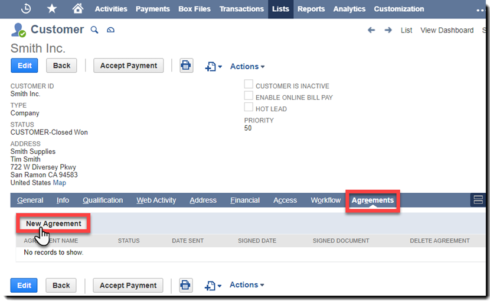

# [!DNL NetSuite] 安裝和自訂指南 （v4.0.4） {#install-customize-NetSuite}

## 概覽 {#overview}

[!DNL NetSuite]Adobe Sign提供與 。 [!DNL NetSuite]您可以使用Adobe Sign [!DNL NetSuite] 整合功能，將合約 （例如合約、報價和其他需要電子簽名的檔） 直接傳 [!DNL NetSuite] 送給收件者。 您可以從客戶、商機、報價和其他 [!DNL NetSuite] 記錄建立和傳送Adobe Sign合約。 Adobe Sign更新 [!DNL NetSuite] 合約的狀態，並在合約完整執行後儲存具有相關 [!DNL NetSuite] 記錄的合約。 您可以檢視從 [!DNL NetSuite] 產品內傳送所有合約的記錄。

如需詳細資訊， [ 請參閱 Adobe Sign for NetSuite 版本資訊 ](https://experienceleague.adobe.com/docs/sign-integrations/using/netsuite/release-notes.html?lang=en) 。

## 安裝套裝組合並設定 OAuth {#install}

[!DNL NetSuite]只有管理員可以安裝或更新此套裝組合。若要設定 OAuth， [!DNL NetSuite] 管理員必須具有管理員存取Adobe Sign。 在「生產」帳戶中安裝套件之前，您應該先在沙箱帳戶中 [!DNL NetSuite] 安裝套件並加以測試。

如需測試的詳細資訊，請參閱 [ 建立Adobe Sign ](#createagreement) 合約。

>[!CAUTION]
>
>升級至第 4.0.4 版的客戶不應移除現有的API鍵。
>
>如需如何使用API鍵的詳細資訊，請參閱 [ 「設定自訂偏好 ](#configure) 設定」。

### 第一次安裝套件套件

1. 流覽至「 [!UICONTROL **Customization > SuiteBundler > Search &amp; Install Bundles」**] 。

1. 在「 *Search和安裝套件」頁面上* ，輸入 **「Adobe Sign** 」作為關鍵字，然後選 **[!UICONTROL 取「Search」]** 。

1. 選取Adobe Sign **** 組合名稱。

   

1. 在「套 *[!UICONTROL 件詳細資料」]* 頁面上，選取「 **[!UICONTROL 安裝」]** 。
1. 在「 *[!UICONTROL 預覽套件安裝]* 」頁面中，選取「 **[!UICONTROL 安裝套裝」]** 。

   （不需要變更頁面上的任何預設值）

   

1. 在顯示的「安裝」對話方塊中，選取「 **[!UICONTROL 確定]** 」以繼續進行。

   在安裝過程中，套件的狀態會顯示為 *[!UICONTROL 「擱置中」]* 。

   

1. 若要顯示更新的狀態，請選取 **[!UICONTROL 「重新整理」]** 。

   套裝安裝完成後， *「已安裝的套裝組合]* 」頁面會 *[!UICONTROL 顯示Adobe Sign[!DNL NetSuite]* 。

   

1. 如果您已是Adobe Sign客戶帳戶，請在安裝或升級後依照「設定 OAuth」的步驟  [ 進行 ](#oauth) 。

   如果您沒有Adobe Sign帳戶，可以 [ 註冊企業試 ] 用版 （HTTPs://esign.adobe.com/adobe-sign-DNL NetSuite-trial-registration.html） 以測試系統。 請依照線上註冊步驟啟用您的Adobe Sign帳戶。

## 安裝或升級後設定 OAuth {#oauth}

Adobe Sign使用 OAuth 2.0 在其中驗證您的Adobe Sign帳戶 [!DNL NetSuite] 。

此通訊協定授權您已安裝 [!DNL NetSuite] 的套件可以與Adobe Sign通訊，而無需要求您的密碼。 敏感資訊不會直接在應用程式之間共用，因此降低了帳戶遭盜用的可能性。

此驗證不會影響您的實作，但您必須在安裝或升級生產或沙箱帳戶中的套件後，進行一次性設定。

設定 [!DNL NetSuite] OAuth 的管理員也必須擁有帳戶層級管理員的存取權，才能Adobe Sign。

1. 在 [!DNL NetSuite] 「設定」 *清單頁面中，流覽至「* Adobe Sign」。

1. **** Search Adobe Sign在頁首中使用「Search」欄位來設定 （自訂記錄類型）。

1. 在「Search結果」頁面中，選 **取「Adobe Sign設定」記錄的 *「檢視**」* 。

   

1. 在「Adobe Sign設定清單」頁面上，選 **[!UICONTROL 取「使用 OAuth 存取 Adobe Sign API *」記錄的「檢視]*** 」。

   

1. 在「Adobe Sign設定」頁面上，選取「 **[!UICONTROL 使用 Adobe Sign 登入」]**

   

1. 在顯示的「Adobe Sign」登入頁面中，輸入您的認證並選取「 **[!UICONTROL 登入」]** 。

   

1. 在顯示的「確認存取權」頁面 （針對 OAuth） 中，選取「 **[!UICONTROL 允許存取」]**

   

1. 授權完成後，系統會將您重新導向至 Adobe Sign Config 頁面 [!DNL NetSuite] ，如下所示。

   

   >[!NOTE]
   >
   >在沙箱帳戶中設定 OAuth 時，您可能會在授權完成時遇到「無法判斷客戶電腦 ID」錯誤。
   >
   >
   >若要繼續操作，您必須變更 URL （系統） 的帳戶網域部分。[!DNL NetSuite].com） 在瀏覽器中指向沙箱， [!DNL NetSuite] 如下所示：
   >
   >
   >變更:
   >
   >
   >系統。[!DNL NetSuite].com/app/site/hosting/scriptlet.nl？script=745&amp;deploy=1&amp;web_access_point=HTTPs：//echosign.com
   >
   >
   >收件人：
   >
   >
   >系統。**沙 箱。** netsuite.com/app/site/hosting/scriptlet.nl？script=745&amp;deploy=1&amp;web_access_point=HTTPs：//echosign.com

## 更新套件組合 （現有使用者）

[!DNL NetSuite] 套件更新會定期由 Adobe 發佈。 Adobe Sign整合的 [!DNL NetSuite] 現有使用者可以更新至最新的套件組合。

>[!CAUTION]
>
>升級至新版本的客戶不應移除現有API機碼。
>
>如需如何使用API鍵的詳細資訊，請參閱 [ 「設定自訂偏好 ](#configure) 設定」。

### 必要條件 {#prerequisites}

更新至第 4.0.4 版套件所需時間，取決於目前狀態為「傳出進行簽名」的合約數量。 更新 100 份合約通常需要 7 – 10 分鐘。 請注意用來估算更新時間的記錄數。

若要決定要簽署的合約數量：

1. 流覽至「 **[!UICONTROL 自訂>清單、記錄和檔案>記錄類型]** 」，然後找到 *「Adobe Sign合約」。*

   或在搜尋列中搜尋Adobe Sign合約。

1. 在「 [!UICONTROL  合約Adobe Sign ] 記錄中，選取 **[!UICONTROL 「Search」]** 。

   

1. 從「 **[!UICONTROL 狀態」]** 下拉式清單中，選取「 **[!UICONTROL 傳出進行簽名]** 」，然後選取「 **[!UICONTROL 提交」]** 。

   

   請注意用來估算更新時間的記錄數。

   

### 更新套件組合 {#updating-the-bundle}

1. 流覽至 **[!UICONTROL 「Customization > SuiteBundler > Search &amp;>清單]** 」，找到您目前的套件組合，如下所示。

   >[!NOTE]
   >
   >如果套裝套裝推出新版本，目前套裝組合的 *「版本* 」編號右側會顯示一個驚嘆號圖示。

1. 在「動作」下拉式選單中，選取「 **[!UICONTROL 更新」]** 。

   

1. 在「預覽組合更新」頁面上，選取「 **[!UICONTROL 更新套裝」]** ，而不變更頁面上顯示的任何預設值。

   安裝期間，套件的狀態會顯示為「 *擱置中」* 。

    。

   >[!NOTE]
   >
   >更新套裝組合時，您可能會收到如下所示的警告訊息。 如果您尚未自訂 [!DNL NetSuite] 電子簽名記錄，可以繼續進行。 如果不確定，建議您先在沙箱帳戶上安裝套裝組合以進行測試，再將套裝在生產帳戶中更新。

   

1. 若要顯示更新的狀態，請選取 **[!UICONTROL 「重新整理」]** 。

   

   >[!NOTE]
   >
   >如果因為數份合約 *具有「傳出進行簽署* 」狀態而導致更新耗時很久，您可以勾選 **[!UICONTROL 「執行記錄]** 」子 *索引標籤中的「Adobe Sign套裝安裝* 」腳本，以決定更新進度。 如需詳細資訊，請參閱 [ 判斷更新 ](#determineprogress) 進度。

   套裝更新完成後，Adobe Sign *[!DNL NetSuite]* 會顯示在 *「已安裝的* 組合」頁面上。

   

## 設定套件組合 {#configure}

### 設定自訂偏好設定  {#set-custom-preferences}

您可以使用自訂偏好設定來指定合約的建立和儲存方式 [!DNL NetSuite] 。 此外，「 *Adobe Sign* 」偏好設定中的「自動布建使用者」可讓您指定從簽署服務傳送 [!DNL NetSuite] 合約時，是否 [!DNL NetSuite] 自動布建使用者。

1. 流覽至 **[!UICONTROL 「設定>公司>一般偏好設定」]** 。
1. 向下捲動頁面，然後選取「 **[!UICONTROL 自訂偏好設定」]** 子索引標籤。

   

1. 視需要啟用和設定您的Adobe Sign偏好設定：

   * **輸入您帳戶** 的 EchoSign API鍵：不要在此欄位中新增或編輯任何值。
   * **以簽署者身分使用父記錄連絡人** ：若啟用此項，父記錄連絡人會在建立合約時預設為第一個簽署者。 傳送者可輕鬆移除或編輯預設簽署者，或在傳送前將其他簽署者新增至合約。
   * **使用 Trans。 如果存在** ，請以簽署者身分聯絡人：只有在同時啟用「以簽署者身分使用上層記錄連絡人」 *偏好設定時，* 此偏好設定才有效。如果已啟用，當從交易記錄 （例如報價） 產生合約時，主要交易連絡人會預設為第一個簽署者。 如需詳細資訊，請參閱 [ 事務記錄 ](#transrecords) 。 如果沒有主要交易連絡人，或是從 [!DNL NetSuite] 物件記錄傳送 （例如，客戶記錄、合作夥伴記錄），則預設收件者是客戶電子郵件的主要連絡人。 傳送者可輕鬆移除或編輯預設簽署者，或在傳送前將其他簽署者新增至合約。
   * **允許將收件者標記為核准者** ：若啟用此項，傳送者可以將收件者標記為核准者。 標示為核准者的收件者可以檢閱及核准合約，但不需要簽署合約。 核准者可能需要在核准過程中將資料輸入欄位。
   * **偏好的合約資料夾 ID** ：用來指定儲存最終簽署合約的檔案夾。 如果您未為此欄位設定值，最終簽署的合約預設會儲存在原始檔案檔案的相同資料夾中。 檔案夾 ID 必須是數位。
   * **自動附加交易 PDF：若啟用此項，交易 PDF** 會在從交易記錄建立新合約時自動附加至合約。
   * **將已簽署的 PDF 新增為 （附件或連結）：** 如果 *從下拉式清單中選取「清單* 」，已簽署的 PDF 會自動新增為檔案的連結。 如果 *從下拉式清單中 [!DNL NetSuite] 選取附件* ，已簽署的 PDF 會儲存為合約記錄上的附件。
   * **將稽核記錄 PDF 包含合約** ：若啟用此項，稽核記錄 PDF 會在合約簽署後自動附加至合約記錄。
   * **「身分驗證方法適用」** ：啟用任何身分驗證方法，可決定要為誰套用識別驗證方法。 這些選項包括 *「所有簽署者」、「僅限* 外部簽署者」或「 *僅限內部簽署者」* 。

   **身分驗證方法** {#identity-verification-methods}

   建立合約時可選取已啟用的身份驗證方法。 若此處啟用一種以上的身分驗證方法，「合約」頁面Adobe Sign會顯示「 **[!UICONTROL 驗證簽署者身分]** 」選項。

   * **啟用簽署** 所需的密碼：要求籤署者輸入您指定的一次性密碼。

   * **啟用知識型Authentication** ：要求籤署者提供其姓名、位址和 SSN 末四碼的選項，然後回答問題清單來驗證他們提供的資訊。 僅適用于美國。

   * **啟用網頁身分Authentication** ：要求籤署者登入以下其中一個網站以驗證其身分：Facebook、Google、LinkedIn、Microsoft Live、Twitter 或 Yahoo！。

   * **Adobe Sign** 自動布建使用者：如果啟用此項，傳送合約登入 [!DNL NetSuite] 的使用者會自動布建Adobe Sign使用者帳戶。

1. 選取 **[!UICONTROL 「儲存]** 」以儲存偏好設定。

## 設定自動狀態更新 {#asu}

「Adobe Sign」整合組合可讓您自動收到所傳送 [!DNL NetSuite] 合約狀態的相關更新 [!DNL NetSuite] 。啟用此功能時， [!DNL NetSuite] 一律反映合約狀態。 您可以啟用自動狀態更新，如下所示：

1. 流覽至「 **[!UICONTROL 設定>公司>啟用功能」 ] 。**
1. 選取「 **[!UICONTROL SuiteCloud]** 」子索引標籤。
1. 啟用下列選項：

   * 在 SuiteBuilder 區段中，啟用「 **[!UICONTROL 自訂記錄」]** 選項。

   * 在 SuiteScript 區段中，啟用 **[!UICONTROL Client SuiteScript]** 和 **[!UICONTROL Server SuiteScript]** 選項，並同意兩者的服務條款。

1. 選取「**[!UICONTROL 儲存]**」。

   您的選項會設定為如影像中所示。

   

## 物件和記錄類型 {#objects}

Adobe Sign整合組合已顯示Adobe Sign合約物件，包含許多標準 [!DNL NetSuite] 物件，包括：「客戶」、「估算」、「商機」、「商機」及「合作夥伴」記錄。 您也可以搭配其他記錄類型 （包括自訂記錄） 一起使用Adobe Sign組合。

「合約」索引標籤會顯示兩種類型的 [!DNL NetSuite] 記錄：「實體」和「事務記錄」。 我們通常假設交易記錄是可轉換為 PDF 檔的記錄 （例如報價）;而實體記錄無法轉換為 PDF。

## 事務記錄 {#transrecords}

如果合約是從交易記錄建立，合約記錄上的第一份檔就是其來自記錄的 PDF 版本，而第一個收件者就是該記錄的電子郵件地址。 如果您不希望第一份檔成為來自記錄的 PDF 版本， **[!UICONTROL 請前往「設定 > 公司」>「一般偏好設定」>「自訂偏好設定」子卷]** 標，然後停 **[!UICONTROL 用「自動附加交易 PDF」]** 選項。 如需詳細資訊，請參閱 [ 「設定自訂偏好 ](#configure) 設定」。

在「自訂偏好設定」下，您也可以啟用「 **[!UICONTROL 使用跨性別」。 如果您希望將主要交易連絡人自動新增為第一位簽署者，請以「第一個簽署者]** 」偏好設定連絡人。 與交易記錄相關聯時，會顯示 **** 「合約」和 **[!UICONTROL 「傳送以供簽署」]** 按鈕。

## 實體記錄 {#entity-records}

如果合約是從實體建立，記錄的第一個收件者就是記錄中的電子郵件地址。 與實體記錄相關聯時，只會顯示「合約」索引標籤。

## 自訂套件組合 {#customize}

自訂套件包含下列專案：

* 針對適當的記錄類型部署「合約」子標籤的腳本，以及「傳送以供簽署」按鈕。
* 設定Adobe Sign記錄類型的角色許可權。
* 修改許可權，授予「合約」 *子索引標籤和「傳送以供簽署」* 按鈕的訪問 *許可權* 。

### 為其他記錄類型設定Adobe Sign合約  {#configuring-adobe-sign-agreements-for-additional-record-types}

若要針對適當的記錄類型部署 *「合約* 」子索引標籤和 *「傳送以供簽署」* 按鈕：

1. 流覽至「 **[!UICONTROL 自訂>腳本>腳本」 ] 。**

1. 在 *出現的* 「腳本」清單頁面上，找到您必須部署的腳本，然後選取「檢 ****[!UICONTROL 視」]**** 。

   * 若要新增「 *傳送以供簽署」* 按鈕，請選 **[!UICONTROL 取「Adobe Sign估算按鈕]** 腳本」。

   * 若要新增「 *合約」索引* 標籤，請選 **[!UICONTROL Adobe Sign合約載入器]** 腳本」。

1. 在「腳本」頁面上，選取「 **[!UICONTROL 部署腳本」]** 。

   

1. 在「腳本部署」頁面上，執行下列動作：

   * 從「 *套用至* 」清單中，選取記錄類型。
   * 您也可以選擇輸入腳本部署 ID。

      如需詳細資訊， *請參閱「說明中心」中的 [!DNL NetSuite] 「建立自訂腳本部署 ID* 」主題。如果您未輸入 ID，系統會產生一個 ID。

   * 勾選「 **[!UICONTROL 已部署」]** 核取方塊。

   

   * 將狀態 *設* 為 **[!UICONTROL 「已發佈」]** 。

      您不必指定 *事件種類* 或 *記錄層級* 。

   * [!UICONTROL 在「*以角色* 執行」 ] 下拉式清單中，選取「 **[!UICONTROL 以系統管理員身分執行」]** 。

   * 在「 **[!UICONTROL 受眾]** 」子索引標籤作用中 （預設為啟用） 時，選取您要授與存取權的特定角色或使用者。 如果您要授與所有角色和使用者的存取權，請啟用各別 **[!UICONTROL 的「選取所有]** 選項」。

   * 選取「**[!UICONTROL 儲存]**」。變更確認訊息顯示後，選取「 **[!UICONTROL 返回」]** 。

1. 選 **[!UICONTROL 取「腳本部署」頁面頂端的「清單]** 」以返回「 *腳本」* 清單頁面。
1. 針對其他腳本重複上述步驟 2 和步驟 3。

## 設定Adobe Sign記錄類型的角色許可權 {#setting-role-permissions-for-adobe-sign-record-types}

大多數 [!DNL NetSuite] 角色應具有無額外自訂的情況下使用Adobe Sign的許可權。 但是，您可能必須授與已建立之其他自訂角色的許可權。

1. 流覽至「 **[!UICONTROL 自訂>清單、記錄和檔案>記錄類型」]** 。

   

   >[!NOTE]
   >
   >如果您沒有看到 *「記錄類型」* 專案，請流覽至 **[!UICONTROL 「設定>公司>「啟用套件雲]** 端」標籤>功能」，然後啟用「 *自訂記錄」* 選項。

1. 在「 *記錄類型」* 頁面上，選取 **[!UICONTROL Adobe Sign]** 合約」加以選取

   

1. 在「自訂記錄類型」 *頁面上，從「* 存取類型 *」下拉式清單中選&#x200B;**[!UICONTROL 取「* 使用許可權清單]** 」。

   

   >[!NOTE]
   >
   >「 *Adobe Sign合約* 記錄」類型是唯一需要 *「使用許可權清單* 」存取類型的Adobe Sign記錄類型。
   >
   >
   >如需設定其他Adobe Sign記錄類型的存取類型指示，請參閱步驟 6。

1. 選取「 **[!UICONTROL 許可權」]** 子索引標籤。

   角色和許可權清單便會顯示。

   

1. 依照以下方式設定「Adobe Sign ] 合約」記錄類型中其他自訂角色的 [!UICONTROL  許可權。

   >[!NOTE]
   >
   >如需詳細資訊， *[請參閱 NetSuite 說明中心中「設定自訂記錄類型 ](https://system.netsuite.com/app/help/helpcenter.nl?fid=section_N2879931.html)* 」主題的許可權清單

   1. 從「角色」清單中 *選取角色* 。
   1. 將「位准」設 *為「**[!UICONTROL 完全」]**。*
   1. 將「預設表格」 *設* 為 **[!UICONTROL 「自訂 EchoSign 合約表格」]** 。
   1. 選取 **[!UICONTROL 「限制表格」]** 核取方塊。
   1. 選取 **[!UICONTROL 「新增]** 」以儲存角色列的變更。

   

   新列會顯示如下所示：

   

   對所有其他自訂角色重複上述步驟至 e。

   * ]**設定所有角色的許可權後， *選**[!UICONTROL 取「儲存在自訂記錄類型* 」頁面。
   「 *[!UICONTROL 客戶記錄類型」]* 頁面會重新顯示。

1. 重複上述步驟 1 到步驟 3，為所有其他Adobe Sign記錄類型設定 *「存取類型* 」

   **[!UICONTROL 不需任何許可權 ] 。** 這適用于下列記錄類型：

   * Adobe Sign設定
   * Adobe Sign 文件
   * Adobe Sign事件
   * Adobe Sign語言
   * Adobe Sign腳本錯誤
   * Adobe Sign已簽署的合約
   * 簽署者Adobe Sign

### 授予「合約」索引標籤和「傳送以供簽署」按鈕的存取權  {#granting-access-to-the-agreement-tab-and-send-for-signature-button}

Adobe Sign整合組合已顯示具有許多標準 [!DNL NetSuite] 物件 （「客戶」、「估 [ 算報價 ] 」、「商機」等） 的Adobe Sign合約物件。 「 *合約* 」子索引標籤會針對下列類型的物件自動啟用：客戶、商機、機會、合作夥伴、潛在客戶、報價和廠商帳單。

系統 *[!UICONTROL 會自動為「引號」物件啟用&#x200B;**[!UICONTROL  「傳送以供簽署]* 」]** 按鈕。

[!DNL NetSuite]管理員可以修改許可權，將「合約」子索引標籤、 *「傳送以供簽署* 」按鈕或這兩個物件新 ** 增至這些物件，藉此擴大將合約建立至其他CRM物件的功能。

#### 修改授予「傳送以供簽署」按鈕存取權的許可權  {#modifying-permissions-to-grant-access-to-the-send-for-signature-button}

1. 流覽至「 **[!UICONTROL 自訂>腳本>腳本」]** 。

   「 *腳本」清單頁面隨即* 顯示。

   * 如有需要，請使用篩選器找出Adobe Sign腳本

1. 在「 *腳本」頁面上* ，找到 *「Adobe Sign估算按鈕* 」腳本 （控制「 *傳送以供簽署」* 按鈕），然後選取「檢 **視」** 。

   

1. 在「 *腳本」* 頁面上，執行下列動作：

   * 選取「 **[!UICONTROL 部署」]** 子索引標籤

   * 在「 *套用至* 」下方，為您要修改的實體選取連結。

      * **[!UICONTROL 此範例中的報價]**

   

   * 選取「 **[!UICONTROL 腳本部署」頁面上的「 *編輯]**」* 按鈕

   

   * 在「 **[!UICONTROL 受眾]** 」子索引標籤作用中，選取您要授與存取權的特定角色或使用者。

      * 如果您要授與所有角色和使用者的存取權，請啟用各別 **[!UICONTROL 的「選取所有]** 選項」
   * 選取「儲存 **[!UICONTROL 」]**

   

#### 修改授予「合約」索引標籤存取權的許可權  {#modifying-permissions-to-grant-access-to-the-agreements-tab}

1. 流覽至「 **[!UICONTROL 自訂>腳本>腳本」]**
1. 在「 [!UICONTROL  腳本」頁面上 ] ，找到 *[!UICONTROL 「Adobe Sign合約載入器]* 」腳本 （控制「 *合約」標籤* ），然後選取「檢 **[!UICONTROL 視」]** 。
1. 在「 *腳本」* 頁面上，執行下列動作：

   1. 選取「 **[!UICONTROL 部署」]** 子索引標籤
   1. 在「 *[!UICONTROL 套用至]* 」下方，為您要修改存取權的實體選取連結
   1. 在「 *[!UICONTROL 腳本部署」]* 頁面上，選取「 **[!UICONTROL 編輯」]** 按鈕
   1. 在「 **[!UICONTROL 受眾]** 」子索引標籤作用中 （預設為作用中） 時，選取您要授與存取權的特定角色或使用者。 如果您要授與所有角色和使用者的存取權，請啟用各別 **[!UICONTROL 的「選取所有]** 選項」
   1. 選取「儲存 **[!UICONTROL 」]**

## 使用套件的Adobe Sign [!DNL NetSuite]

若要傳送來自 [!DNL NetSuite] 這些合約的合約並接收更新，使用者在登入 [!DNL NetSuite] 和存Adobe Sign時必須具有相同的登入 ID （電子郵件地址）。

### 建立Adobe Sign合約

在沙箱或生產帳戶中安裝新套裝後，您應該透過建立新合約來測試套裝組合。 您可以從實體記錄、交易記錄或單獨合約建立Adobe Sign合約。

>[!NOTE]
>
>建立合約的程式會因建立方式而略有不同。 一般程式涉及指定合約的選項、新增一或多個合約檔，以及指定收件者。 以下說明的程式假設您是從客戶記錄建立合約。

1. 選取或建立要傳送合約的客戶記錄，或者您可以選取已啟用「合約」索引標籤的另一個 [!DNL NetSuite] 記錄類型。

1. 從記錄中，選取「 **[!UICONTROL 合約]** 」子索引標籤。
1. 選取「 **[!UICONTROL 新合約」]** 。

   

1. 在「合約 *[!UICONTROL Adobe Sign]* 頁面上，選取「 **[!UICONTROL 編輯」]** 。

   

1. 指定合約的選項，如下所示：

   * **合約名稱** — 輸入合約的名稱。
   * **訊息** 輸入收件者的自訂訊息。
   * **簽名類型** — 選取檔接受的簽名類型。 這些選項包括 *電子簽名* 和 *傳真簽名* 。

   * **我還必須簽署此合約** — 啟用此選項，即可指出傳送者也必須簽署合約。
   * **簽名順序** -如果 *「我還必須簽署此合約* 」選項已啟用，請選取傳送者和收件者應簽署的順序。 選項包括「我簽署，然後收件者簽署」、「收件者簽署，然後我簽署」和「無」。

   * **預覽檔或位置簽名 （或表單欄位）** — 啟用此選項可讓傳送者預覽合約，並允許其在傳送給收件者之前，將欄位 （拖放簽名、縮寫簽名欄位和其他表單欄位） 新增至合約。
   * **驗證簽署者身** 分 — 啟用此選項，然後選取下列其中一個身分驗證選項

      * 只有在「自訂偏好設定」中啟用下列三種簽署者身分驗證方法中的其中一種以上時，才會顯示此選項。 （請參閱 [如需詳細資訊，請設定自訂偏好 ](#customize) 設定。） 如果只啟用一個偏好設定，則 **[!UICONTROL 不會顯示「驗證簽署者身]** 分」選項。

   **身分驗證方法**

   * **需要簽署** 密碼 — 要求籤署者輸入您指定的一次性密碼。
   * **答題式Authentication** — 要求籤署者提供其姓名、位址和 SSN 末四碼的選項，然後回答問題清單來驗證他們提供的資訊。 僅適用于美國。
   * **網頁身分Authentication** — 要求籤署者登入以下其中一個網站以驗證其身分：Facebook、Google、LinkedIn、Twitter、Yahoo！ 或 Microsoft Live。
   * **檢視 PDF** 所需的密碼 — 啟用此選項可要求收件者在開啟合約或已簽署的合約的 PDF 之前輸入密碼。 傳送給所有人的 PDF 檔案會經過加密，需要密碼才能開啟。 密碼無法復原，請勿遺失。 如果遺失密碼，您必須刪除該交易，然後重新開始。
   * **密碼/確認密碼** — 如果 *啟用了「檢視 PDF* 所需的密碼」選項，請輸入應該用來檢視合約的密碼。
   * **提醒收件者簽署** — 指定是否和多久會傳送提醒給收件者。 這些選項包括 *「從不* 」、 *「每日* 」或「 *每週」* 。
   * **語言：** 指定簽署頁面和電子郵件通知顯示給收件者的語言。
   * **代管第一個簽署者的** 簽署 — 啟用此選項可允許寄件者代管第一個簽署者的親筆簽署。
   * **「簽署截止日期日期」** — 輸入整份數位，指出合約的簽署截止日期 （今天日期 + 天數）。
   * **上層記錄** — 選擇性選取父記錄，即可將該記錄連結至合約。

   

1. 選取「 **[!UICONTROL 檔」索引卷]** 標。

   

1. 在「檔 *」子標籤上，使用* 「 *檔」下拉式清單，從檔案封裝中附加現有檔Adobe Sign檔* 」，然後選 **[!UICONTROL 取「附加」]** 。

   或者，按一下 **[!UICONTROL 「新增Adobe Sign檔」]** 以存取 *[!UICONTROL 「Adobe Sign檔]* 」頁面，然後在檔案套件中 [!DNL NetSuite] 輸入檔案名稱、從交易記錄中選取檔案 （如果適用） 或附加新檔。

   您可以將多份檔新增至合約。

1. 選 **[!UICONTROL 取「收件者」]** 子索引標籤，然後從連絡人清單中選取或輸入電子郵件地址來指定收件者。

   

   每位收件者皆可標示為簽署者或副本收件者。 如果啟用「 *允許將收件者標記為核准者簽署者* 」自訂偏好設定，收件者也可以標記為核准者。 如需詳細資訊，請參閱 [ 設定自訂偏好 ](#customize) 設定。

   * **簽署者** 必須簽署合約。
   * **核准者** 必須核准，但不能簽署合約，而且您也可以選擇性地將資料新增至合約。
   * **收件者會** 收到合約更新通知，以及合約簽署完成後通知。 副本收件者不是簽署或核准程式的一方。

      *如果單獨啟用或搭配* 「使用跨性別使用」，即會啟用「以簽署者身分記錄連絡人 *」自訂偏好設定。依簽署者偏好設定，連絡人* 會預設為第一個收件者，但可以變更。

1. 在輸入每個收件者後選 **[!UICONTROL 取「新增]** 」。

1. 選取「 **[!UICONTROL 儲存]** 」以儲存合約。

### 傳送合約以供簽署

合約準備就緒後，選取「 **[!UICONTROL 傳送以供簽署」]** 按鈕。

* 如果「 *預覽檔或位置簽名」* 選項已啟用，請按一下「傳 **[!UICONTROL 送以供簽署」]** 。 在開啟的視窗中，預覽檔或在傳送檔前將表單欄位拖曳至檔。 選 **[!UICONTROL 取「傳送]** 」以傳送合約給收件者。

* 如果「 *[!UICONTROL 第一個簽署者的主控簽署」]* 選項已啟用，請按一下「傳 **[!UICONTROL 送以供簽署」]** 。 在開啟的視窗中，允許簽署者簽署有傳送者身分的檔。

   「第一 *個簽署者」欄位的「主控簽署」欄位旁邊* 也會出現「目前簽署者 ** 」的主控簽署連結，可在檔簽署前加以存取。使用此連結代管多位簽署者的合約簽署，或在不小心關閉時重新開啟快顯視窗。

傳送合約後，收件者會收到一封電子郵件，通知他們有待簽署的檔。

收件者簽署檔後，傳送者會透過電子郵件收到檔已簽署的通知。

#### 以報價傳送

Adobe Sign與引號直接整合，系統會自動產生引號 [!DNL NetSuite] PDF 並附加至合約記錄。

檢視報價時，選取「 **[!UICONTROL 傳送以供簽署」]** 。 它會產生並顯示附加至合約的引號。 您也可以將「 *傳送以供簽署」* 按鈕新增至其他交易記錄類型。 如需詳細資訊，請參閱 [ 物件和記錄類型 ](#objects) 。

### 追蹤狀態和傳送提醒

傳送合約後：

* 在「合約詳細資料」區段中，檔狀態變更 *為「傳出進行簽署* 」
* 「傳 *送以供簽署」* 按鈕已由下列三個按鈕所取代：

   * **更新狀態** — 若未設定狀態更新，請手動更新狀態。 如需詳細資訊，請參閱 [ 設定自動狀態更新 ](#asu) 。
   * **傳送提醒** — 以傳送提醒給目前的簽署者。
   * **取消合約** — 以取消合約。 如果合約尚未所有收件者尚未簽署，合約在傳送以供簽署後可能會取消。

合約記錄中會顯示新的 *「事件* 」子索引標籤，您可以在此追蹤合約狀態。

您可以查看合約事件的記錄，其中包含傳送、檢視和簽署合約時的相關資訊。

合約簽署完成後：

* 其狀態會變更為「 *已簽署」* 。
* 您可以使用連結連結，連結至此合約的「父記錄」。
* 您可以使用「已簽署的檔和稽核記錄」下方的「下載」連結來存取這些檔。
* 另 *一個「已簽署檔」* 子索引標籤會隨即顯示，以檢視已簽署檔的縮圖。

>[!NOTE]
>
>傳送合約以供簽署後，您就無法編輯該記錄。 這是為了保留事件記錄。

## 卸載套裝組合

若要卸載此套裝組合，請依照「說明」中 [!DNL NetSuite] 提供的步驟操作。 如需詳細資訊， *[請參閱「說明中心」中的 [!DNL NetSuite] 「卸載套件 ](https://docs.oracle.com/en/cloud/saas/netsuite/ns-online-help/section_N3400972.html)* 」主題。

當您卸載套裝組合時，未簽署的合約會被刪除。 已簽署的合約及其對應的稽核 PDF 檔案不受影響。

如果您必須保留未簽署的合約，請勿卸載套件。

## 解決

### 決定更新進度

如果更新似乎需要更長的時間，您可以查看「Adobe Sign套裝套裝安裝」腳本的「執行記錄」子索引標籤，以決定更新的進度，如下所示：

1. 流覽至「 **[!UICONTROL 自訂>腳本>腳本」]** 。
1. 在「 [!UICONTROL  腳本」頁面上 ] ，找到 *[!UICONTROL 「Adobe Sign套件安裝]* 」腳本，然後選取「 **[!UICONTROL 編輯」]** 。
1. 在「 [!UICONTROL  腳本」頁面上 ] ，選取「 **執行記錄」** 子索引標籤。
1. 選取 **「重新整理」** 。

   執行記錄會更新以反映狀態。 「 *詳細資訊* 」欄會顯示您合約的更新進度。

   

### 解決存取權杖問題

與合約互動時，您可能會收到「提供的存取權杖無效或已過期」訊息。

這可能是因為下列原因：

* 設定 [!DNL NetSuite] OAuth 的 /Adobe Sign 管理員已撤銷存取權杖
* 存取權杖已過期，因為過去 60 天內未傳送 [!DNL NetSuite] 任何合約
* [!DNL NetSuite]/Adobe Sign管理員尚未成功完成初始 OAuth 設定

若要解決此問題，請再次執行 OAuth 設定程式。 如需詳細資訊，請參閱 [ 安裝或升級 ](#oauth) 後設定 OAuth。

### 解決檔狀態問題 {#resolvestatus}

如果 [ 設定自動狀態更新 ](#asu) ，但合約狀態並未在傳送合約後更新，請嘗試下列操作：

1. 檢查 Adobe Sign External Update *腳本的部署執行記錄* ，查看您是否收到來自 Adobe Sign 的呼叫，如下所示：

   1. 導覽至「 **[!UICONTROL 自訂>腳本部署>腳本]**
   1. 在「 *腳本部署」頁面上* ，找到 *「Adobe Sign外部更新* 」腳本，然後選取「 **[!UICONTROL 編輯」]**
      1. 在「 *[!UICONTROL 腳本部署」]* 頁面上，選取「 **[!UICONTROL 執行記錄」]** 子索引標籤。
      * 您應該會看到 *每個合約 ID 的「更新合約記錄* 」專案

1. 檢查Adobe Sign「更新 *合約」腳本的* 部署執行記錄，確認是否有下列錯誤：

   1. 流覽至「 **[!UICONTROL 自訂>腳本>腳本部署」]** 。
   1. 在「 [!UICONTROL  腳本部署」頁面上 ] ，找到 *[!UICONTROL Adobe Sign更新]* 合約」腳本的「 [!UICONTROL  排程 ] 」狀態，然後選取「 **[!UICONTROL 編輯」]** 。
   1. 在「 [!UICONTROL  腳本部署」 ] 頁面上，選取「 **[!UICONTROL 執行記錄」]** 子索引標籤。
   1. 在「類型」 ] 下 [!UICONTROL  ，選取 **[!UICONTROL 「錯誤]** 」以篩選結果。

1. 最後，按照上述步驟 2 的指示檢查 Adobe Sign Manager *腳本的執行記錄* 錯誤。

### 解決 MIME 類型錯誤  {#resolving-mime-type-errors}

如果您在傳送合約時收到 MIME 類型錯誤，這可能是因為「檔案名」欄位中的名稱與上傳檔案的檔案名和副檔名不符。 如果您將「檔案名」欄位保留空白，將會自動填入正確的檔案名和副檔名。

### 檢視腳本記錄 {#viewing-script-logs}

您也可以檢視與檔狀態問題無關之腳本的部署執行記錄。 如需詳細資訊，請參閱 [ 解決檔狀態問題 ](#resolvestatus) 。

1. 流覽至「 **[!UICONTROL 自訂>腳本>腳本」]** 。

   「 *腳本」清單頁面隨即* 顯示。 如有需要，請使用篩選器找出適當的腳本。

1. 選 **[!UICONTROL 取對應腳本的「檢視]** 」。

1. 選取 **[!UICONTROL 頁面上的「執行記錄]** 」子索引標籤，以顯示腳本記錄檔。

## 支援 {#support}

前往 [ Adobe Sign 支援入口網站 ](https://adobe.com/go/adobesign-support-center_tw) 存取常見問答集、檔、知識庫文章，或聯絡Adobe支援。
