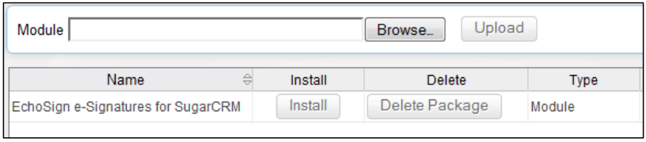
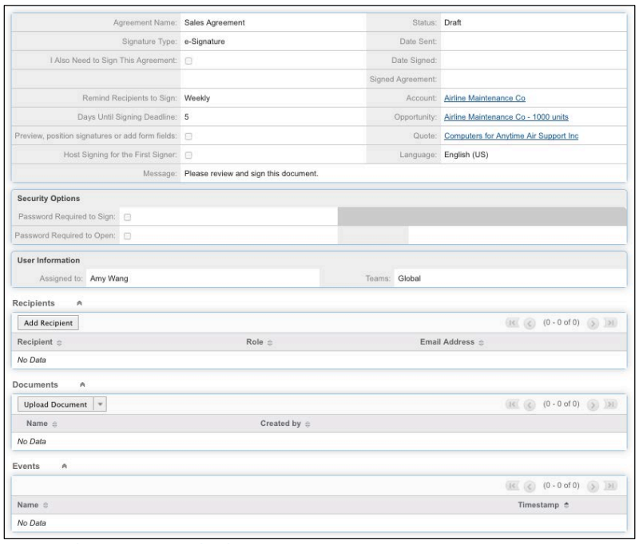

# [!DNL SugarCRM]  安裝指南 {#sugarcrm-install-guide}

[連絡客戶服務](https://adobe.com/go/adobesign-support-center_tw)

Adobe [!DNL EchoSign] [!DNL SugarCRM] 是領先業界的電子簽名和網頁合約解決方案， [!DNL SugarCRM] 可針對電子簽名和傳真簽名提供電子簽名自動化。 使用者可以直接從 這些帳戶和產品中傳送合約、檢視合約記錄，以及儲存包含相關帳戶、連絡人、報價等的 eSigned 合約。Adobe [!DNL EchoSign] [!DNL SugarCRM] 適用于所有受支援的 3.3 - 6.7 版，適用于隨選或內部部署解決方案。

本檔是 [!DNL SugarCRM] 管理員瞭解如何安裝和設定增效模組Adobe [!DNL EchoSign] [!DNL SugarCRM] 指南。

## 安裝此增效模組 {#install-plugin}

1. 從「格外引標籤」清單中取得 [!DNL EchoSign] [!DNL SugarCRM]  封存檔案的  Adobe。
1. 使用 [!DNL SugarCRM] 您的管理員帳戶登入。
1. 前往 **[!UICONTROL 「管理]** 」> **[!UICONTROL 模組載入器]** 。

   

1. 若要上傳外掛程式Adobe的封存檔案 [!DNL EchoSign] [!DNL SugarCRM] ，請選取 **[!UICONTROL 「流覽]** 」，然後選擇封存檔案，然後選取「 **[!UICONTROL 上傳]** 」。
1. 上傳封存檔案後，選取「 **[!UICONTROL 安裝]** 」即可開始安裝。
1. 檢閱條款與條件，然後選取「 **[!UICONTROL 接受]** > **[!UICONTROL 修訂]** 」。
1. 如果外掛程式安裝成功，進度列會顯示 100% 成功。  如果進度列未達到 100%，請選取 **[!UICONTROL 「顯示記錄」]** 以查看在 100 度選單中發生的錯誤。

   

1. 安裝後，前往 **[!UICONTROL 「管理>修復]** 」，然後選取 **[!UICONTROL 「快速修復和重建]** 」。

>[!NOTE]
>
>如果您要在 OnDemand 上安裝外掛程式 [!DNL SugarCRM] ，請提交支援票證， [!DNL SugarCRM] 以便暫時移除 OnDemand 套件檢視窗的限制，以便安裝套件。 這是標準程式的一部分。

## 升級增效模組 {#upgrade-plugin}

如果要將增效模組的Adobe更新 [!DNL EchoSign] [!DNL SugarCRM] 為較新版本，請先安裝該增效模組，而不需卸載舊版。升級增效模組後，前往 **[!UICONTROL 「管理]** > **[!UICONTROL 修復]** 」，然後選取 **[!UICONTROL 「快速修復和重建]** 」。

**注意：** 如果您卸載先前的增效模組，請勿在卸載期間移除表格。 否則，您可能會遺失 [!DNL EchoSign] 合約資料。

## 設定增效模組 {#configure-plugin}

1. 如果您已是Adobe [!DNL EchoSign] 客戶，請繼續執行步驟 2。

   如果您沒有 [!DNL EchoSign] 帳戶， [ 請註冊 14 天免費試用 ](https://sugarcrmintegration.echosign.com/public/login) ，並依照線上註冊步驟啟用您的Adobe [!DNL EchoSign] 帳戶。
1. 登入 [ Echo Sign 帳戶 ](http://www.echosign.com) 並依照下列步驟操作：
   1. 選取 **[!UICONTROL 「帳戶]** 」索引標籤。
   1. 選 **[!UICONTROL 取]** 左下角的「EchoSign API」。
   1. 選 **[!UICONTROL 取「啟用API存取]** 」，然後從頁面取得API鍵。

   

1. 在「小插字調整」中，前往「 **[!UICONTROL 管理]** >Adobe EchoSign設定」，然後 **** 在標示為「EchoSign API 鍵」的欄位中輸入 **[!UICONTROL API鍵]** 。
1. 您也可以選擇使用下列設定來設定外掛程式：

   1. 從引號建立合約時自動附加 PDF：如果 [!DNL SugarCRM] 使用者從「引號」模組建立 EchoSign 合約，請選擇是否要自動附加引號的 PDF。
   1. 管理收件者清單：選取「合約」模組中「收件者」子面板中顯示的 [!DNL EchoSign] 模組。 這也會將「 [!DNL EchoSign] 合約」子面板新增至這些模組。
   1. 將傳送按鈕新增至這些模組：選取是否要將「報價」 [!DNL EchoSign] 模組的主要動作包含「建立合約」按鈕/動作。
   1. 選 **[!UICONTROL 取「]** 儲存」以儲存設定。

**注意：** 增效模組 [!DNL EchoSign] 的Adobe [!DNL SugarCRM] 需要 [ PHP SOAP 擴充功能 ](http://www.php.net/manual/en/book.soap.php) 。 若要啟用 SOAP 支援，請使用 enable-soap 設定 PHP。

## 取得合約更新 （ [!DNL SugarCRM] 適用于 6.3 版或更新版本） {#get-agreement-updates}

對於 6.3 版和更新版本，您可以使用下列兩個選項來取得合約更新。 在舊版的 ProxyCRM 中，預設的增效模組僅提供回呼方法 （Option 1）。

### 選項 1：設定將更新推入 EchoSign 的回呼方法

如果您的網站是公開的，您可以Adobe EchoSign [!DNL SugarCRM] 在發生新事件時偵測您的實例。 [!DNL SugarCRM] 然後自動即時更新合約狀態、事件，並下載已簽署的檔 （如果已簽署）。 （如果您是防火牆的後方，則需要將伺服器 IP 位址加入白名單 [!DNL EchoSign] ，或使用「排程的工作」方法來更新本指南下一節所述的 EchoSign 合約）。

1. 前往 **[!UICONTROL 「管理]** **[!UICONTROL >Adobe EchoSign設定]** 」。
1. 勾選「 **[!UICONTROL 使用 EchoSign 回呼方法]** 更新合約的事件和狀態」核取方塊。
1. 選取 **[!UICONTROL 「儲存]** 」。

### 選項 2：為 [!DNL SugarCRM] 防火牆後的實例設定排程工作

[!DNL EchoSign]增 [!DNL SugarCRM] 效模組也可以使用「排程工作」查詢已 [!DNL EchoSign] 傳出進行簽署之合約的更新。如果您的內部 [!DNL SugarCRM] 部署安裝位於防火牆後方，可使用排程的工作查詢方法。

若要設定：

1. 前往 **[!UICONTROL 「管理]** > **[!UICONTROL 排程器]** 」。
1. 從索引標籤下拉式選單中，選取「 **[!UICONTROL 建立排程器]** 」。
1. 輸入工作名稱。
1. 在「工作」欄位中，選 **[!UICONTROL Adobe EchoSign狀態更新程式]** 」。
1. 將工作設定為視需要經常執行。 我們建議將合約設定為每 10 分鐘執行一次，也就是說，開啟、讀取或簽署合約後，更新時可能需要最多 10 分鐘 [!DNL SugarCRM] 。

   **注意：** 如果您有許多合約需要簽署，經常執行可能會導致系統變慢。

   

1. 前往 **[!UICONTROL 「管理]** **[!UICONTROL >Adobe EchoSign設定]** 」。
1. 取消勾選 **[!UICONTROL 「使用 EchoSign 回呼方法]** 更新合約的事件和狀態」方塊。
1. 選取 **[!UICONTROL 「儲存]** 」。注意：開啟排程器 [!DNL SugarCRM] 即可使用此功能。

若要將 EchoSign 合約新增至其他 [!DNL SugarCRM] 模組：

1. 前往 **[!UICONTROL 管理]** > **** Studio。
1. 從左欄資料夾樹狀結構中，選取新增合約的模組 [!DNL EchoSign] 。
1. 選 **** 取「關係」> **[!UICONTROL 新增關係]** 。
1. 從下拉式選單中，選取「類型為 **[!UICONTROL 一到多]** 」，將「模組」選取為 **[!UICONTROL 「EchoSign 合約]** 」。
1. 選取 **[!UICONTROL 「儲存和部署]** 」。

   

   [!DNL EchoSign] 合約現在會出現在模組中，並且可以在此建立和追蹤合約。

   

**其他設定步驟**

* **隱藏 [!DNL EchoSign] 模組：您可以前往「管理 」 – 「顯示模組索引標籤」** [!DNL EchoSign] 和「子面板」，將「收件者」和「事件」模組移至隱藏欄，藉此隱藏「收件者」 [!DNL EchoSign] 和「事件」模組。
* **停用套件掃描** ：如果您已在自己的系統上啟用套件，則需要在安裝期間停用它。 如果您使用 [!DNL SugarCRM] 「隨選」，請聯絡 [!DNL SugarCRM] 支援人員以停用 PackageScan。

## 卸載增效模組 {#uninstall-plugin}

1. 使用 [!DNL SugarCRM] 您的管理員帳戶登入。
1. 前往 **[!UICONTROL 「管理]** 」> **[!UICONTROL 模組載入器]** 。
1. 選取 **** [!UICONTROL  EchoSign for SiliconCRM 增效模組旁的「卸載 ] 」。
1. 選 **[!UICONTROL 取「確認]** 」以開始卸載。 您也可以選取以移除為外掛程式建立的資料庫表格。

   

   如果外掛程式成功卸載，進度列將表示 100% 成功。 如果進度列未達到 100%，請選取 [!UICONTROL  「顯示記錄」 ] 以查看在 100 度選單中發生的錯誤。

   

## 將Adobe [!DNL EchoSign] 用於 [!DNL SugarCRM] {#use-echosign-for-sugarcrm}

您可以建立 [!DNL EchoSign] 與帳戶、連絡人、報價或其他模組相關聯的Adobe [!DNL SugarCRM] 合約。 您可以附加檔案、指定收件者，以及傳送以供簽署。 Adobe [!DNL EchoSign] 以 [!DNL SugarCRM] 合約的目前狀態進行更新，並在 [!DNL SugarCRM] 合約完整執行後儲存已簽署的合約。

### 建立和編輯Adobe [!DNL EchoSign] 合約 {#create-edit-agreements}

您可以透過「合約」 [!DNL EchoSign] 模組或透過管理員設定的模組建立「 [!DNL SugarCRM] 合約」。

1. 從 [!UICONTROL  「EchoSign 合約」標籤上的「動作 ] 」清單  中，選取「 **[!UICONTROL 建立 EchoSign 合約]** 」。
1. 在合約的主要區段中 [!DNL EchoSign] ，輸入下列資訊或從各種合約選項中選取：

   1. **[!UICONTROL 名稱：]** 輸入合約的名稱。
   1. **[!UICONTROL 簽名類型：]** 選取檔接受的簽名類型。 這些選項包括電子簽名和傳真簽名。
   1. **[!UICONTROL 我也需要簽署這份合約：]** 指示傳送者是否也需要簽署合約。
   1. **[!UICONTROL 簽名順序：]** 如果勾選了上一個「我也需要簽署此合約」選項，則也請選取傳送者和收件者應簽署的順序。
   1. **[!UICONTROL 提醒收件者簽署：]** 選取提醒收件者簽署檔的頻率。 選項為「每日」或「每週」。
   1. **[!UICONTROL 「簽署截止日期前天數」：]** 指定必須簽署合約的天數。
   1. **[!UICONTROL 預覽、定位簽名或新增表單欄位：]**  選取此選項可在傳送合約之前預覽合約，或是在傳送給收件者之前，將簽名欄位、縮寫簽名欄位或其他表單欄位拖放到合約上。 在預覽檔或拖曳您想要放在檔上的欄位後，請記得選取「傳送」按鈕以傳送合約給收件者。
   1. **[!UICONTROL 代管第一位簽署]** 者的簽署：指示傳送者是否要當面代管合約簽署。
      * **[!UICONTROL 訊息：]** 包含給收件者的訊息。
      * **[!UICONTROL 帳戶、機會、報價：]** 選取或修改與此合約相關聯的「帳戶」、「機會」或「報價」。
      * **[!UICONTROL 語言：]** 指定簽署頁面和電子郵件通知顯示給收件者的語言。

      

1. 在 [!UICONTROL  EchoSign 合約的「安全性選項」 ] 區段中  ，輸入下列資訊：

   a） **[!UICONTROL 需要密碼才能簽署：]** 指示收件者是否必須輸入密碼才能簽署檔。b） **[!UICONTROL 開啟所需的密碼：]** 指示收件者是否必須輸入密碼才能開啟合約或已簽署的合約 PDF
c） **[!UICONTROL 密碼：]** 指定用來簽署或開啟檔的密碼。d） **[!UICONTROL 確認密碼：]** 確認用來簽署或開啟檔的密碼。

1. 在合約的其他區段中 [!DNL EchoSign] ，輸入下列資訊：

   a） **[!UICONTROL 使用者：]** 指定 [!DNL SugarCRM] 使用者。 預設值為使用者目前登入系統。b） **[!UICONTROL 團隊：]** 若要變更主要團隊指派，請輸入新的主要團隊名稱。 若要為記錄指派其他團隊，請按一下「 **[!UICONTROL 選取]** 」並從「團隊清單」選取團隊，或選取「 **[!UICONTROL 新增]** 」以新增團隊欄位並輸入團隊名稱。 如需詳細資訊，請參閱應用程式指南中的「將記錄指派給使用者和團隊 [!DNL SugarCRM] 」。

1. 選取 **[!UICONTROL 「儲存]** 」。

### [!DNL EchoSign] 合約詳細資訊檢視 {#agreement-detail-view}

[!DNL EchoSign]儲存合約後，合約的「細節檢視」包含下列子面板：

* **[!UICONTROL 收件者：]** 此子面板中列出的任何連絡人，都能收到在「檔」子面板中指定的檔。 您必須在傳送合約之前新增一或多位收件者。
* **[!UICONTROL 檔：]** 上傳新檔或選取已上傳至檔 [!DNL SugarCRM] 以傳送以供簽署。
* **[!UICONTROL 事件：]** 此子面板會列出與合約有關的任何動作，例如傳送以供簽署、檢視或簽署的合約。若要編輯 [!DNL EchoSign] 合約，請選取合約「  細節檢視」上的「編輯」按鈕  。

**注意：** 傳送合約以供簽署後，「 [!UICONTROL  細節檢視」中的「編輯」 ] 按鈕會移除，以保留事件記錄。 不過，您可以啟用「編輯」按鈕。 若要這麼做，請移至 [!UICONTROL  「管理員 ] [!UICONTROL  >Adobe EchoSign設定」， ] 然後取消勾選「傳 *[!UICONTROL 送合約以索取簽名」選項，停用編輯或刪除功能]* 。

### 將檔新增至 [!DNL EchoSign] 合約 {#add-document}

[!DNL SugarCRM] 使用者可以上傳新檔，或使用 EchoSign 合約 [!DNL SugarCRM] 記錄的「檔」子面板，選取已上傳至的檔。若要上傳檔，請選取 **[!UICONTROL 「]** 檔」子面板中的「上傳 [!UICONTROL  檔 ] 」。

如需該表單個別欄位的詳細資訊，請參閱應用程式指南的「檔模組 [!DNL SugarCRM] 」區段。

若要選取檔，請按一下 **** 「檔」子面板中的「選取」。 如 [!DNL SugarCRM] 需如何在子面板中管理相關資訊的詳細資訊，請參閱應用程式指南中的「檢視和記錄管理資訊」。

### 指定合約的收件者 [!DNL EchoSign] {#specify-recipient}

1. 從合約的 [!UICONTROL  「收件者」 ] 子面板 [!DNL EchoSign] 中，選取「 **[!UICONTROL 新增收件者]** 」。
1. 輸入下列資訊：
a） [!UICONTROL  收件者： ] 從下拉式選單中選取收件者類型。 在文字欄位中輸入收件者的名稱或電子郵件地址。 [!DNL SugarCRM] 在輸入時查看名稱，並提供選取範圍清單。 如果找到符合的名稱，請選取名稱。 您也可以選取箭頭圖示，從彈出式視窗中選取名稱。 若要清除欄位中的名稱，請選取 **[!UICONTROL X]** 圖示。b） [!UICONTROL  角色： ] 從下拉式選單中選取角色。 這些選項包括「簽署者」、「副本」和「核准者」。 核准者不必簽署檔。
1. 選取「儲存」。

### 傳送合約以供簽署 {#send-for-signature}

當合約準備好傳送以供簽署時， **** 請從頁面左上方的下拉式選單中選取「傳送以供簽署」。 收件者接著會收到一封電子郵件，通知他們有待簽署的檔。 收件者簽署檔後，傳送者會收到電子郵件通知。如果 [!UICONTROL  核取「第一個簽署者主控簽署」 ] 選項，您可以選取「傳 **[!UICONTROL 送以供簽署]** 」，讓簽署者簽署有傳送者在場的檔。

**[!UICONTROL 「第一個簽署者」欄位的「]** 主控簽署」欄位旁邊也會出現「目前簽署者」的主控簽署連結  ，可在檔簽署前加以存取。您可以使用此連結代管多位簽署者的合約簽署，或在不小心關閉時重新開啟快顯視窗。如果 [!UICONTROL  核取「預覽」、「定位簽名或新增表單欄位」 ] 選項，請選取「 **[!UICONTROL 傳送以供簽署」，]** 讓傳送者能夠在傳送檔之前預覽檔或將欄位拖曳到檔上。 您必須在 **[!UICONTROL 該視窗中選取「傳]** 送」，才能將合約傳送給收件者。

圖 5：選取「傳送以供簽署」，將檔傳送給收件者以索取簽名。

### 從報價記錄傳送 {#send-from-quote-record}

Adobe [!DNL EchoSign] 與引號直接整合 [!DNL SugarCRM] ，系統會自動產生引號 PDF 並附加至合約記錄。檢視報價時，選取 **[!UICONTROL 「建立 EchoSign 合約」]** 以產生引號，並自動將引號附加至合約。 新合約也會自動建立任何相關「機會」、「帳戶」或「報價」的關聯。

若要關閉合約中引號 PDF 的自動附件，請前往 **** 「管理 **[!UICONTROL >Adobe EchoSign設定]** 」，然後取消勾選 *[!UICONTROL 「從報價建立合約時自動附加 PDF」方塊]* 。

### 取消合約 {#cancel-agreement}

[!DNL EchoSign]如果所有收件者尚未簽署檔，您可在傳送合約以索取簽名後取消合約。傳  送檔以供簽署後，合約的「細節檢視」中會顯示「取消合約」按鈕。 選 **[!UICONTROL 取「取消合約]** 」以取消合約。

注意：如果傳 [!DNL EchoSign] 送合約以供簽署，且記錄遭到刪除，您必須先取消合約，再將其刪除。

### 追蹤簽名 {#track-signatures}

合約 [!UICONTROL  的「事件」 ] 子面板 [!DNL EchoSign] 會追蹤傳送以供簽署的合約狀態。 若要查看合約的最新更新 [!DNL EchoSign] ，請選取「 **[!UICONTROL 更新狀態]** 」。  只有在傳送合約以供簽署後，才能使用「更新狀態」按鈕。

### 傳送提醒 {#send-reminders}

若要在傳送合約後傳送提醒給目前的簽署者，請選取「 **[!UICONTROL 傳送提醒]** 」。 系統會立即傳送電子郵件提醒給目前的簽署者，告知您有待簽署的合約。

