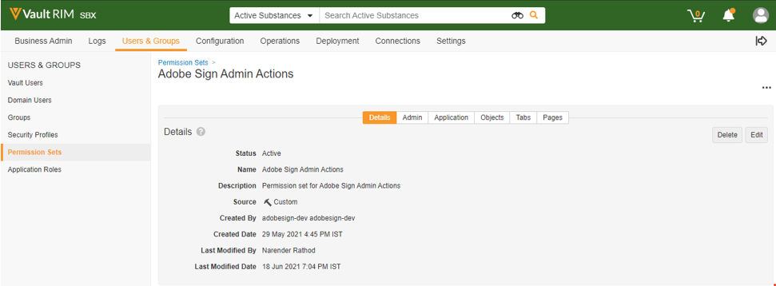

# [!DNL Veeva Vault] 安裝指南{#veeva-installation-guide}

[**連絡 Adobe Sign 支援人員**](https://adobe.com/go/adobesign-support-center_tw)

## 概覽 {#overview}

本檔說明如何與平臺建立Adobe Sign整合 [!DNL Veeva Vault] 。 [!DNL Veeva Vault] 是專為生命科學建立的企業內容管理 （ECM） 平臺。 「保存庫」是內容和資料存放庫，通常用於法規檔、研究報告、授予申請、一般合約等。 單一企業可以擁有多個需要單獨維護的「保存庫」。

完成整合的高階步驟包括：

* 在 Adobe Sign 中啟用您的管理帳戶 （僅限新客戶）
* 建立物件以追蹤保存庫中合約生命週期的記錄。
* 建立新的「安全性」描述檔。
* 在「Adobe Sign中設定「群組」以保持 [!DNL Veeva Vault] 整合使用者。
* 建立檔欄位和轉譯。
* 設定網頁動作並更新檔生命週期。
* 建立檔案類型使用者和使用者角色設定。

## 配置 [!DNL Veeva Vault]

為了與 Adobe Sign [!DNL Veeva Vault] 整合進行設定，我們會在保存庫中建立特定物件，協助追蹤合約生命週期的記錄。 管理員必須建立下列物件：

* 簽名
* 簽署
* 簽名事件
* 處理鎖

### 建立簽名物件  {#create-signature-object}

建立簽名物件以儲存合約相關資訊。 Signaure 物件是包含下列特定欄位下資訊的資料庫：

**簽名物件欄位**

| 欄位 | 標籤 | 輸入 | 描述 |
| --- | --- | ---| --- | 
| external_id__c | 合約 ID | 字串 （100） | 保持Adobe Sign唯一的合約 ID |
| file_hash__c | 檔案雜湊 | 字串 （50） | 在傳送給 Adobe Sign 的檔案中，保持 md5 chcksum |
| name__v | 姓名 | 字串 （128） | 包含合約名稱 |
| sender__c | 寄件者 | 物件 （使用者） | 保留已建立合約之保存庫使用者的參照 |
| signature_status__c | 簽名狀態 | 字串 （75） | 以Adobe Sign方式保留合約狀態 |
| signature_type__c | 簽名類型 | 字串 （20） | Adobe Sign中包含合約的簽名類型 （WRITTEN 或 ESIGN） |
| start_date__c | 開始日期 | DateTime | 傳送合約以供簽署的日期 |
| cancellation_date__c | 取消日期 | Datetime | 保留合約已取消的日期。 |
| completion_date__c | 完成日期 | Datetime | 保留合約完成的日期。 |
| viewable_rendition_used__c | 已使用的可檢視轉譯 | 布林值 | 標注，指出已傳送可檢視的轉譯以供簽署。 （預設為正確） |

### 建立簽署物件 {#create-signatory-object}

建立簽署物件以儲存合約中參與者的相關資訊。 其包含下列特定欄位下的資訊：

**簽署物件欄位**

| 欄位 | 標籤 | 輸入 | 描述 |
| --- | --- | ---| --- | 
| email__c | 電子郵件 | 字串 （120） | 保持Adobe Sign唯一的合約 ID |
| external_id__c | 參與者 ID | 字串 （80） | 持有Adobe Sign唯一參與者的識別碼 |
| name__v | 姓名 | 字串 （128） | 包含Adobe Sign參與者的名稱 |
| order__c | 順序 | 數字 | 包含Adobe Sign合約參與者的訂單編號 |
| role__c | 角色 | 字串 （30） | Adobe Sign合約參與者的角色 |
| signature__c | 簽名 | 物件 （簽名） | 包含簽名父記錄的參考資訊 |
| signature_status__c | 簽名狀態 | 字串 （100） | 保留Adobe Sign合約參與者的狀態 |
| user__c | 使用者 | 物件 （使用者） | 如果參與者是保存庫使用者，則參照簽署者的使用者記錄 |

### 建立簽名事件物件  {#create-signature-event}

系統會建立「簽署事件」物件，以儲存合約的事件相關資訊。 其包含下列特定欄位下的資訊：

| 欄位 | 標籤 | 輸入 | 描述 |
| --- | --- | ---| --- | 
| acting_user_email__c | 有效使用者的電子郵件 | 字串 | Adobe Sign執行導致產生事件的動作的使用者電子郵件 |
| acting_user_name__c | 代理使用者名稱 | 字串 | 包含執行導致產生事件之動作的Adobe Sign使用者的名稱 |
| description__c | 描述 | 字串 | 包含Adobe Sign事件說明 |
| event_date__c | 事件日期 | Datetime | 保留Adobe Sign事件的日期和時間 |
| event_type__c | 事件種類 | 字串 | 包含Adobe Sign事件種類 |
| name__v | 姓名 | 字串 | 自動產生的事件名稱 |
| participant_comment__c | 參與者注釋 | 字串 | 如果有的話，請保留Adobe Sign參與者的注釋 |
| participant_email__c | 參與者電子郵件 | 字串 | Adobe Sign參與者的電子郵件 |
| participant_role__c | 參與者角色 | 字串 | Adobe Sign參與者的角色 |
| signature__c | 簽名 | 物件 （簽名） | 包含簽名父記錄的參考資訊 |

### 建立處理鎖物件  {#create-process-locker}

系統會建立 Process Locker 物件來鎖定Adobe Sign整合程式。 不需要任何自訂欄位。

## 建立安全性設定檔{#security-profiles}

若要成功整合保存庫，系統會建立名為 Adobe Sign Integration Profile 的新安全設定檔 ** ，並為 *Adobe Sign管理員動作設定許可權* 。 Adobe Sign整合設定檔會指派給系統帳戶，並會在呼叫保存 API 時由整合使用。 此描述檔允許下列許可權：

* 保存 API
* 閱讀、建立、編輯和刪除：簽名、簽署者、簽名事件和處理鎖物件

所有需要存取「保存庫」Adobe Sign記錄的使用者安全設定檔，都必須具有「簽名」、「簽署者」和「簽名事件」物件的「讀取」許可權。

## 建立群組 {#create-group}

若要設定 [!DNL Vault] Adobe Sign，系統會 *建立名為「Adobe Sign Admin Group」的新群組* 。 此群組是用來為Adobe Sign相關欄位設定檔欄位層級安全性， *且預設應包含 Adobe Sign 整合* 描述檔。

## 建立使用者 {#create-user}

Adobe Sign整合的保存庫系統帳戶使用者必須：

* 擁有Adobe Sign整合描述檔
* 有安全性設定檔
* 具有停用密碼過期的特定安全性策略
* 成為 Adobe Sign 管理員群組的成員。

若要確保系統帳戶使用者屬於特定檔生命週期的「Adobe Sign管理員群組」，您必須建立「使用者角色設定」記錄。

## 建立應用程式角色 {#create-application-roles}

您必須建立名為 *「Adobe Sign管理員角色」的應用程式角色* 。 此角色必須在每個符合Adobe簽名資格的檔案類型的生命週期中定義。 針對每個Adobe Sign特定的生命週期狀態，Adobe Sign管理員角色皆可使用適當的許可權新增和設定。

## 建立檔欄位 {#create-fields}

若要與 Adobe Sign 建立整合，管理員需要建立以下兩個新的共用文件欄位：

* 簽名 （signature__c）
* 允許Adobe Sign使用者動作 （allow_adobe_sign_user_actions__c）

這些共用欄位必須新增至所有符合Adobe簽名資格的檔案類型。 這兩個欄位皆應具有特定安全性，僅允許「Adobe Sign管理員群組」的成員更新其值。

管理員必須新增現有的共用欄位 *「停用保存保存覆迭」（disable_vault_overlays__v），* 並將其設為所有符合「Adobe簽名」資格的檔案類型「作用中」。 您也可以選擇使用特定安全性，僅允許Adobe Sign管理員群組的成員更新其值。

## 建立檔轉譯 {#create-renditions}

管理員必須建立名為 Adobe Sign 轉譯 （adobe_sign_rendition__c） 的新轉譯類型 ** ，此類型由保存整合使用來將已簽署的 PDF 檔上傳至Adobe Sign。 針對每個符合Adobe簽名資格的檔案類型，應宣告Adobe Sign轉譯。

## 設定網頁動作 {#web-actions}

Adobe Sign和保存庫整合要求您按照兩個網頁動作建立和設定：

* **建立** Adobe Sign：建立或顯示Adobe Sign合約。

   類型：檔
目標：在保存庫中顯示
URL： <https://{integrationDomain}/adobe-sign-int/signature?docId=${Document.id}&majVer=${Document.major_version_number__v}&minVer=${Document.minor_version_number__v}&sessionId=${Session.id}&vaultId=${Vault.Id> }

* **取消** Adobe Sign：會在Adobe Sign中取消現有的合約，並將檔的狀態還原為初始合約。

   類型：檔
目標：在保存庫中顯示
URL： <https://{integrationDomain}/adobe-sign-int/cancel?docId=${Document.id}&majVer=${Document.major_version_number__v}&minVer=${Document.minor_version_number__v}&sessionId=${Session.id}&vaultId=${Vault.Id> }

## 更新檔生命週期 {#document-lifecycle}

針對每個符合Adobe簽名資格的檔案類型，對應的檔生命週期必須新增生命週期角色和狀態來進行更新。

### 生命週期角色 {#lifecycle-role}

Adobe Sign必須將管理員應用程式角色新增到符合Adobe簽名資格的檔所使用的所有生命週期中。 應使用下列選項建立此角色：

* 啟用動態存取控制
* 只包含「檔案類型群組」的檔共用規則

### 生命週期狀態 {#lifecycle-states}

Adobe Sign合約生命週期具有下列狀態：

* 草案
* 編寫或DOCUMENTS_NOT_YET_PROCESSED
* OUT_FOR_SIGNATURE或OUT_FOR_APPROVAL
* 已簽署或核准
* 已取消
* 已過期

將保存檔傳送給Adobe Sign時，其狀態應對應至合約的狀態。 在符合Adobe簽名資格的檔所使用的每個生命週期中新增下列狀態，即可完成此步驟：

* **在Adobe簽署之前** （已審核）：這是可傳送檔至Adobe Sign狀態的預留位置名稱。 根據檔案類型，檔案類型可以是「草稿」狀態或「已審核」。 檔狀態標籤可根據客戶需求自訂。 在Adobe簽署狀態之前，必須先定義下列兩個使用者動作：

   * 將檔狀態變更為「在 *草稿中Adobe Sign* 狀態的動作。 對於任何生命週期的所有檔案類型，此使用者動作的名稱必須相同。 如果需要，此動作的標準可以設定為「允許Adobe Sign使用者動作等於是。
   * 稱為「網路動作」的「Adobe Sign」動作。 這個狀態必須具備可讓Adobe Sign管理員角色：檢視檔、檢視內容、編輯欄位、編輯關係、下載來源、管理可檢視轉譯，以及變更狀態。

   

* **在「草稿Adobe Sign** 中：這是狀態的預留位置名稱，表示檔已上傳至Adobe Sign，且其合約處於「草稿」狀態。 這是必要的狀態。 此狀態必須為下列五個使用者動作加以凹陷：

   * 將檔狀態變更為「 *在編寫Adobe Sign* 狀態的動作。 對於任何生命週期的所有檔案類型，此使用者動作的名稱必須相同。 如果需要，此動作的標準可以設定為「允許Adobe Sign使用者動作等於是。
   * 將檔狀態變更為「 *在簽署Adobe狀態的動作* 。 對於任何生命週期的所有檔案類型，此使用者動作的名稱必須相同。 如果需要，此動作的標準可以設定為「允許Adobe Sign使用者動作等於是。
   * 將檔狀態變更為 *「已取消」狀態Adobe Sign* 動作。 對於任何生命週期的所有檔案類型，此使用者動作的名稱必須相同。 如果需要，此動作的標準可以設定為「允許Adobe Sign使用者動作等於是。
   * 稱為「網頁動作」的動作「Adobe Sign」。
   * 稱為「取消Adobe Sign」網頁動作。 這個狀態必須具備可讓Adobe Sign管理員角色：檢視檔、檢視內容、編輯欄位、編輯關係、下載來源、管理可檢視轉譯，以及變更狀態。

   

* **在「Adobe Sign編寫」中** ：這是狀態的預留位置名稱，表示檔已上傳至Adobe Sign，且其合約處於 AUTHORING 或DOCUMENTS_NOT_YET_PROCESSED狀態。 這是必要的狀態。 此狀態必須已定義下列四個使用者動作：

   * 將檔狀態變更為「已取消」狀態Adobe Sign動作。 無論生命週期如何，此使用者動作的名稱對所有檔案類型都必須相同。 如果需要，此動作的標準可以設定為「允許Adobe Sign使用者動作等於是。
   * 將檔狀態變更為「在簽署Adobe狀態的動作。 無論生命週期如何，此使用者動作的名稱對所有檔案類型都必須相同。 如果需要，此動作的標準可以設定為「允許Adobe Sign使用者動作等於是。
   * 稱為「網路動作」的動作「Adobe Sign」
   * 稱為「取消Adobe Sign」網頁動作。 這個狀態必須具備可讓Adobe Sign管理員角色：檢視檔、檢視內容、編輯欄位、編輯關係、下載來源、管理可檢視轉譯，以及變更狀態。

   

* **在Adobe簽署中** ：這是狀態的預留位置名稱，表示檔已上傳至Adobe Sign，且其合約已傳送給參與者 （OUT_FOR_SIGNATURE或OUT_FOR_APPROVAL狀態）。 這是必要的狀態。 此狀態必須已定義下列五個使用者動作：

   * 將檔狀態變更為「已取消」狀態Adobe Sign動作。 無論客戶的需求是什麼，此動作的目標狀態都可以是，但針對不同類型可能不同。 無論生命週期如何，此使用者動作的名稱對所有檔案類型都必須相同。 如果需要，此動作的標準可以設定為「允許Adobe Sign使用者動作等於是。
   * 將檔狀態變更為「已拒絕」狀態Adobe Sign動作。 無論客戶的需求是什麼，此動作的目標狀態都可以是，但針對不同類型可能不同。 無論生命週期如何，此使用者動作的名稱對所有檔案類型都必須相同。 如果需要，此動作的標準可以設定為「允許Adobe Sign使用者動作等於是。
   * 將檔狀態變更為Adobe已簽署狀態的動作。 無論客戶的需求是什麼，此動作的目標狀態都可以是，但針對不同類型可能不同。 但是，無論生命週期如何，此使用者動作的名稱對於所有檔案類型都必須相同。 如果需要，此動作的標準可以設定為「允許Adobe Sign使用者動作等於是。
   * 稱為「網頁動作」的動作 *Adobe Sign* 。
   * 稱為「網頁動作 *取消」的動作Adobe Sign* 。 這個狀態必須具備可讓Adobe Sign管理員角色：檢視檔、檢視內容、編輯欄位、編輯關係、下載來源、管理可檢視轉譯，以及變更狀態。

   

* **Adobe已簽署 （已核准）** ： 這是狀態的預留位置名稱，表示檔已上傳至Adobe Sign，且其合約已完成 （已簽署或已核准狀態）。 這是必要的狀態，並且可以是現有的生命週期狀態，例如核准。此狀態不需要使用者動作。 這個狀態必須具備安全性，才能讓Adobe Sign管理員角色：檢視檔、檢視內容和編輯欄位。

下圖說明Adobe Sign合約與保存檔狀態之間的對應，其中「簽署之前」狀態為「草稿」Adobe。

## 建立檔案類型群組和使用者角色設定  {#document-type-group-user-role}

### 建立檔案類型群組 {#create-document-type-group}

管理員需要建立名為「Adobe Sign檔」的新「檔案類型群組」記錄。 系統會針對所有符合Adobe Sign程式資格的檔分類新增此檔案類型群組。 由於檔案類型群組屬性不會從類型繼承為子類型，也不會從子類型繼承到分類層級，因此必須針對每個符合Adobe Sign資格的檔分類進行設定。

### 建立使用者角色設定 {#create-user-role-setup}

一旦正確設定生命週期，系統應確保 DAC 為所有符合Adobe Sign程式資格的檔新增Adobe Sign管理員使用者。 建立適當的「使用者角色設定」記錄可指定：

* 「檔案類型」群組做為「Adobe Sign檔」，
* 「Adobe Sign管理員角色」的應用程式角色，以及
* 整合使用者。

>[!NOTE]
>
>如果「使用者角色設定」物件未包含「檔案類型群組」物件所參照的欄位，則應新增此欄位。

## 套件部署生命週期 {#deployment-lifecycle}

### 一般部署生命週期 {#general-deployment}

**步驟 1.** 建立名為「Adobe Sign管理員角色」的新應用程式「角色」。

**步驟 2.** 建立名為「Adobe Sign檔」的新檔「類型群組」。

**步驟 3.** 部署套件。

**步驟 4.** 建立名為「Adobe Sign管理員群組」的新使用者管理群組。

**步驟 5.** 使用安全性描述檔「Adobe Sign整合描述檔」建立整合使用者設定檔，然後將其指派給Adobe Sign管理員群組。

**步驟 6.** 針對需要存取「保存庫」中Adobe Sign記錄的使用者，將所有安全性設定檔的讀取者許可權指派給「簽名」、「簽署者」和「簽名事件」物件。

**步驟 7.** 針對每個符合Adobe簽名資格的檔案類型，定義各檔案類型的Adobe Sign管理員角色。 針對每個Adobe Sign特定的生命週期狀態，系統會使用適當的許可權新增和設定此角色。

**步驟 8.** 針對每個符合Adobe簽名資格的檔案類型宣告Adobe Sign轉譯。

**步驟 9.** 針對每個符合Adobe簽名資格的檔案類型，新增生命週期角色和狀態以更新對應的檔生命週期。

**步驟 10。** 針對所有符合Adobe Sign程式資格的檔分類，新增名為「Adobe Sign檔」的檔案類型群組。

**步驟 11.** 所有設定完成後，系統應確保 DAC 為所有符合Adobe Sign程式資格的檔新增Adobe Sign管理員使用者。 建立適當的「使用者角色設定」記錄，將「檔案類型群組」指定為「Adobe Sign檔」、「應用程式角色」指定為「Adobe Sign管理員角色」，以及整合使用者，即可完成此作業。

### 特定部署生命週期 {#specific-deployment}

**步驟 1.** 建立名為「Adobe Sign管理員角色」的新應用程式角色。

**步驟 2.** 建立名為「Adobe Sign檔」的新「檔案類型」群組。

**步驟 3.** 部署套件。

**步驟 4.** 建立名為「Adobe Sign管理員群組」的新使用者管理群組。

**步驟 5.** 使用名為「Adobe Sign整合描述檔」的安全性描述檔建立一個整合使用者設定檔，並指派給 Adobe Sign Admin Group。
