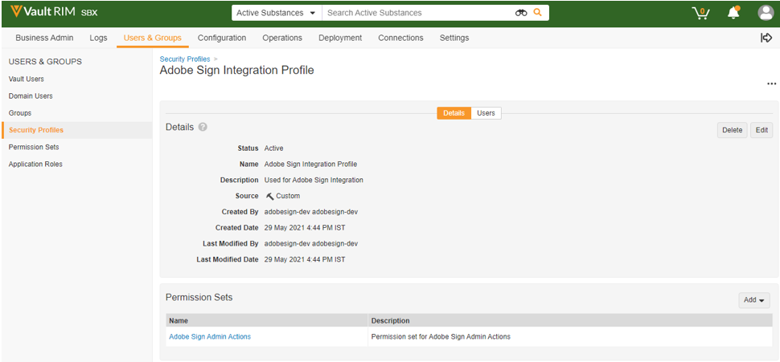
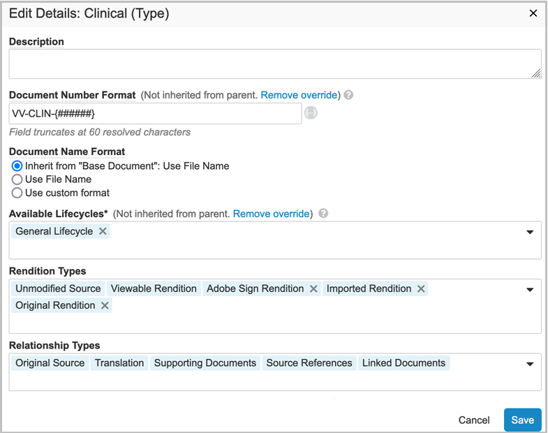
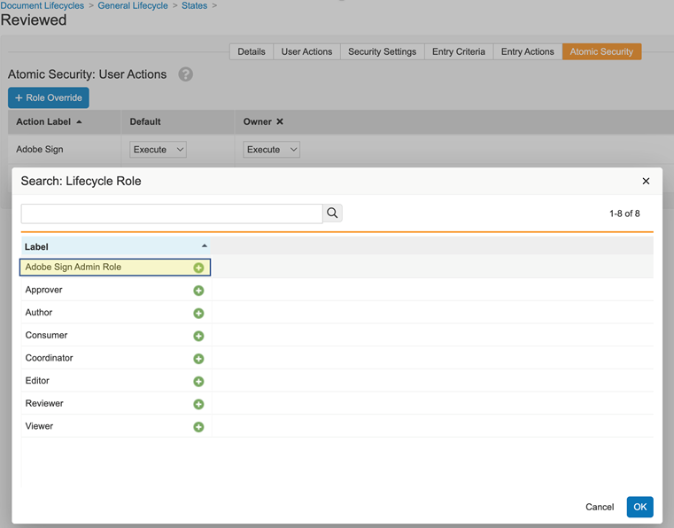
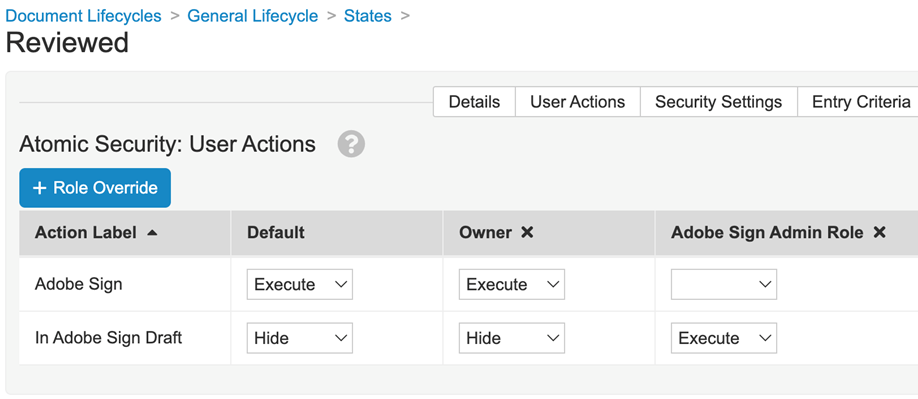
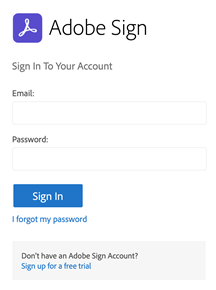

# [!DNL Veeva Vault] 安裝指南{#veeva-installation-guide}

[**連絡 Adobe Acrobat Sign 支援**](https://adobe.com/go/adobesign-support-center_tw)

## 概覽 {#overview}

本檔說明如何與 [!DNL Veeva Vault] 平臺建立 Adobe Acrobat Sign 整合。 [!DNL Veeva Vault] 是專為生命科學建立的企業內容管理 （ECM） 平臺。 「保存庫」是內容和資料存放庫，通常用於法規檔、研究報告、授予申請、一般合約等。 單一企業可以擁有多個必須單獨維護的「保存庫」。

完成整合的高階步驟包括：

* 在 Adobe Acrobat Sign 中啟用您的管理帳戶 （僅限新客戶）。
* 建立物件以追蹤保存庫中合約生命週期的記錄。
* 建立新的「安全性」描述檔。
* 在 Adobe Acrobat Sign 中設定群組以保持 [!DNL Veeva Vault] 整合使用者。
* 建立檔欄位和轉譯。
* 設定網頁動作並更新檔生命週期。
* 建立檔案類型使用者和使用者角色設定。
* 使用中間軟體將 Veeva Vault 連接至 Adobe Acrobat Sign。

>[!NOTE]
>
>Adobe Sign管理員必須在 Adobe Acrobat Sign 中執行「Adobe Acrobat簽署」設定步驟。

## 配置 [!DNL Veeva Vault] {#configure-veeva}

若要設定 [!DNL Veeva Vault] 與 Adobe Acrobat Sign 整合，您必須執行下列步驟。

### 步驟 1. 建立群組 {#create-group}

若要設定 Adobe Acrobat Sign， [!DNL Vault] 系統會建立一個名為 *「Adobe Sign管理員群組」的新群組* 。 此群組是用來為Adobe Acrobat Sign 相關欄位設定檔欄位層級安全性，且預設應包含 *Adobe Sign整合描述檔* 」。

### 步驟 2. 部署套件 {#deploy-package}

[部署套件 ](https://helpx.adobe.com/content/dam/help/en/PKG-AdobeSign-Integration.zip) 並依照步驟進行。 部署後，套件會建立：

* 自訂物件：簽名物件、簽署物件、簽名事件物件、處理鎖物件
* 簽名物件頁面版面配置
* 簽名事件物件頁面版面配置
* 簽署物件頁面版面配置
* Process Locker 物件頁面版面配置
* Adobe Sign整合工作記錄物件頁面版面配置
* Adobe Sign轉譯類型
* 原始轉譯類型
* 共用欄位signature__c
* Adobe Sign網頁動作
* 取消Adobe Sign網頁動作
* Adobe Sign管理員動作許可權集
* Adobe Sign整合描述檔安全性設定檔
* 管理員角色Adobe Sign應用程式角色
* 檔案類型群組「Adobe Sign檔」
* Adobe Sign整合工作記錄物件

#### 簽名物件 {#signature-object}

建立簽名物件以儲存合約相關資訊。 簽名物件是包含下列特定欄位下資訊的資料庫：

**簽名物件欄位**

| 欄位 | 標籤 | 類型 | 描述 |
| --- | --- | ---| --- | 
| external_id__c | 合約 ID | 字串 （100） | 包含 Adobe Acrobat Sign 唯一的合約 ID |
| file_hash__c | 檔案雜湊 | 字串 （50） | 按住已傳送至 Adobe Acrobat Sign 的檔案 md5 總和檢查碼 |
| name__v | 名稱 | 字串 （128） | 包含合約名稱 |
| sender__c | 寄件者 | 物件 （使用者） | 保留已建立合約之保存庫使用者的參照 |
| signature_status__c | 簽名狀態 | 字串 （75） | 在 Adobe Acrobat Sign 中保留合約狀態 |
| signature_type__c | 簽名類型 | 字串 （20） | Adobe Acrobat簽署 （WRITTEN 或 ESIGN） 中包含合約的簽名類型 |
| start_date__c | 開始日期 | DateTime | 傳送合約以供簽署的日期 |
| cancellation_date__c | 取消日期 | Datetime | 保留合約已取消的日期。 |
| completion_date__c | 完成日期 | Datetime | 保留合約完成的日期。 |
| viewable_rendition_used__c | 已使用的可檢視轉譯 | 布林值 | 標注，指出已傳送可檢視的轉譯以供簽署。 （預設為正確） |
| plugin_version__c | 增效模組版本 | 文字 （10） | 其用於允許適當處理在部署新版本 4.0 之前建立的所有合約。 注意：部署 4.0 自訂網頁應用程式版本後，每次建立簽名記錄時，此欄位會設定為 4.0。 |
| external_environment__c | 外部環境 | 文字 （20） | 保留Adobe Sign建立合約的環境名稱。 |

#### 簽署物件 {#signatory-object}

建立簽署物件以儲存合約中參與者的相關資訊。 其包含下列特定欄位下的資訊：

**簽署物件欄位**

| 欄位 | 標籤 | 類型 | 描述 |
| --- | --- | ---| --- | 
| email__c | 電子郵件 | 字串 （120） | 包含 Adobe Acrobat Sign 唯一的合約 ID |
| external_id__c | 參與者 ID | 字串 （80） | 「Adobe Acrobat簽署」唯一參與者的識別碼 |
| name__v | 名稱 | 字串 （128） | 包含 Adobe Acrobat Sign 參與者的名稱 |
| order__c | 順序 | 數字 | Adobe Acrobat簽署合約參與者的訂單編號 |
| role__c | 角色 | 字串 （30） | Adobe Acrobat簽署合約參與者的角色 |
| signature__c | 簽名 | 物件 （簽名） | 包含簽名父記錄的參考資訊 |
| signature_status__c | 簽名狀態 | 字串 （100） | 保留Adobe Acrobat簽署合約參與者的狀態 |
| user__c | 使用者 | 物件 （使用者） | 如果參與者是保存庫使用者，則參照簽署者的使用者記錄 |

#### 簽名事件物件 {#signature-event}

「簽名事件」物件是建立的，用來儲存合約的事件相關資訊。 其包含下列特定欄位下的資訊：

簽名事件物件欄位

| 欄位 | 標籤 | 類型 | 描述 |
| --- | --- | ---| --- | 
| acting_user_email__c | 有效使用者的電子郵件 | 字串 | 儲存執行導致產生事件之動作的 Adobe Acrobat Sign 使用者的電子郵件 |
| acting_user_name__c | 代理使用者名稱 | 字串 | 包含執行導致產生事件之動作的 Adobe Acrobat Sign 使用者名稱 |
| description__c | 描述 | 字串 | 包含 Adobe Acrobat Sign 事件的說明 |
| event_date__c | 事件日期 | Datetime | Adobe Acrobat簽署事件的日期和時間 |
| event_type__c | 事件種類 | 字串 | 包含 Adobe Acrobat Sign 事件種類 |
| name__v | 名稱 | 字串 | 自動產生的事件名稱 |
| participant_comment__c | 參與者注釋 | 字串 | 如果有的話，請保留 Adobe Acrobat Sign 參與者的注釋 |
| participant_email__c | 參與者電子郵件 | 字串 | 包含 Adobe Acrobat Sign 參與者的電子郵件 |
| participant_role__c | 參與者角色 | 字串 | 擁有 Adobe Acrobat Sign 參與者的角色 |
| signature__c | 簽名 | 物件 （簽名） | 包含簽名父記錄的參考資訊 |
| external_id__c | 外部 ID | 文字 （200） | 包含由 Adobe Sign 產生的合約事件識別碼。 |

#### 處理鎖物件 {#process-locker}

程式鎖物件會建立來鎖定 Adobe Acrobat Sign 整合程式。 不需要任何自訂欄位。

#### Adobe Sign整合工作記錄物件 {#task-log}

建立Adobe Sign整合任務記錄 （as_int_task_log__c）。 它是用來追蹤 AgreementsEventsSynchronizerJob 和 AgreementsEventsProcessingJob 執行的大量物件。AgreementsEventsSynchronizerJob：此工作可確保所有從Adobe Sign遺失的合約事件，皆可針對過去 N 天中于保存庫中建立的所有簽名，建立為「保存庫中作用中的簽名事件」。AgreementsEventsProcessingJob：此工作可確保所有具有有效簽名事件記錄的檔都會根據事件種類進行處理。

Adobe Sign整合工作記錄物件欄位

| 欄位 | 標籤 | 類型 | 描述 |
|---|---|---|---| 
| start_date__c | 開始日期 | Datetime | 工作開始日期 |
| end_date__c | 結束日期 | Datetime | 工作結束日期 |
| task_status__c | 工作狀態 | 挑選清單 | 保持工作狀態：完成 （task_completed__c） 失敗 （task_completed_with_errors__c） 失敗 （task_failed__c） |
| task_type__c | 任務類型 | 挑選清單 | 包含工作類型：合約事件同步 （agreements_events_synchronization__c） 合約事件處理 （agreements_events_processing__c） |
| messages__c | 訊息 | 長 （32000） | 包含工作訊息 |

做為部署套件一部分的簽名、簽署者、簽名事件、處理鎖和任務記錄物件預設會啟用「此物件的稽核資料變更」屬性。

**注意：** 您可以啟用稽核資料變更設定，在稽核記錄中進行保存庫擷取物件記錄資料變更。 此設定預設為關閉狀態。 啟用此設定並建立記錄後，您就無法再停用該設定。 如果此設定關閉且有記錄，則只有保存庫擁有者可以更新設定。

#### **顯示簽名物件的參與者和步驟記錄** {#display-participants-history}

做為部署套件一部分的簽名物件隨附「 [ 簽名詳細資訊頁面版面配置」 ](https://vvtechpartner-adobe-rim.veevavault.com/ui/#admin/content_setup/object_schema/pagelayout?t=signature__c&amp;d=signature_detail_page_layout__c) 。 「頁面版面配置」有「參與者」和「步驟記錄」區段。

* 「 *參與者* 」區段具有「相關物件」區段，設定後如下圖所示。

   

* 您可以編輯要針對參與者顯示的欄 （如下所示）。

   

* 「步驟 *記錄* 」區段具有「相關物件」區段，設定後如下圖所示。

   

* 您可以編輯「步驟記錄」要顯示的欄 （如下所示）。

   

#### **檢視參與者與Adobe Acrobat簽署檔的稽核記錄** {#view-participants-audit-history}

* 若要檢視「參與者」和「Adobe Acrobat簽署」檔的稽核記錄，請選取檔「Adobe簽名」區段中的連結。

   

* 開啟的頁面會顯示 Adobe Acrobat Sign 檔的「參與者」和「步驟記錄」，如下所示。

   

* 檢視簽名的稽核記錄，如下所示。

   

### 步驟 3. 設定安全性設定檔 {#security-profiles}

在步驟 2 中成功部署套件會建立Adobe Sign整合設定檔。 Adobe Sign整合設定檔會指派給系統帳戶，並會在呼叫保存 API 時由整合使用。 此描述檔允許下列許可權：

* 保存 API
* 閱讀、建立、編輯和刪除：簽名、簽署者、簽名事件和處理鎖物件

您必須將包含的安全性描述檔設定為Adobe Sign整合描述檔」，以更新Adobe Sign管理員群組 （在步驟 1 中建立），如下圖所示。

### 步驟 4. 建立使用者 {#create-user}

Adobe Acrobat Sign 整合的保存庫系統帳戶使用者必須：

* 擁有Adobe Sign整合描述檔
* 有安全性設定檔
* 具有停用密碼過期的特定安全性策略
* 成為 Adobe Sign 管理員群組的成員。

若要這麼做，請依照下列步驟操作：

1. 建立 Adobe Acrobat Sign 整合的保存庫系統帳戶使用者。

   

2. 將使用者新增至「Adobe Sign管理員群組」。

   

### 步驟 5. 設定檔案類型群組 {#create-document-type-group}

部署 Adobe Acrobat Sign 套件時，它會建立名為「Adobe Sign檔」的檔案類型群組記錄。

您必須針對所有符合 Adobe Acrobat Sign 程式資格的檔分類新增此檔案類型群組。 由於檔案類型群組屬性不會從類型繼承為子字元，也不會從子類型繼承到分類層級，因此必須針對每個符合 Adobe Acrobat Sign 資格的檔分類進行設定。

**注意：** 如果「使用者角色設定」物件未包含參照「檔案類型群組」物件的欄位，則必須新增欄位。 若要這麼做，請移至 **[!UICONTROL 「物件]** > **[!UICONTROL 使用者角色設定]** 」> **[!UICONTROL 欄位]** ，並完成必要的步驟，如下圖所示。

### 步驟 6. 建立使用者角色設定 {#create-user-role-setup}

在正確設定生命週期後，系統應確保 DAC 新增Adobe Sign管理員使用者，以處理所有符合 Adobe Acrobat Sign 程式資格的檔。 建立適當的「使用者角色設定」記錄可指定：

* Adobe Sign檔案類型群組
* Adobe Sign管理員角色的應用程式角色
* 整合使用者

### 步驟 7. 設定檔欄位 {#create-fields}

套件部署會根據建立整合所需的新共用檔欄位建立：

* 簽名 （signature__c）

若要設定檔欄位：

1. 前往「設定」索引標籤，然後選 **[!UICONTROL 取「共用欄位>**[!UICONTROL  檔 ]**欄位」]** 。
1. 在「顯示區段」欄位中，選取「 **[!UICONTROL 建立顯示區段]** 」，然後將「Adobe簽名 ]**」指派**[!UICONTROL  為「區段」標籤。

   

1. 對於共用的檔欄位 （signature__c），請更新「UI」區段，並以 **[!UICONTROL 「Adobe簽名]** 」作為區段標籤。
1. 將兩個共用欄位新增至所有符合Adobe Acrobat簽名資格的檔案類型。 若要這麼做，請在「基本檔」頁面中，選 **[!UICONTROL 取右上角的「新增]** > **[!UICONTROL 現有共用欄位]** 」。

   

   

   

1. 這兩個欄位都必須具有特定安全性，僅允許「Adobe Sign管理員群組」的成員更新其值。

   

停用保存覆蓋 （disable_vault_overlays__v） 是現有的共用欄位。 您也可以選擇使用特定安全性，僅允許Adobe Sign管理員群組的成員更新其值。

### 步驟 8. 宣告檔轉譯 {#declare-renditions}

「保存庫」整合使用名為 *「Adobe Sign轉譯」（adobe_sign_rendition__c）* 的新轉譯類型，將已簽署的 PDF 檔上傳至 Adobe Acrobat Sign。 您必須針對每個符合Adobe Acrobat簽名資格的檔案類型宣告Adobe Sign轉譯。

「保存庫」整合使用名為 *「原始轉譯」（original_rendition__c）* 的新轉譯類型作為轉譯的名稱，如果已簽署的檔讀入為可檢視的轉譯，則該轉譯應該用來儲存原始可檢視的轉譯。

### 步驟 9. 更新網頁動作 {#web-actions}

Adobe Acrobat Sign 和保存庫整合，您必須執行以下兩個網頁動作來建立和設定：

* **建立Adobe Sign** ：建立或顯示Adobe Acrobat簽署合約。

   類型：檔
目標：在保存庫中顯示
認證：透過「貼文訊息」啟用會話後認證
URL： <https://api.na1.adobesign.com/api/gateway/veevavaultintsvc/partner/agreement?docId=${Document.id}&majVer=${Document.major_version_number__v}&minVer=${Document.minor_version_number__v}&vaultid=${Vault.id}&useWaitPage=true>

   

* **取消Adobe Sign** ：會取消 Adobe Acrobat Sign 中現有的合約，並將檔的狀態還原為初始合約。

   類型：檔
目標：在保存庫中顯示
認證：透過「貼文訊息」啟用會話後認證
URL：： <https://api.na1.adobesign.com/api/gateway/veevavaultintsvc/partner/agreement/cancel?docId=${Document.id}&majVer=${Document.major_version_number__v}&minVer=${Document.minor_version_number__v}&vaultid=${Vault.id}&useWaitPage=true>

   

### 步驟 10. 更新檔生命週期 {#document-lifecycle}

針對每個符合「Adobe簽名」的檔案類型，您必須新增生命週期角色和狀態，以更新對應的檔生命週期。

Adobe Acrobat Sign 合約生命週期具有下列狀態：

* 草案
* 編寫或DOCUMENTS_NOT_YET_PROCESSED
* OUT_FOR_SIGNATURE或OUT_FOR_APPROVAL
* 已簽署或核准
* 已取消
* 已過期

若要更新檔生命週期，請依照下列步驟操作：

1. 新增生命週期角色。 Adobe Sign管理員應用程式角色必須新增到符合Adobe Acrobat簽名資格的檔所使用的所有生命週期中，如下所示。

   

   管理員角色的建立應有下列選項：

   * 已啟用「動態存取控制」。
   * 檔共用規則只包含「檔案類型群組」，如下圖所示。

   

2. 建立生命週期狀態。 若要這麼做，請前往 **[!UICONTROL 「設定]** >設定 ]**>**[!UICONTROL  檔生命週期」> **[!UICONTROL 「**[!UICONTROL  一般生命週期 ]**]** 」> **[!UICONTROL 狀態]** > **[!UICONTROL 建立」]** 。接下來，建立下列狀態：

   * 在「草稿Adobe Sign中

   

   * 在「Adobe Sign製作」中

   

   * 在「簽署Adobe中

   

3. 將「使用者動作」新增至下列狀態。

   將保存檔傳送至 Adobe Acrobat Sign 時，其狀態應對應至合約的狀態。 若要這麼做，請在符合Adobe簽名資格的檔所使用的每一個生命週期中新增以下狀態：

   * **在Adobe簽署** 之前 （已審核）：這是可傳送檔至 Adobe Acrobat Sign 狀態的預留位置名稱。 根據檔案類型，檔案類型可以是「草稿」狀態或「已審核」。 檔狀態標籤可根據客戶需求自訂。 在Adobe簽署狀態之前，必須先定義下列兩個使用者動作：

      * 將檔狀態變更為 *「在草稿* 中Adobe Sign狀態的動作。 對於任何生命週期的所有檔案類型，此使用者動作的名稱必須相同。
      * 稱為「網頁動作」的「Adobe Sign」動作。 這個狀態必須具備可讓Adobe Sign管理員角色：檢視檔、檢視內容、編輯欄位、編輯關係、下載來源、管理可檢視轉譯，以及變更狀態。

      

      * 「修改 *檢閱* 狀態基本安全性」，將其「 *在「Adobe Sign草稿* 」中設為「隱藏」，且僅限「為 *Adobe Sign管理員角色執行」* 。
      **注意：** 如果 *Adobe Sign管理員角色* 不屬於 *「基本安全性：使用者動作* 」，請選 **[!UICONTROL 取「編輯]** > **[!UICONTROL 角色覆寫]** 」來新增 **[!UICONTROL Adobe Sign管理員角色]** 。接下來，新增 **「檢閱 *狀態」的Adobe Sign管理員角色*** 」。

      
      
      

   * **在「草稿** Adobe Sign中：這是狀態的預留位置名稱，表示檔已上傳至 Adobe Acrobat Sign，且其合約處於「草稿」狀態。 這是必要的狀態。 此狀態必須定義下列五個使用者動作：

      * 將檔狀態變更為 *「在編寫Adobe Sign狀態的* 動作。 對於任何生命週期的所有檔案類型，此使用者動作的名稱必須相同。
      * 將檔狀態變更為 *「在簽署Adobe狀態的動作* 。 對於任何生命週期的所有檔案類型，此使用者動作的名稱必須相同。
      * 將檔狀態變更為 *「已取消* 」狀態Adobe Sign動作。 對於任何生命週期的所有檔案類型，此使用者動作的名稱必須相同。
      * 稱為「網頁動作」的動作 *Adobe Sign* 。
      * 稱為「網頁動作取消」的動作 *Adobe Sign* 。 這個狀態必須具備可Adobe Sign管理員角色的安全性：檢視檔、檢視內容、編輯欄位、編輯關係、下載來源、管理可檢視轉譯，以及變更狀態。

      

      * *「在Adobe Sign以基本安全性草稿* 」修改：「 *已取消* *」Adobe Sign、「在Adobe Sign撰寫* *」中的「Adobe簽署* 」動作必須隱藏給所有人，但「管理員角色」除Adobe Sign除外
      **注意：** 如果 *「Adobe Sign管理員角色* 不屬於 *「基本安全性」：使用者動作* ，請選 **[!UICONTROL 取「編輯]** >角色覆寫 ]**」來新增**[!UICONTROL  Adobe Sign **[!UICONTROL 管理員角色]** 。接著，在 **[!UICONTROL 「草稿 *」狀態Adobe Sign新增Adobe Sign管理員角色]*** 」。

      

   * **在「Adobe Sign編寫** 」中：這是狀態的預留位置名稱，表示檔已上傳至 Adobe Acrobat Sign，且其合約處於 AUTHORING 或DOCUMENTS_NOT_YET_PROCESSED狀態。 這是必要的狀態。 此狀態必須已定義下列四個使用者動作：

      * 將檔狀態變更為「已取消」狀態Adobe Sign動作。 無論生命週期如何，此使用者動作的名稱對所有檔案類型都必須相同。
      * 將檔狀態變更為「在簽署Adobe狀態的動作。 無論生命週期如何，此使用者動作的名稱對所有檔案類型都必須相同。
      * 稱為「網頁動作」的動作「Adobe Sign」
      * 稱為「取消Adobe Sign」的動作。 這個狀態必須具備可讓 Adobe Sign 管理員角色具備以下安全性：檢視檔、檢視內容、編輯欄位、編輯關係、下載來源、管理可檢視轉譯，以及變更狀態。

      

      * *「在Adobe Sign原安全性中* 修改」： *除了「管理員角色」之外，所有Adobe Sign「已取消* *」和「在Adobe簽署中」* 動作都必須 Adobe Sign隱藏
      **注意：** 如果 *「Adobe Sign管理員角色* 不屬於 *「基本安全性」：使用者動作* ，請選 **[!UICONTROL 取「編輯]** >角色覆寫 ]**」來新增**[!UICONTROL  Adobe Sign **[!UICONTROL 管理員角色]** 。接著，在「Adobe Sign編寫狀態」中新增 **[!UICONTROL 「Adobe Sign管理員 *角色]*** 」。

      

   * **在Adobe簽署** 中：這是狀態的預留位置名稱，表示檔已上傳至 Adobe Acrobat Sign，且其合約已傳送給參與者 （OUT_FOR_SIGNATURE 或OUT_FOR_APPROVAL狀態）。 這是必要的狀態。 此狀態必須已定義下列五個使用者動作：

      * 將檔狀態變更為「已取消」狀態Adobe Sign動作。 無論客戶的需求是什麼，都可以實現此動作的目標狀態，但針對不同類型可能不同。 無論生命週期如何，此使用者動作的名稱對所有檔案類型都必須相同。
      * 將檔狀態變更為「已拒絕」狀態Adobe Sign動作。 無論客戶的需求是什麼，都可以實現此動作的目標狀態，但針對不同類型可能不同。 無論生命週期如何，此使用者動作的名稱對所有檔案類型都必須相同。
      * 將檔狀態變更為「已簽署Adobe狀態的動作。 無論客戶的需求是什麼，都可以實現此動作的目標狀態，但針對不同類型可能不同。 但是，無論生命週期如何，此使用者動作的名稱對於所有檔案類型都必須相同。
      * 稱為「網頁動作」的動作 *Adobe Sign* 。
      * 稱為「網頁動作取消」的動作 *Adobe Sign* 。 這個狀態必須具備可讓 Adobe Sign 管理員角色具備以下安全性：檢視檔、檢視內容、編輯欄位、編輯關係、下載來源、管理可檢視轉譯，以及變更狀態。

      

      * *「在Adobe簽署狀態下修改* 」： *除了「管理員角色」之外，所有Adobe Sign「已取消* 」、 *「已* Adobe Sign拒絕」和 *「已簽署* Adobe Sign Adobe」動作皆必須隱藏
      **注意：** 如果 *「Adobe Sign管理員角色* 不屬於 *「基本安全性」：使用者動作* ，請選 **[!UICONTROL 取「編輯]** >角色覆寫 ]**」來新增**[!UICONTROL  Adobe Sign **[!UICONTROL 管理員角色]** 。接著，在 **[!UICONTROL 「簽署狀態Adobe新增Adobe Sign *管理員角色*]** 」。

      

      * **Adobe已簽署 （已核准）** ：這是狀態的預留位置名稱，表示檔已上傳至 Adobe Acrobat Sign，且其合約已完成 （已簽署或已核准狀態）。 這是必要的狀態，並且可以是現有的生命週期狀態，例如核准。此狀態不需要使用者動作。 它必須具備可讓Adobe Sign管理員角色：檢視檔、檢視內容和編輯欄位的安全性。

   下圖說明Adobe Acrobat簽署合約與保存檔狀態之間的對應，其中「簽署前Adobe」狀態為「草稿」。

   

### 步驟 11. 在生命週期階段群組中，將Adobe Sign舞臺新增至一般生命週期

### 步驟 12. 設定生命週期狀態下「使用者角色」的許可權

您必須在「生命週期狀態」中設定每個「使用者角色」的適當許可權，如下圖所示。

### 步驟 13. 根據檔狀態和使用者角色設定基本安全性

### 步驟 14. 為「取消」Adobe Sign建立檔訊息

## 使用中介軟體聯 [!DNL Veeva Vault] 機至 Adobe Acrobat Sign {#connect-middleware}

完成 Adobe Acrobat Sign 管理員帳戶的 [!DNL Veeva Vault] 設定後，管理員必須使用中間軟體在兩個帳戶之間建立連線。 Adobe Acrobat [!DNL Veeva Vault] Sign 帳戶連線是由 Adobe Acrobat Sign 身分發起，然後用來儲存 [!DNL Veeva Vault] 身分。為了提高系統安全性和穩定性，管理員必須使用專用 [!DNL Veeva Vault] 的系統/服務/公用程式帳戶，例如 `adobe.for.veeva@xyz.com` ，而不是個人使用者帳戶，例如 `bob.smith@xyz.com` 。

Adobe Acrobat Sign 帳戶管理員必須依照下列步驟，使用中間軟體聯 [!DNL Veeva Vault] 機至 Adobe Acrobat Sign：

1. 前往 Adobe Acrobat [ Sign forHome  [!DNL Veeva Vault]  頁面 ](https://static.adobesigncdn.com/veevavaultintsvc/index.html) 。
1. 從右上角選 **[!UICONTROL 取「登]** 入」。

   

1. 在開啟的 Adobe Acrobat Sign 登入頁面中，提供帳戶管理員電子郵件和密碼，然後選取「 **[!UICONTROL 登入」]** 。

   

   成功登入後，頁面會顯示關聯的電子郵件 ID 和「設定」索引標籤，如下所示。

   

1. 選取「 **[!UICONTROL 設定」索引標籤]** 。

   「設定」頁面會顯示可用的連線，並且在進行第一個連線設定時顯示 *「沒有可用* 的連線」（如下所示）。

   

1. 選取 **[!UICONTROL 「新增連線]** 」以新增連線。

1. 在開啟的「新增連線」對話方塊中，提供必要的詳細資料， [!DNL Veeva Vault] 包括認證。

   Adobe Acrobat簽署憑證會在初始Adobe Sign登入時自動填入。

   

1. 選取 **[!UICONTROL 「驗證]** 」以驗證帳戶詳細資料。

   成功驗證後，您會看到「使用者成功驗證」通知，如下所示。

   

1. 若要將使用限制為特定 Adobe Acrobat Sign 群組，請展開 **[!UICONTROL 「群組]** 」下拉式清單，然後選取其中一個可用的群組。

   

1. 若要將稽核報告附加至已簽署的轉譯，請選取「將稽核報告附加至已簽署的轉譯」 ]**核取方塊**[!UICONTROL  。

   

1. 若要允許在 Adobe Acrobat Sign 中自動布建使用者，請選取「自動布建 Sign 使用者」 ]**核取方塊**[!UICONTROL  。

   **注意：** 只有在 Adobe Acrobat Sign 的 Adobe Acrobat Sign 帳戶層級啟用了新Adobe Acrobat Sign 使用者的自動布建，啟用 **[!UICONTROL Adobe Acrobat Sign 整合的「自動布建 Sign 使用者]** [!DNL Veeva Vault] 」，Adobe Acrobat Sign 帳戶管理員如下所示。

   

1. 若要將「Adobe Sign轉譯」設定為在 Veeva 中顯示而非「原始轉譯」，請選取核取方塊 **[!UICONTROL 「Acrobat簽署轉譯]** 」。

   

1. 選取 **[!UICONTROL 「儲存]** 」以儲存新的連線。

   新連線會顯示在「設定」索引標籤下方，顯示與 Adobe Acrobat Sign 成功 [!DNL Veeva Vault] 整合。

   

