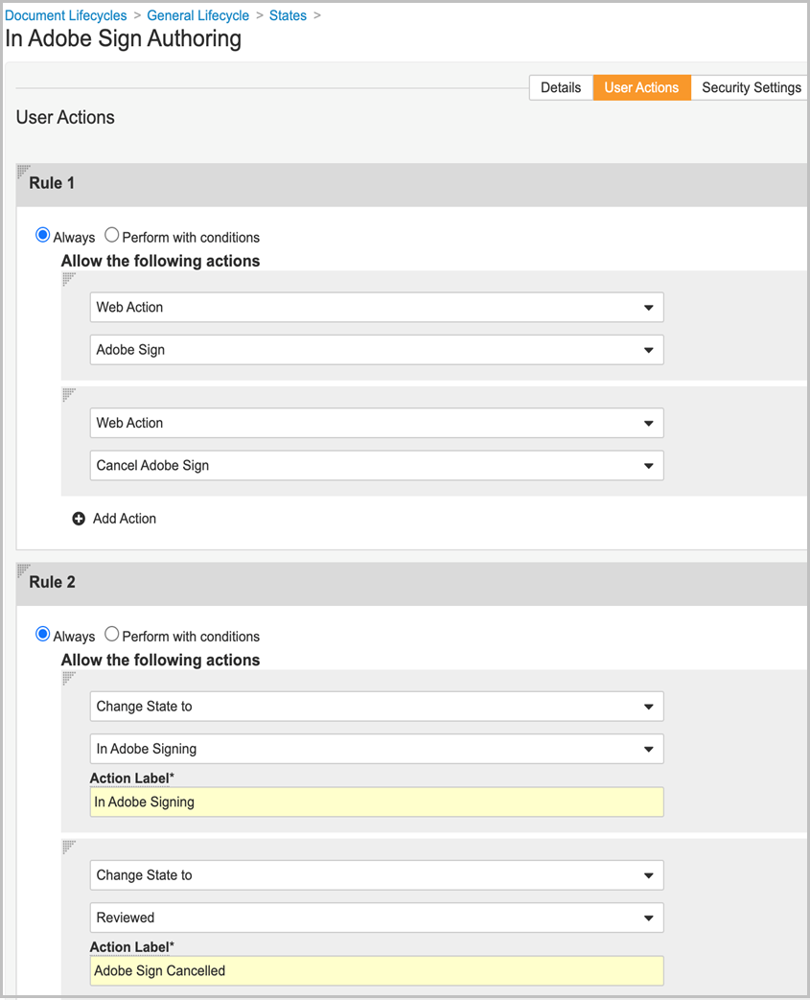

# [!DNL Veeva Vault] 安裝指南{#veeva-installation-guide}

[**連絡 Adobe Sign 支援人員**](https://adobe.com/go/adobesign-support-center_tw)

## 概覽 {#overview}

本檔說明如何與 [!DNL Veeva Vault] 平臺建立Adobe Sign整合。 [!DNL Veeva Vault] 是專為生命科學建立的企業內容管理 （ECM） 平臺。 「保存庫」是內容和資料存放庫，通常用於法規檔、研究報告、授予申請、一般合約等。 單一企業可以擁有多個必須單獨維護的「保存庫」。

完成整合的高階步驟包括：

* 在 Adobe Sign 中啟用您的管理帳戶 （僅限新客戶）。
* 建立物件以追蹤保存庫中合約生命週期的記錄。
* 建立新的「安全性」描述檔。
* 在Adobe Sign中設定一個群組，以保持 [!DNL Veeva Vault] 整合使用者。
* 建立檔欄位和轉譯。
* 設定網頁動作並更新檔生命週期。
* 建立檔案類型使用者和使用者角色設定。
* 使用中介軟體將 Veeva Vault 連接至Adobe Sign。

>[!NOTE]
>
>Adobe Sign管理員必須在Adobe Sign內執行Adobe Sign設定步驟。

## 配置 [!DNL Veeva Vault] {#configure-veeva}

若要設定 [!DNL Veeva Vault] 與 Adobe Sign 整合，您需要執行下列步驟。

### 步驟 1. 建立群組 {#create-group}

若要設定Adobe Sign，系統會建立一個名為 *「 [!DNL Vault] Adobe Sign管理員群組」的新群組* 。此群組是用來為Adobe Sign相關欄位設定檔欄位層級安全性，且預設應包含 *Adobe Sign整合描述檔* 」。

### 步驟 2. 部署套件 {#deploy-package}

[部署套件 ](https://helpx.adobe.com/content/dam/help/en/PKG-AdobeSign-Integration.zip) 並依照步驟進行。 部署後，套件會建立：

* 自訂物件：簽名物件、簽署物件、簽名事件物件、處理鎖物件
* 簽名物件頁面版面配置
* 簽名事件物件頁面版面配置
* 簽署物件頁面版面配置
* Process Locker 物件頁面版面配置
* Adobe Sign轉譯類型
* 原始轉譯類型
* 共用欄位signature__c、allow_adobe_sign_user_actions__c
* Adobe Sign網頁動作
* 取消Adobe Sign網頁動作
* Adobe Sign管理員動作許可權集
* Adobe Sign整合描述檔安全性設定檔
* 管理員角色Adobe Sign應用程式角色
* 檔案類型群組「Adobe Sign檔」

#### 簽名物件 {#signature-object}

建立簽名物件以儲存合約相關資訊。 簽名物件是包含下列特定欄位下資訊的資料庫：

**簽名物件欄位**

| 欄位 | 標籤 | 類型 | 描述 |
| --- | --- | ---| --- | 
| external_id__c | 合約 ID | 字串 （100） | 保持Adobe Sign唯一的合約 ID |
| file_hash__c | 檔案雜湊 | 字串 （50） | 按住已傳送給 Adobe Sign 的檔案的 md5 總和檢查碼 |
| name__v | 名稱 | 字串 （128） | 包含合約名稱 |
| sender__c | 寄件者 | 物件 （使用者） | 保留已建立合約之保存庫使用者的參照 |
| signature_status__c | 簽名狀態 | 字串 （75） | 以Adobe Sign方式保留合約狀態 |
| signature_type__c | 簽名類型 | 字串 （20） | Adobe Sign中包含合約的簽名類型 （WRITTEN 或 ESIGN） |
| start_date__c | 開始日期 | DateTime | 傳送合約以供簽署的日期 |
| cancellation_date__c | 取消日期 | Datetime | 保留合約已取消的日期。 |
| completion_date__c | 完成日期 | Datetime | 保留合約完成的日期。 |
| viewable_rendition_used__c | 已使用的可檢視轉譯 | 布林值 | 標注，指出已傳送可檢視的轉譯以供簽署。 （預設為正確） |

#### 簽署物件 {#signatory-object}

建立簽署物件以儲存合約中參與者的相關資訊。 其包含下列特定欄位下的資訊：

**簽署物件欄位**

| 欄位 | 標籤 | 類型 | 描述 |
| --- | --- | ---| --- | 
| email__c | 電子郵件 | 字串 （120） | 保持Adobe Sign唯一的合約 ID |
| external_id__c | 參與者 ID | 字串 （80） | 持有Adobe Sign唯一參與者的識別碼 |
| name__v | 名稱 | 字串 （128） | 包含Adobe Sign參與者的名稱 |
| order__c | 順序 | 數字 | 包含Adobe Sign合約參與者的訂單編號 |
| role__c | 角色 | 字串 （30） | Adobe Sign合約參與者的角色 |
| signature__c | 簽名 | 物件 （簽名） | 包含簽名父記錄的參考資訊 |
| signature_status__c | 簽名狀態 | 字串 （100） | 保留Adobe Sign合約參與者的狀態 |
| user__c | 使用者 | 物件 （使用者） | 如果參與者是保存庫使用者，則參照簽署者的使用者記錄 |

#### 簽名事件物件 {#signature-event}

「簽名事件」物件是建立的，用來儲存合約的事件相關資訊。 其包含下列特定欄位下的資訊：

| 欄位 | 標籤 | 類型 | 描述 |
| --- | --- | ---| --- | 
| acting_user_email__c | 有效使用者的電子郵件 | 字串 | Adobe Sign執行導致產生事件的動作的使用者電子郵件 |
| acting_user_name__c | 代理使用者名稱 | 字串 | 包含執行導致產生事件之動作的Adobe Sign使用者的名稱 |
| description__c | 描述 | 字串 | 保留Adobe Sign事件的說明 |
| event_date__c | 事件日期 | Datetime | 保留Adobe Sign事件的日期和時間 |
| event_type__c | 事件種類 | 字串 | 包含Adobe Sign事件種類 |
| name__v | 名稱 | 字串 | 自動產生的事件名稱 |
| participant_comment__c | 參與者注釋 | 字串 | 如果有的話，請保留Adobe Sign參與者的注釋 |
| participant_email__c | 參與者電子郵件 | 字串 | 拿著Adobe Sign參與者的電子郵件 |
| participant_role__c | 參與者角色 | 字串 | Adobe Sign參與者的角色 |
| signature__c | 簽名 | 物件 （簽名） | 包含簽名父記錄的參考資訊 |

#### 處理鎖物件 {#process-locker}

系統會建立 Process Locker 物件來鎖定 Adobe Sign 整合程式。 不需要任何自訂欄位。

做為部署套件一部分的「簽名」、「簽署者」、「簽名事件」和「處理鎖」物件預設已啟用「此物件的稽核資料變更」屬性。

**注意：** 您可以啟用稽核資料變更設定，在稽核記錄中進行保存庫擷取物件記錄資料變更。 此設定預設為關閉狀態。 啟用此設定並建立記錄後，您就無法再停用該設定。 如果此設定關閉且有記錄，則只有保存庫擁有者可以更新設定。

#### **顯示簽名物件的參與者和步驟記錄** {#display-participants-history}

做為部署套件一部分的簽名物件隨附「 [ 簽名詳細資訊頁面版面配置」 ](https://vvtechpartner-adobe-rim.veevavault.com/ui/#admin/content_setup/object_schema/pagelayout?t=signature__c&amp;d=signature_detail_page_layout__c) 。 「頁面版面配置」有「參與者」和「步驟記錄」區段。

* 「 *參與者* 」區段具有「相關物件」區段，設定後如下圖所示。

   

* 您可以編輯要針對參與者顯示的欄 （如下所示）。

   

* 「步驟 *記錄* 」區段具有「相關物件」區段，設定後如下圖所示。

   

* 您可以編輯「步驟記錄」要顯示的欄 （如下所示）。

   

#### **檢視參與者與Adobe Sign檔的稽核記錄** {#view-participants-audit-history}

* 若要檢視Adobe Sign檔的參與者和稽核記錄，請在檔的「Adobe簽名」區段中選取連結。

   

* 開啟的頁面會顯示Adobe Sign檔的「參與者」和「步驟記錄」，如下所示。

   

* 檢視簽名的稽核記錄，如下所示。

   

### 步驟 3. 設定安全性設定檔 {#security-profiles}

在步驟 2 中成功部署套件會建立Adobe Sign整合設定檔。 Adobe Sign整合設定檔會指派給系統帳戶，並會在呼叫保存 API 時由整合使用。 此描述檔允許下列許可權：

* 保存 API
* 閱讀、建立、編輯和刪除：簽名、簽署者、簽名事件和處理鎖物件

您必須將包含的安全性描述檔設定為Adobe Sign整合描述檔」，以更新Adobe Sign管理員群組 （在步驟 1 中建立），如下圖所示。

### 步驟 4. 建立使用者 {#create-user}

Adobe Sign整合的保存庫系統帳戶使用者必須：

* 擁有Adobe Sign整合描述檔
* 有安全性設定檔
* 具有停用密碼過期的特定安全性策略
* 成為 Adobe Sign 管理員群組的成員。

若要這麼做，請依照下列步驟操作：

1. 建立 Adobe Sign 整合的保存庫系統帳戶使用者。

   

2. 將使用者新增至「Adobe Sign管理員群組」。

   

### 步驟 5. 設定檔案類型群組 {#create-document-type-group}

部署 Adobe Sign 套件時，會建立名為「Adobe Sign檔」的檔案類型群組記錄。

您必須針對所有符合Adobe Sign程式資格的檔分類新增此檔案類型群組。 由於檔案類型群組屬性不會從類型繼承為子字元，也不會從子類型繼承到分類層級，因此必須針對符合Adobe Sign資格的每個檔的分類進行設定。

**注意：** 如果「使用者角色設定」物件未包含參照「檔案類型群組」物件的欄位，則必須新增欄位。 若要這麼做，請移至 **[!UICONTROL 「物件]** > **[!UICONTROL 使用者角色設定]** 」> **[!UICONTROL 欄位]** ，並完成必要的步驟，如下圖所示。

### 步驟 6. 建立使用者角色設定 {#create-user-role-setup}

一旦正確設定生命週期，系統應確保 DAC 為所有符合Adobe Sign程式資格的檔新增Adobe Sign管理員使用者。 建立適當的「使用者角色設定」記錄可指定：

* Adobe Sign檔案類型群組
* Adobe Sign管理員角色的應用程式角色
* 整合使用者

### 步驟 7. 設定檔欄位 {#create-fields}

套件部署會根據建立整合所需的兩個新共用文件欄位建立：

* 簽名 （signature__c）
* 允許Adobe Sign使用者動作 （allow_adobe_sign_user_actions__c）

若要設定檔欄位：

1. 前往「設定」索引標籤，然後選 **[!UICONTROL 取「共用欄位>**[!UICONTROL  檔 ]**欄位」]** 。
1. 在「顯示區段」欄位中，選取「 **[!UICONTROL 建立顯示區段]** 」，然後將「Adobe簽名 ]**」指派**[!UICONTROL  為「區段」標籤。

   

1. 對於兩個共用的檔欄位 （signature__c 和 allow_adobe_sign_user_actions__c），請更新「UI」區段，並以 **[!UICONTROL 「Adobe簽名]** 」作為區段標籤。
1. 將三個共用欄位新增至所有符合Adobe簽名資格的檔案類型。 若要這麼做，請在「基本檔」頁面中，選 **[!UICONTROL 取右上角的「新增]** > **[!UICONTROL 現有共用欄位]** 」。

   

   

   

1. 請注意，這兩個欄位都必須具有特定安全性，僅允許Adobe Sign管理員群組的成員更新其值。

   

停用保存覆蓋 （disable_vault_overlays__v） 是現有的共用欄位。 您也可以選擇使用特定安全性，僅允許Adobe Sign管理員群組的成員更新其值。

### 步驟 8. 宣告檔轉譯 {#declare-renditions}

保存庫整合使用名為 *「Adobe Sign轉譯」（adobe_sign_rendition__c）* 的新轉譯類型，將已簽署的 PDF 檔上傳至Adobe Sign。 您必須針對每個符合Adobe簽名資格的檔案類型宣告Adobe Sign轉譯。

「保存庫」整合使用名為 *「原始轉譯」（original_rendition__c）* 的新轉譯類型作為轉譯的名稱，如果已簽署的檔讀入為可檢視的轉譯，則該轉譯應該用來儲存原始可檢視的轉譯。

### 步驟 9. 更新網頁動作 {#web-actions}

Adobe Sign和保存庫整合要求您執行以下兩個網頁動作來建立和設定：

* **建立Adobe Sign** ：建立或顯示Adobe Sign合約。

   類型：檔
目標：在保存庫中顯示
認證：透過「貼文訊息」啟用會話後認證
URL： <https://api.na1.adobesign.com/api/gateway/veevavaultintsvc/partner/agreement?docId=${Document.id}&majVer=${Document.major_version_number__v}&minVer=${Document.minor_version_number__v}&vaultid=${Vault.id}&useWaitPage=true>

   

* **取消Adobe Sign：會在Adobe Sign** 中取消現有的合約，並將檔的狀態還原為初始合約。

   類型：檔
目標：在保存庫中顯示
認證：透過「貼文訊息」啟用會話後認證
URL：： <https://api.na1.adobesign.com/api/gateway/veevavaultintsvc/partner/agreement/cancel?docId=${Document.id}&majVer=${Document.major_version_number__v}&minVer=${Document.minor_version_number__v}&vaultid=${Vault.id}&useWaitPage=true>

   

### 步驟 10. 更新檔生命週期 {#document-lifecycle}

針對每個符合「Adobe簽名」的檔案類型，您必須新增生命週期角色和狀態，以更新對應的檔生命週期。

Adobe Sign合約生命週期具有下列狀態：

* 草案
* 編寫或DOCUMENTS_NOT_YET_PROCESSED
* OUT_FOR_SIGNATURE或OUT_FOR_APPROVAL
* 已簽署或核准
* 已取消
* 已過期

若要更新檔生命週期，請依照下列步驟操作：

1. 新增生命週期角色。 Adobe Sign管理員應用程式角色必須新增到符合Adobe簽名資格的檔所使用的所有生命週期中，如下所示。

   

   管理員角色的建立應有下列選項：

   * 已啟用「動態存取控制」。
   * 檔共用規則只包含「檔案類型群組」，如下圖所示。

   

2. 建立生命週期狀態。 若要這麼做，請前往 **[!UICONTROL 「設定]** >設定 ]**>**[!UICONTROL  檔生命週期」> **[!UICONTROL 「**[!UICONTROL  一般生命週期 ]**]** 」> **[!UICONTROL 狀態]** > **[!UICONTROL 建立」]** 。接下來，建立下列狀態：

   * 在「草稿Adobe Sign中

   

   * 在「Adobe Sign製作」中

   

   * 在「簽署Adobe中

   

3. 將「使用者動作」新增至下列狀態。

   將保存檔傳送給Adobe Sign時，其狀態應對應至合約的狀態。 若要這麼做，請在符合Adobe簽名資格的檔所使用的每一個生命週期中新增以下狀態：

   * **在Adobe簽署** 之前 （已審核）：這是可傳送檔至Adobe Sign狀態的預留位置名稱。 根據檔案類型，檔案類型可以是「草稿」狀態或「已審核」。 檔狀態標籤可根據客戶需求自訂。 在Adobe簽署狀態之前，必須先定義下列兩個使用者動作：

      * 將檔狀態變更為 *「在草稿* 中Adobe Sign狀態的動作。 對於任何生命週期的所有檔案類型，此使用者動作的名稱必須相同。 如有需要，此動作的標準可以設定為「允許Adobe Sign使用者動作等於「是」。
      * 稱為「網頁動作」的「Adobe Sign」動作。 這個狀態必須具備可讓Adobe Sign管理員角色：檢視檔、檢視內容、編輯欄位、編輯關係、下載來源、管理可檢視轉譯，以及變更狀態。

      

   * **在「草稿** Adobe Sign中：這是狀態的預留位置名稱，表示檔已上傳至Adobe Sign，且其合約處於「草稿」狀態。 這是必要的狀態。 此狀態必須定義下列五個使用者動作：

      * 將檔狀態變更為 *「在編寫Adobe Sign狀態的* 動作。 對於任何生命週期的所有檔案類型，此使用者動作的名稱必須相同。 如有需要，此動作的標準可以設定為「允許Adobe Sign使用者動作等於「是」。
      * 將檔狀態變更為 *「在簽署Adobe狀態的動作* 。 對於任何生命週期的所有檔案類型，此使用者動作的名稱必須相同。 如有需要，此動作的標準可以設定為「允許Adobe Sign使用者動作等於「是」。
      * 將檔狀態變更為 *「已取消* 」狀態Adobe Sign動作。 對於任何生命週期的所有檔案類型，此使用者動作的名稱必須相同。 如有需要，此動作的標準可以設定為「允許Adobe Sign使用者動作等於「是」。
      * 稱為「網頁動作」的動作「Adobe Sign」。
      * 稱為「取消Adobe Sign」的動作。 這個狀態必須具備可讓 Adobe Sign 管理員角色具備以下安全性：檢視檔、檢視內容、編輯欄位、編輯關係、下載來源、管理可檢視轉譯，以及變更狀態。

      

   * **在「Adobe Sign編寫** 」中：這是狀態的預留位置名稱，表示檔已上傳至Adobe Sign，且其合約處於 AUTHORING 或DOCUMENTS_NOT_YET_PROCESSED狀態。 這是必要的狀態。 此狀態必須已定義下列四個使用者動作：

      * 將檔狀態變更為「已取消」狀態Adobe Sign動作。 無論生命週期如何，此使用者動作的名稱對所有檔案類型都必須相同。 如有需要，此動作的標準可以設定為「允許Adobe Sign使用者動作等於「是」。
      * 將檔狀態變更為「在簽署Adobe狀態的動作。 無論生命週期如何，此使用者動作的名稱對所有檔案類型都必須相同。 如有需要，此動作的標準可以設定為「允許Adobe Sign使用者動作等於「是」。
      * 稱為「網頁動作」的動作「Adobe Sign」
      * 稱為「取消Adobe Sign」的動作。 這個狀態必須具備可讓 Adobe Sign 管理員角色具備以下安全性：檢視檔、檢視內容、編輯欄位、編輯關係、下載來源、管理可檢視轉譯，以及變更狀態。

      

   * **在Adobe簽署** 中：這是狀態的預留位置名稱，表示檔已上傳至Adobe Sign，且其合約已傳送給參與者 （OUT_FOR_SIGNATURE 或OUT_FOR_APPROVAL狀態）。 這是必要的狀態。 此狀態必須已定義下列五個使用者動作：

      * 將檔狀態變更為「已取消」狀態Adobe Sign動作。 無論客戶的需求是什麼，都可以實現此動作的目標狀態，但針對不同類型可能不同。 無論生命週期如何，此使用者動作的名稱對所有檔案類型都必須相同。 如有需要，此動作的標準可以設定為「允許Adobe Sign使用者動作等於「是」。
      * 將檔狀態變更為「已拒絕」狀態Adobe Sign動作。 無論客戶的需求是什麼，都可以實現此動作的目標狀態，但針對不同類型可能不同。 無論生命週期如何，此使用者動作的名稱對所有檔案類型都必須相同。 如有需要，此動作的標準可以設定為「允許Adobe Sign使用者動作等於「是」。
      * 將檔狀態變更為「已簽署Adobe狀態的動作。 無論客戶的需求是什麼，都可以實現此動作的目標狀態，但針對不同類型可能不同。 但是，無論生命週期如何，此使用者動作的名稱對於所有檔案類型都必須相同。 如有需要，此動作的標準可以設定為「允許Adobe Sign使用者動作等於「是」。
      * 稱為「網頁動作」的動作 *Adobe Sign* 。
      * 稱為「網頁動作取消」的動作 *Adobe Sign* 。 這個狀態必須具備可讓 Adobe Sign 管理員角色具備以下安全性：檢視檔、檢視內容、編輯欄位、編輯關係、下載來源、管理可檢視轉譯，以及變更狀態。

      

      * **Adobe已簽署 （已核准）** ：這是狀態的預留位置名稱，表示檔已上傳至Adobe Sign，且其合約已完成 （已簽署或已核准狀態）。 這是必要的狀態，並且可以是現有的生命週期狀態，例如核准。此狀態不需要使用者動作。 它必須具備可讓Adobe Sign管理員角色：檢視檔、檢視內容和編輯欄位的安全性。

   下圖說明Adobe Sign合約與保存檔狀態之間的對應，其中「簽署前Adobe」狀態為「草稿」。

   

### 步驟 11. 在生命週期階段群組中，將Adobe Sign舞臺新增至一般生命週期

### 步驟 12. 設定生命週期狀態下「使用者角色」的許可權

您必須在「生命週期狀態」中設定每個「使用者角色」的適當許可權，如下圖所示。

### 步驟 13. 根據檔狀態和使用者角色設定基本安全性

### 步驟 14. 為「取消」Adobe Sign建立檔訊息

## 使用中介軟體聯 [!DNL Veeva Vault] 機至Adobe Sign {#connect-middleware}

完成與Adobe Sign管理員帳戶的設定 [!DNL Veeva Vault] 後，管理員必須使用中間軟體在兩個帳戶之間建立連線。 和 [!DNL Veeva Vault] Adobe Sign 帳戶連線是由 Adobe Sign Identity 起始，然後用來儲存 [!DNL Veeva Vault] 身分。為了提高系統安全性和穩定性，管理員必須使用專用 [!DNL Veeva Vault] 的系統/服務/公用程式帳戶，例如 `adobe.for.veeva@xyz.com` ，而不是個人使用者帳戶，例如 `bob.smith@xyz.com` 。

Adobe Sign帳戶管理員必須依照下列步驟，使用中間軟體聯 [!DNL Veeva Vault] 機至Adobe Sign：

1. 前往 Adobe Sign [ forHome  [!DNL Veeva Vault]  頁面 ](https://static.adobesigncdn.com/veevavaultintsvc/index.html) 。
1. 從右上角選 **[!UICONTROL 取「登]** 入」。

   

1. 在開啟的「Adobe Sign」登入頁面中，提供帳戶管理員電子郵件和密碼，然後選取「 **[!UICONTROL 登入」]** 。

   

   成功登入後，頁面會顯示關聯的電子郵件 ID 和「設定」索引標籤，如下所示。

   

1. 選取「 **[!UICONTROL 設定」索引標籤]** 。

   「設定」頁面會顯示可用的連線，並且在進行第一個連線設定時顯示 *「沒有可用* 的連線」（如下所示）。

   

1. 選取 **[!UICONTROL 「新增連線]** 」以新增連線。

1. 在開啟的「新增連線」對話方塊中，提供必要的詳細資料， [!DNL Veeva Vault] 包括認證。

   Adobe Sign憑證會在初始Adobe Sign登入時自動填入。

   

1. 選取 **[!UICONTROL 「驗證]** 」以驗證帳戶詳細資料。

   成功驗證後，您會看到「使用者成功驗證」通知，如下所示。

   

1. 若要將使用限制為特定Adobe Sign群組，請展開 **[!UICONTROL 「群組]** 」下拉式清單，然後選取其中一個可用的群組。

   

1. 若要將稽核報告附加至已簽署的轉譯，請選取「將稽核報告附加至已簽署的轉譯」 ]**核取方塊**[!UICONTROL  。

   

1. 若要允許在Adobe Sign中自動布建使用者，請選取「自動布建 Sign 使用者」 ]**核取方塊**[!UICONTROL  。

   **注意：** 只有在Adobe Sign的Adobe Sign帳戶層級啟用了新Adobe Sign使用者的自動布建，以及啟用 **[!UICONTROL 「自動布建 Sign 使用者]** 」以進行 [!DNL Veeva Vault] Adobe Sign整合，Adobe Sign 帳戶管理員才能進行下列整合。

   

1. 若要將「Adobe Sign轉譯」設定為顯示在 Veeva 中而非「原始轉譯」，請選取「核取方塊 **[!UICONTROL 顯示Adobe Sign轉譯」]** 。

   

1. 選取 **[!UICONTROL 「儲存]** 」以儲存新的連線。

   新連線會顯示在「設定」索引標籤下方，顯示已成功Adobe Sign整合 [!DNL Veeva Vault] 。

   

