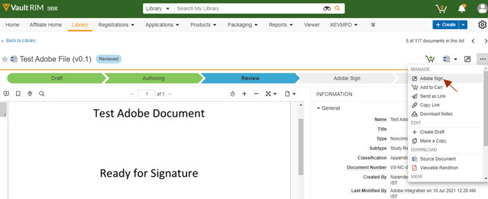

# [!DNL Veeva Vault]Adobe Sign： 使用手冊 {#veeva-vault-user-guide}

[**連絡 Adobe Sign 支援人員**](https://adobe.com/go/adobesign-support-center_tw)

本檔旨在協助 [!DNL Veeva Vault] 客戶瞭解如何使用Adobe Sign整合 [!DNL Veeva Vault] 來傳送合約。

## 概覽 {#overview}

Adobe Sign整合 [!DNL Veeva Vault] 有助於取得簽名或核准流程，以利任何需要合法簽名或可稽核檔處理的檔。

傳送檔以供簽署的整體程式類似于傳送電子郵件，因此大多數使用者都容易採用。

Adobe Sign與 [!DNL Veeva Vault] 簡化程式的整合，並加快您的檔和簽名工作流程。 使用整合工作流程，您可以：

* 節省在縮圖郵件、隔夜和傳真上花費的時間和資源。
* 傳送合約以索取電子簽名或核准， [!DNL Veeva Vault] 存取即時合約記錄，並檢視已儲存的合約。
* 即時追蹤整個組織的交易，並在合約被檢視、簽署、取消或拒絕時取得更新。
* eSign 提供超過 20 種語言版本，支援全球超過 50 個地區的傳真回覆服務.
* 建立可重複使用的合約範本以傳送選項。

## 使用Adobe Sign傳送合約 [!DNL Veeva Vault] {#send-sign-vault-agreement}

若要使用 Adobe Sign 來傳送 Veeva 的合約：

1. 前往登 [[!DNL Veeva Vault]  入頁面 ](https://login.veevavault.com/) ，並輸入您的使用者名稱和密碼。 它會開啟您的保存庫首頁，如下所示。

   

1. 選取 **[!UICONTROL 「資料庫」]** 索引標籤，然後從右上角選取「 **[!UICONTROL 建立]** 」。

   

1. 選取 **[!UICONTROL 「上傳並繼續」]** 。

1. 從本機磁片磁碟機上傳任何檔。

1. 在顯示的對話方塊中，選 **[!UICONTROL 取「類型]** 為 *[!UICONTROL 臨床」]* ，然後視需要選取 **[!UICONTROL 子類型]** 和 **[!UICONTROL 分類]** 。

   

1. 選取 **[!UICONTROL 「確定]** 」以關閉對話方塊。

1. 選取「 **[!UICONTROL 下一步」]** 。

1. 在顯示的視窗中，填寫中繼資料區段中的所有必要欄位，然後選取「儲存 **[!UICONTROL 」]** 。

   

1. 它會以「草稿 ]**」狀態建立測試檔案**[!UICONTROL  ，如下所示。

   

1. 從右上角選取  下拉式選單，然後選取「 **[!UICONTROL 開始審核」]** 。

   

1. 選取「 **[!UICONTROL 審核者」]** 和 **[!UICONTROL 「審核到期日」]** 。

1. 選取「 **[!UICONTROL 開始」]** 。 檔「狀態」變更為「 [!UICONTROL  審核中」 ] 。

   

1. 代表審核者完成指派的工作。 完成後，會將檔「狀態」變更為 [!UICONTROL  「已審核」 ] 。

   

1. 選取  下拉式選單，然後選 **[!UICONTROL 取「Adobe Sign]** 」。

   

1. 在「保存庫」中開啟的 iFrame 視窗中，輸入收件者的電子郵件地址，然後選 **[!UICONTROL 取「下一步」]** 。

   

   **注意：** 如果傳送者的電子郵件沒有Adobe Sign使用者帳戶，iFrame 視窗會顯示一則訊息，如下所示。 也會傳送包含啟用帳戶指示的電子郵件給使用者。

   

   

   但是，如果 *「自動布建 Sign 使用者* 」功能已停用，Adobe Sign使用者建立失敗，而且 iFrame 視窗會顯示訊息，要求使用者連絡其Adobe Sign帳戶管理員。 Adobe Sign帳戶管理員可以採取下列其中一個動作：

   * 啟用帳戶的 *「自動布建 Sign 使用者* 」功能。
   * 在使用 Veeva 保存庫Adobe Sign整合之前，先在Adobe Sign中建立使用者。

   

1. 檔處理完成後，從右側面板拖放「簽名」欄位，然後選 **[!UICONTROL 取「傳送」]** 。

   

1. 檔會傳送給收件者以供簽署。 收件者收到檔電子郵件後，檔狀態會從 [!UICONTROL  「審核 ] 中」變更為 [!UICONTROL  「在Adobe簽署」 ] 。

   

1. 在Adobe Sign擷取並完成所有簽名後，保存庫中的檔「狀態」會變更為 [!UICONTROL  「已核准」 ] 。

1. 選取 **[!UICONTROL 「檔檔案」]** 選項，然後展開「 **[!UICONTROL 保存庫」中的「轉譯」]** 區段。 一旦檔處於核准狀態，就會自動建立名為「Adobe Sign轉譯」的新轉譯。

   

1. 下載Adobe Sign轉譯」，以驗證再次傳送簽名。

   

## 使用Adobe Sign取消合約 [!DNL Veeva Vault] {#cancel-sign-vault-agreement}

1. 前往登 [[!DNL Veeva Vault]  入頁面 ](https://login.veevavault.com/) ，並輸入您的使用者名稱和密碼。 它會開啟您的保存庫首頁，如下所示。

   

1. 選取「 **[!UICONTROL 資料庫」]** 索引標籤，然後選取檔。 檔狀態可以是： [!UICONTROL  在「草稿 ] Adobe Sign中、 [!UICONTROL  在「Adobe Sign撰 ] 寫」或 [!UICONTROL  「在Adobe中簽署」 ] 。

   

1. 選取 **[!UICONTROL 「取消Adobe Sign」]** 。

   

1. 它會觸發 Web 動作並在保存庫 ] 中 [!UICONTROL  載入 iFrame 視窗。

   

1. 檔狀態會自動變更為「 [!UICONTROL  審核」 ] 。

   

檔狀態變更為「審核」後，您可以再次傳送檔以索取簽名。
