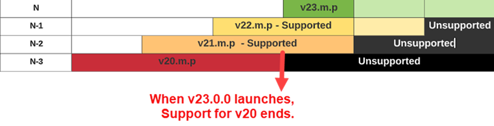

# 產品版本與生命週期 {#version}

Adobe Sign整合服務的Adobe Sign版本設定慣例和支援生命週期，與您可能熟悉的其他Adobe產品相同。

## 版本號碼

套件版本使用由三個部分組成的編號系統來識別發行版本的連續組建編號，以及新增或變更內容方面升級的相對匯入。

版本編號遵循以下模式：N.m.p

其中，N = 主要版本;m = 次要版本;p = 修補版本。

例如，整合套件 23.2.1 版代表下列版本狀態：

* 主要版本：23
* 次要版本：2
* 修補版本：1

當工程師開發出套件的新「組建」時，根據程式碼更新的性質來增加版本編號。

* 主要版本變更涉及大幅增加功能，或是核心系統的重要變更。
* 次要版本更新包括較小的功能更新和安全性修補程式。 若有安全性更新或解決回報的專案，Adobe Sign可能需要升級為最新修補版本。
* 修補程式版本幾乎別無例外地都是錯誤修正和 UI 調整

>[!NOTE]
>
>當產品在開發中反覆運算時，所有版本不會公開。 因此，發行版本之間的修補程式版本可能會大幅提升。

管理員必須將版本保持在最新狀態，以確保帳戶擁有所有功能的完整存取權，且所有已知的安全性問題都修補完畢。 出於安全關注或是解決重大系統問題，Adobe Sign可能需要升級為最新修補版本。

## 版本支援生命週期

Adobe Sign整合產品的版本支援週期是根據套件的主要版本來定義，並指出Adobe Sign主動支援個別整合版本的時間段。

Adobe Sign支援套件的最新版本和前兩個主要版本 （包含所有相關的次要和修補程式更新）。 主要版本的表示方法如下：

* 最新版本 (N)：套件的最新主要版本
* 上一個版本 (N-1)：最新版本的上一個主要版本
* 最後支援版本 (N-2)：最新版本的上兩個主要版本

例如，如果套件的最新可用版本是 23.2.1，那麼：

* 最新主要版本 (N) 為 23
* 此套件的上一個主要版本 (N-1) 為 22
* 此套件的最後支援主要版本 (N-2) 為 21
* 21.0.0 以前的所有版本均不受支援

## 版本服務生命週期

版本服務週期會在服務可使用時，定義整個範圍。時間表與版本支援週期相符，並增加了 90 天的寬限期，可讓客戶能完成升級。

* 在不支援版本的寬限期間，只提供升級至新版本的支援，而非維護不支援的版本
* 寬限期過後，版本就會失用

* Adobe Sign 將不接受不提供服務的版本要求
* 一旦整合升級至目前版本，Adobe Sign 和整合之間的通訊將會恢復正常

如有任何疑問，請連絡您的經銷商與客戶支援。
