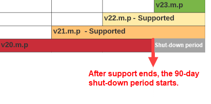

# Product versions and lifecycle {#version}

The Adobe Sign versioning convention and support lifecycle for integrated services aligns with other Adobe products that you may be familiar with.

## Version numbers

套件版本使用由三個部分組成的編號系統來識別發行版本的連續組建編號，以及新增或變更內容方面升級的相對匯入。

The version number follows this pattern: N.m.p

Where, N = Major version; m = Minor version; p = Patched version.

For example, an integration package version 23.2.1 indicates a release status of:

* Major version: 23
* Minor version: 2
* Patch version: 1

As engineers develop new “builds” of the package, they increment the version number according to the nature of the updates to the code.

* Major version changes involve a significant addition in features or an important change to the core systems.
* Minor version updates include smaller feature updates and security patches. Adobe Sign may require an upgrade to the latest patched version in case of security updates or to address a reported item.
* 修補程式版本幾乎別無例外地都是錯誤修正和 UI 調整

>[!NOTE]
>
>All versions are not released to the public as the product iterates in development. So, there might be significant jumps in the patch version between releases.

The admins must keep their version up-to-date to ensure that the account has full access to all the features and all known security issues are patched. Adobe Sign may require an upgrade to the latest patched version in the case of a security concern or to address a critical system issue.

## Version support lifecycle

The version support lifecycle of an Adobe Sign integration product is defined based on the major version of the package, and indicates the time frame that Adobe Sign is actively supporting the individual version of the integration.

Adobe Sign supports the current version of a package, and the previous two major versions (inclusive with all related minor and patch updates). 主要版本的表示方法如下：

* 最新版本 (N)：套件的最新主要版本
* 上一個版本 (N-1)：最新版本的上一個主要版本
* 最後支援版本 (N-2)：最新版本的上兩個主要版本

For example, if the current available version of the package is 23.2.1, then:

* 最新主要版本 (N) 為 23
* 此套件的上一個主要版本 (N-1) 為 22
* 此套件的最後支援主要版本 (N-2) 為 21
* 21.0.0 以前的所有版本均不受支援

## Version service lifecycle

版本服務週期會在服務可使用時，定義整個範圍。時間表與版本支援週期相符，並增加了 90 天的寬限期，可讓客戶能完成升級。

* 在不支援版本的寬限期間，只提供升級至新版本的支援，而非維護不支援的版本
* After the grace period, the version falls out of service

* Adobe Sign 將不接受不提供服務的版本要求
* 一旦整合升級至目前版本，Adobe Sign 和整合之間的通訊將會恢復正常

如有任何疑問，請連絡您的經銷商與客戶支援。
