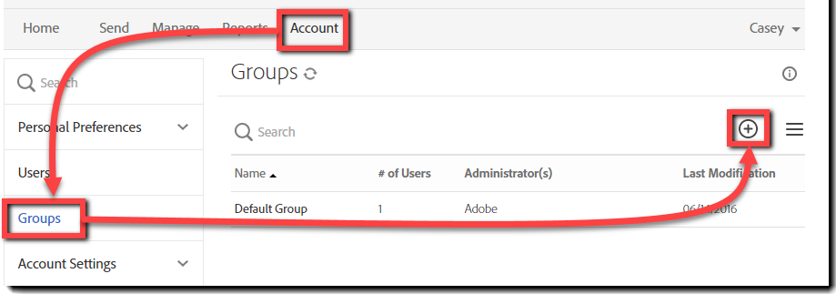

# [!DNL Workday] 安裝指南{#workday-installation-guide}

[**連絡 Adobe Sign 支援人員**](https://adobe.com/go/adobesign-support-center_tw)

## 概覽 {#overview}

本檔說明如何將Adobe Sign整合至 [!DNL Workday] 租使用者。 若要在應用程式內使用 [!DNL Workday] Adobe Sign，您需要瞭解如何建立和修改專案， [!DNL Workday] 例如：

* 業務流程框架
* 租使用者設定和設定
* 報告和 [!DNL Workday] 工作室整合

完成整合的高階步驟包括：

* 在 Adobe Sign 中啟用您的管理帳戶 （僅限新客戶）
* 在Adobe Sign中設定群組以保持 [!DNL Workday] 整合使用者
* 建立 OAuth 關係 [!DNL Workday] 與Adobe Sign

## 啟用您的Adobe Sign帳戶 {#activating-your-adobe-sign-account}

已建立帳戶的現有客戶可以跳至「 [ 設定  [!DNL Workday]](#config) Adobe Sign」主題。

對於第一次Adobe Sign且沒有現有的登入帳戶的客戶，Adobe入門專家會為您的帳戶 （Adobe Sign） 提供下列資訊 [!DNL Workday] 。 完成後，您會收到確認電子郵件，如下所示。

您必須遵循電子郵件中的指示來初始化您的帳戶，並存取您的Adobe Sign  首頁。

## 設定 Adobe Sign [!DNL Workday] {#config}

若要設定 [!DNL Workday] Adobe Sign，您必須在 Adobe Sign 系統中產生以下兩個專用物件：

* **[!DNL Workday]群組** ： [!DNL Workday] 需要Adobe Sign帳戶內的專用「群組」才能啟用整合功能。Adobe Sign群組僅用來控制 [!DNL Workday] Adobe Sign的使用方式。 任何其他可能的使用方式，例如 Salesforce.com 或 Arriba 則不會受到影響。 群組會隱藏電子郵件通知 [!DNL Workday] ，好讓 [!DNL Workday] 使用者只會在其 [!DNL Workday] 收件匣內收到通知。

* **驗證使用者以持有整合密** 鑰：群 [!DNL Workday] 組僅需有一位群組層級管理員，身為整合金鑰的許可權持有人。 我們建議管理員使用功能性的電子郵件地址（例如個人 `HR@MyDomain.com` 電子郵件），以減少日後停用該使用者並因此停用整合的風險。

### 在 Adobe Sign 中建立使用者和群組 {#create-a-user-and-group-in-adobe-sign}

若要在 Adobe Sign 建立用戶：

1. 以帳戶管理員身分登入 Adobe Sign.
1. 流覽至 **[!UICONTROL 「帳戶]** > **[!UICONTROL 使用者]** 」。
1. 按一下  以建立新使用者。

   

1. 在開啟的對話方塊中，提供新的使用者詳細資料：

   * 提供功能性的電子郵件，供您存取。
   * 請適當輸入姓名.
   * **[!UICONTROL 從「使用者群組」中選取「為此使用者建立新的]** 群組」。
   * 為 **[!UICONTROL 新組名]** 提供直覺式名稱，例如 *[!DNL Workday]* 。

   

1. 按一下&#x200B;**[!UICONTROL 「儲存」]**。

   它會帶您返回「 [!UICONTROL  使用者」 ] 頁面，其中會列出具有 **[!UICONTROL 已建立狀態的新使用者]** 。

   

若要驗證具有「已建立」狀態的使用者的電子郵件地址：

1. 登入新使用者的電子郵件。
2. 找到名為「歡迎使用 Adobe Sign」的電子郵件.
3. 按一下它說明的位置 **[!UICONTROL 按一下這裡以設定您的密碼]** 。
4. 設定密碼.

確認電子郵件地址後，使用者的狀態會從「 [!UICONTROL  已建立」變更 ] 為「 [!UICONTROL  作用中 ] 」。

### 定義驗證使用者 {#define-the-authenticating-user}

若要提升群組中的新使用者 [!DNL Workday] ：

1. 導覽至[!UICONTROL 「用戶」]頁面 (若您目前不在該頁面).
2. 按兩下 [!DNL Workday] 群組中的使用者。

   這會開 [!UICONTROL  啟 ] 使用者許可權的「編輯」頁面。

3. 檢查 **[!UICONTROL 「群組管理員]** 」。
4. 按一下&#x200B;**[!UICONTROL 「儲存」]**。

## 設定 [!DNL Workday] 租使用者 {#configure-workday}

若 [!DNL Workday] 要完成租使用者和Adobe Sign之間的連線，我們需要在兩個服務之間建立信任關係。 完成後，我們可以新增「審核檔」步驟，透過Adobe Sign啟用簽名程式。

>[!NOTE]
>
>Adobe Sign是整個環境中Adobe Document Cloud。 [!DNL Workday]

建立信任關係的方式：

1. 以 [!DNL Workday] 帳戶管理員的身分登入。
1. 開啟 **[!UICONTROL 「編輯租使用者設定 - 業務流程]** 」頁面。
1. 找到[!UICONTROL 「電子簽名設定」]區段：

   

1. 按一下 **[!UICONTROL 「使用 Adobe 驗證]** 」。

   這會啟動 OAuth2.0 驗證順序。

1. 當系統詢問時，請提供您先前建立的「Adobe Sign群組」管理員的認證。
1. 核准存取Adobe Sign。

>[!NOTE]
>
>請先確認您已完全登出任何其他Adobe Sign例項，再繼續進行。

連線後，會設定啟用 Adobe 設定的核取方塊，您就可以開始使用 [!DNL Workday] Adobe Sign。

### 設定「審核檔」步驟 {#configure-review}

「審核檔」步驟的檔可以是下列任一項：

* 靜態檔
* 在同一個業務流程中由「產生檔」步驟產生的檔
* 使用報告建立的格式化報告 [!DNL Workday] Designer

您可以新增具有 [ Adobe 文字標籤的任何檔 ](https://adobe.com/go/adobesign_text_tag_guide_tw) ，以控制「簽署特定元件」Adobe的外觀和位置。 文件來源必須在業務流程定義中指定。您無法在執行業務流程時上傳隨選文件。

唯一能透過「審核檔」步驟使用Adobe Sign，是能夠將簽署者群組序列化。 此優勢可讓您指定以角色為基礎的群組，依序完成簽署作業。Adobe Sign不支援平行簽署群組。

如需設定「審核檔」步驟的協助，請參閱 [ 快速入門手冊 ](https://adobe.com//go/adobesign_workday_quick_start) {target=&quot;_blank&quot;}。

## 支援 {#support}

### [!DNL Workday] 支援 {#workday-support}

[!DNL Workday] 是整合所有者，如有關於整合範圍、功能請求，或是日常整合功能的問題，請優先連絡 Workday。

您可以參閱下列 [!DNL Workday] 社群文章，瞭解如何疑難排解整合及產生檔：

* [電子簽名整合疑難排解](https://doc.workday.com/#/reader/3DMnG~27o049IYFWETFtTQ/zhA~hYllD3Hv1wu0CvHH_g)
* [審核檔步驟](https://doc.workday.com/#/reader/3DMnG~27o049IYFWETFtTQ/TboWWKQemecNipWgxLAjqg)
* [動態檔產生](https://community.workday.com/saml/login?destination=/articles/176443)
* [提供檔產生秘訣](https://community.workday.com/node/183242)

### Adobe Sign支援 {#adobe-sign-support}

Adobe Sign 是整合合作夥伴，同時也是當整合無法取得簽名，或待簽名通知失敗時應該連絡的對象。

Adobe Sign 客戶應連絡其 Customer Success Manager (CSM) 以取得支援。或是以電話連絡 Adobe Technical Support：輸入 1-866-318-4100，等候電話語音提供產品清單，然後依序輸入 4 和 2 (依提示操作)。

* [將Adobe文字標籤新增至檔](https://adobe.com/go/adobesign_text_tag_guide)
* [檢閱檔設定和範例](https://www.adobe.com/go/adobesign_workday_quick_start)

## 常見問題 {#faq}

### 為何即使 [!DNL Workday] 檔已完整簽署，狀態也不會在內部更新？ {#why-is-the-status-not-being-updated-within-workday-even-the-document-is-fully-signed}

[!DNL Workday]如果應聘者在登入後未按一下「送出」按鈕，檔狀態可能無法  反映Adobe Sign。

根據 [!DNL Workday] 工作檢查電子簽名簽署狀態：若要開始此程式，使用者可提交相關聯的收件匣工作。

根據 [!DNL Workday] 開發：只有當使用者在簽署檔後提交收件匣工作時，原始簽署才會完成程式。 簽署後，iframe 會關閉，並將使用者重新導向至相同的工作，使用者可以按一下「 [!UICONTROL  送出」 ] 按鈕來完成程式。
