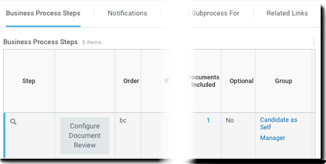
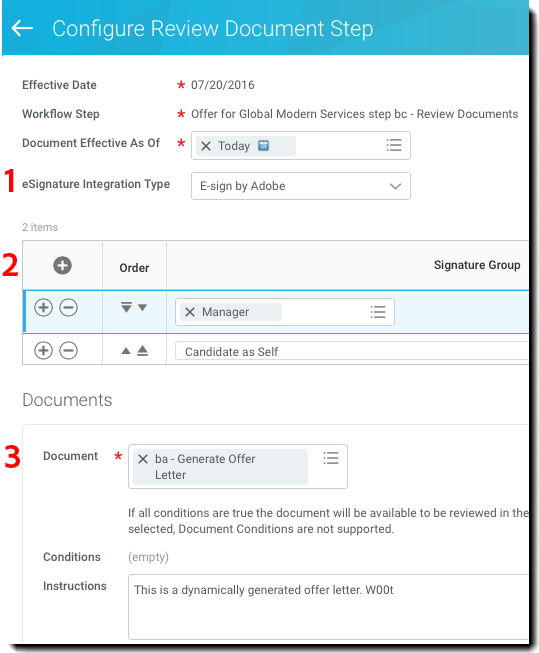
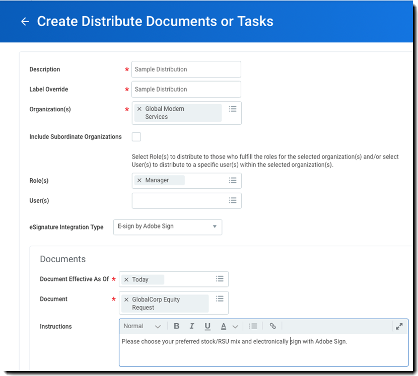

# [!DNL Workday] 快速入門指南{#workday-quick-start-guide}

[**連絡 Adobe Sign 支援人員**](https://www.adobe.com/go/adobesign-support-center)

## 概覽 {#overview}

本檔旨在協助 [!DNL Workday] 管理員瞭解如何自訂 [!DNL Workday] 業務流程，以納入Adobe Sign以取得電子簽名。 若要在其中使用 [!DNL Workday] Adobe Sign，您必須知道如何建立和修改專案， [!DNL Workday] 例如：

* [!UICONTROL 業務流程框架]
* 租使用者設定和設定
* 報告與 [!DNL Workday] Studio 整合

## 在 中存取 Adobe Sign[!DNL Workday] {#access-adobe-sign}

[!UICONTROL Adobe Sign電子簽名功能 ] 會顯示為  [!UICONTROL  「業務流程架構」（BPF） 中的「審核檔步驟」動作， ] 並顯示為「分送檔工作」。

## [!UICONTROL 「審核文件」步驟] {#review-document-step}

Adobe Sign會 [!DNL Workday] 透過「 [!UICONTROL  審核檔」步驟公開 ] ，您可以在其中新增到 400 多個業務流程中的任何一個 [!DNL Workday] ，包括 [!UICONTROL  優惠 ] 、 [!UICONTROL  分發檔和工作 ] 、退約 [!UICONTROL  補償 ] 等。

您可參閱「 [[!DNL Workday]  審核檔步驟」上的社群文章  ](https://doc.workday.com/#/reader/3DMnG~27o049IYFWETFtTQ/TboWWKQemecNipWgxLAjqg) 。

「審核檔步驟」與含 Adobe Sign [!UICONTROL  的 ] 可計費交易之間有一對一關聯性。 您可以在單一「 [!UICONTROL  審核檔」步驟中合併多份檔 ] ，這些檔會顯示為單一套件以供簽署。

**注意** ：只能在 *特定「* 審核檔」步驟中參考單一「動態 [!UICONTROL  檔 ] 」。

若要定義功能性 [!UICONTROL  「審核檔」步驟 ] ：

1. 插入 [!UICONTROL  「審核檔」步驟 ] 。
1. 指定可依「審核檔」步驟操作的群組 （角色  ）。

若要設定「 [!UICONTROL  審核檔」步驟 ] ：

1. 請依 *[!UICONTROL Adobe將電子簽名整合類型指定]* 為 ** eSign。

1. 在簽名方格新增列.

   * 簽名方格會指定文件傳遞過程中的簽名順序：每列可以包含一個或多個角色，而每列也代表簽署流程中的每個步驟。
   * 在特定步驟中，會通知角色的每個成員該簽署事件呈現擱置狀態.
   * 只要角色的某一成員進行簽署，即完成該列步驟，文件會接著進行下一列步驟.
   * 所有列都已簽署後，「 [!UICONTROL  審核檔」步驟即 ] 完成。

1. 指定要簽署的文件。如果檔是 [!UICONTROL  Offer ] BP，您可以透過「產生檔」步驟加以使用。 否則，請選擇現有的文件或報告。

1. 對所有需要簽署的文件重複執行步驟 3。

   

1. 您也可以選擇新增「重新導向使用者」，以擷取「拒絕簽署」動作。 當使用者拒絕時，請 [!DNL Workday] 將檔重新傳送至已設定的安全群組以供審核。

從「審核檔步驟」的相關動作選單  中，選取「 **[!UICONTROL 業務流程]** **[!UICONTROL 」>「維持重新導向]** 」。 接著，選取下列其中一項：

* **[!UICONTROL 返回]** ：讓安全群組成員退回業務流程的上一步。 業務流程會從該步驟重新開始。
* **[!UICONTROL 移至下]** 一步：讓安全群組成員可以前進到業務流程的下一步。
* **[!UICONTROL 安全群組]** ：以重新導向業務流程中的步驟。 「重新導向」區段的業務流程安全性原則中選取此提示顯示的安全群組。

## 業務流程步驟說明 {#business-process-step-notes}

[!UICONTROL 業務流程框架 ] 功能強大，但您必須確保：

* 每個業務流程都必須有一個完成步驟，最好是在業務流程結束時完成。

* 搜尋圖示的相關動作選單會設定完成步驟。 只有在「檢視」BP（而非「編輯」BP） 時才可以這樣做。

* 業務流程的每一步驟是按順序執行.

   您可以變更順序值以改變步驟順序. 例如，若要在專案「c」和「d」之間插入步驟，請將新專案指定為「ca」。

### 範例：優惠 {#example-offer}

Offer BP 是 Job Application Dynamic BP 的副程式  ，必須設定為執行 Offer BP。 當工作應用程式狀態移至「 [!UICONTROL  優惠 ] 」或「優惠」時，將會觸發  此設定。

以下範例中，「 [!UICONTROL  審核檔」步驟 ] 是使用北美和日本的「動態檔」步驟。

![[!DNL Workday] 業務流程範例](images/bp-for-offersmaller-575.png)

此業務流程依以下步驟進行：

* 要求 BP 的召集者要求要求對應聘者進行補償 （步驟 b）。
* 使用步驟條件測試目前的國家/地區是否不是日本。

   若為 true，則會執行使用英文檔的步驟 「ba」。

   若為 false，則會執行使用日文檔的步驟「bb」。

* 在「審核 [!UICONTROL  檔」步驟 ] 「bc」中定義簽名程式。
* 定義在必要完成步驟「d」中提供優惠的決策點。

在「ba」步驟所產生的動態文件稱為[!UICONTROL 「工作邀請函」]，其中包含名為[!UICONTROL 「快速工作邀請」]的單一文字塊。您可以視需要新增多個文字區塊，例如頁首、標注、補償、Stock、結案、條款等。

![[!DNL Workday] 檢視檔頁面](images/offer-letter-575.png)

以下動態聘書是在 [!DNL Workday] RTF 文字編輯器中建立的。 以灰色標示 *的專案* 是 [!DNL Workday] 參考上下文資料的物件。

在 {{括弧}} 中的項目為 [Adobe 文字標籤](https://adobe.com/go/adobesign_text_tag_guide_tw)。

在「 [!UICONTROL  審核檔」步驟中 ] ，系統會參考上一個步驟中的動態檔，並透過兩個簽署群組定義連續的簽名程式。

以下說明的行為會先將動態產生的檔傳送給雇用管理員，然後路由至應徵者。

![[!DNL Workday] 定義的簽署群組](images/configure-rd-stepsmaller-575.png)

### 範例：分發檔 {#example-distribute-documents}

在 [!DNL Workday] 30 天內推出「大量分送檔或工作」工作，可用來將單一檔傳送給大量群組 （&lt;20K) of individual signers. 每份文件限一個簽名。從搜尋列存取「 [!UICONTROL  建立分送檔或工作 ] 」動作，以建立分送。

範例：傳送員工股票選擇表格給使用 Global Modern Services 的所有經理  。 您可以視需要進一步篩選給個別經理。

您也可以存取「 **檢視分送檔或工作** 」報告，追蹤分送進度。

### 範例：報告 {#example-reporting}

[!DNL Workday] 具備強大的報告基礎架構。若要瞭解 Adobe Sign 的流程細節，請檢查&#x200B;*「審核文件事件」*&#x200B;中的元素。

下列是可以套用所有業務流程、用來檢視 Adobe Sign 的交易及其狀態的簡易自訂報告。

![[!DNL Workday] 自訂報告範例](images/review-document-eventsmaller-575.png)

以下報告是透過檢視實作 Tenant 中的「工作邀請」、「上線」以及「薪資提案」業務流程而產生。

您可以從中檢視：

* 分送進行簽名的文件
* 相關業務流程步驟
* 下一位簽名者

![[!DNL Workday]使用此三個物件的 報告範例](images/workday-reportsmaller-575.png)

## 已簽署的檔 {#signed-documents}

簽署 [!DNL Workday] 週期會透過Adobe Sign來隱藏所有電子郵件通知。 使用者會在其 [!DNL Workday] 收件匣中得知待處理的動作。

一旦所有「簽名群組」簽署檔，已簽署檔的副本便會透過電子郵件分發給「簽名群組」的所有成員。

若要抑制此行為，您可以聯絡 [!UICONTROL  您的Adobe Sign Success Manager ] 或 [ Adobe Sign 支援小組 ](https://adobe.com/go/adobesign-support-center) 。

在內部 [!DNL Workday] ，您可以在完整程式記錄中存取已簽署的檔。 您可能會發現：

* 在「員工基本資料」上處理員工檔，以及
* 應聘者個人資料上的應聘者檔 （錄用信函）。

下圖顯示求職者 Chris Foxx 的已簽署錄用通知。

![範例 [!DNL Workday] 錄取通知](images/offer.png)

## 支援 {#support}

### [!DNL Workday] 支援 {#workday-support}

[!DNL Workday] 是整合所有者，如有關於整合範圍、功能請求，或是日常整合功能的問題，請優先連絡 Workday。

社 [!DNL Workday] 群提供數篇好文章，說明如何疑難排解整合及產生檔：

* [電子簽名整合的疑難排解](https://doc.workday.com/#/reader/3DMnG~27o049IYFWETFtTQ/zhA~hYllD3Hv1wu0CvHH_g)
* [檢閱文件步驟](https://doc.workday.com/#/reader/3DMnG~27o049IYFWETFtTQ/TboWWKQemecNipWgxLAjqg)
* [動態文件產生](https://community.workday.com/node/176443)
* [提供文件產生配置秘訣](https://community.workday.com/node/183242)

### Adobe Sign支援 {#adobe-sign-support}

Adobe Sign 是整合合作夥伴，同時也是當整合無法取得簽名，或待簽名通知失敗時應該連絡的對象。

Adobe Sign客戶應聯絡其客戶成功經理尋求支援。 或者，  您也可以透過電話連絡Adobe技術支援：1-866-318-4100，等候產品清單，然後輸入：4 和 2 （依提示操作）。

* [新增 Adobe Text 標籤至文件](https://www.adobe.com/go/adobesign_text_tag_guide)

<!--
[Download PDF](images/adobe-sign-for-workday-quick-start-guide-2016.pdf)
-->
