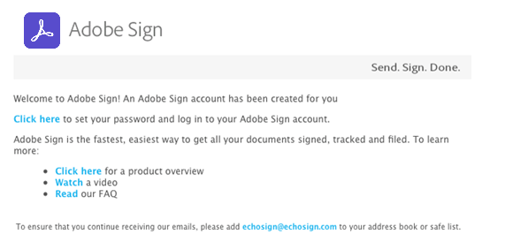
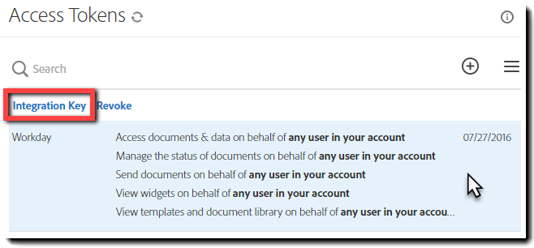

# [!DNL Workday] 安裝試用版{#workday-trial-installation}

## 概覽 {#overview}

本檔旨在協助 [!DNL Workday] 客戶瞭解如何使用 Adobe Sign 啟用試用帳戶，然後將其整合至 [!DNL Workday] 租使用者。 若要在應用程式內使用 [!DNL Workday] Adobe Sign，您需要瞭解如何建立和修改專案， [!DNL Workday] 例如：

* 業務流程框架
* 租使用者設定和設定
* 報告與 [!DNL Workday] Studio 整合

**注意** ：如果您有現有的 Adobe Sign 帳戶，則無需開始試用。 您可以聯絡客戶成功經理以請求 [!DNL Workday] 整合。

以下是完整整合的高階步驟：

* 啟用 Adobe Sign 試用版帳戶
* 在 Adobe Sign 中產生整合金鑰
* 將整合金鑰安裝至 [!DNL Workday] 租使用者

## 啟用您的Adobe Sign試用帳戶 {#activate-sign-trial-account}

若要申請 30 天的Adobe Sign試用版，您必須填寫此 [ 註冊表單 ](https://land.echosign.com/esign-trial-workday-registration.html) 。

**注意** ：我們強烈建議您使用有效功能的電子郵件地址來建立試用版，而不是臨時電子郵件。 您必須存取此電子郵件才能驗證帳戶，因此位址必須有效。

在一個工作天內，Adobe Sign入門專家會將您的帳戶 （Adobe Sign 中） 規定為 [!DNL Workday] 。 完成後，您會收到確認電子郵件，如下所示。

請依照電子郵件中的指示初始化您的帳戶，並存取您的Adobe Sign  首頁。

## 產生整合金鑰 {#generate-an-integration-key}

若要進行新安裝，您需要在 Adobe Sign 產生整合金鑰，然後將其輸入 [!DNL Workday] 。 此金鑰會驗證Adobe Sign與 [!DNL Workday] 環境，以便彼此信任及共用內容。

若要在 Adobe Sign 中產生整合金鑰：

1. 以管理員身分登入 Adobe Sign.
1. 導覽至 **[!UICONTROL **帳戶]** > **[!UICONTROL 個人偏好]** 設定> **[!UICONTROL 存取權杖**]** 。
1. 在視窗右側按一下&#x200B;**圓圈中有加號的圖示.**

   會開啟「 [!UICONTROL  建立整合金鑰」 ] 介面。

   

1. 為您的金鑰提供直覺式名稱，例如 [!DNL Workday] 。

   您必須為整合金鑰啟用下列元素：

   * agreement_read
   * agreement_write
   * agreement_send
   * widget_read
   * library_read

   

1. 按一下&#x200B;**[!UICONTROL 「儲存」]**。

   畫面會顯示[!UICONTROL 「存取記號」]頁面，並出現您透過帳戶設計的金鑰。

1. 按一下為 [!DNL Workday] 。

   定義最上方會顯示[!UICONTROL 整合金鑰]連結.

1. 按一下&#x200B;**[!UICONTROL 「整合金鑰」]**&#x200B;連結.

   這會顯示整合金鑰。

   

1. 複製此金鑰，並將其存放在安全的位置，以繼續進行下一步.
1. 按一下「**[!UICONTROL 確定]**」。

   

## 設定 [!DNL Workday] 租使用者 {#configuring-the-workday-tenant}

### 安裝整合金鑰 {#install-the-integration-key}

將整合金鑰安裝到 [!DNL Workday] 租使用者後，便會與Adobe Sign建立信任關係。 建立關係後，任何業務流程都可以 [!UICONTROL  新增「審核檔」步驟 ] 來啟用簽名程式。

**注意**[!DNL Workday]：Adobe Sign 在 環境中稱為「Adobe Document Cloud」。

若要安裝整合金鑰：

1. 以 [!DNL Workday] 帳戶管理員的身分登入。
1. Search取並開啟 **[!UICONTROL 「編輯租使用者設定 - 業務流程]** 」頁面。

1. 提供下列四個欄位的資訊：

   * **[!UICONTROL Adobe Document Cloud承認]** ：整合的修正文字辨識。

   * **[!UICONTROL Adobe Document Cloud API金鑰]** ：安裝整合金鑰的位置

   * **[!UICONTROL Adobe Document Cloud寄件者]** 電子郵件地址：Adobe Sign中群組層級管理員的電子郵件地址

   * **[!UICONTROL 「檔已取消」時移除需要電子簽名的檔]** ：如果檔已取消，可選擇性設定將檔從簽署週期中移除 [!DNL Workday] 。

   

1. 接下來，完成安裝：

   1. 在[!UICONTROL 「Adobe Sign API 整合金鑰」]欄位中貼上您的整合金鑰.
   1. 將 Adobe Sign 管理員的電子郵件地址輸入[!UICONTROL 「Adobe Document Cloud 寄件者電子郵件地址」]欄位.
   1. 按一下「**[!UICONTROL 確定]**」。

   

Adobe Sign功能現在可以新增到任何業務流程中，方法是新增「 [!UICONTROL  審核檔」步驟 ] ，並將其設為透過 **[!UICONTROL Adobe]** 作為電子簽名類型來使用 eSign。

### 設定「審核檔」步驟 {#configure-the-review-document-step}

「審核檔」步驟的檔可以是靜態檔;在同一個業務流程中由「產生檔」步驟產生的檔;或是以報告建立的格式化報告 [!DNL Workday] Designer。 這所有的案例都能透過[「Adobe 文字標籤」](https://adobe.com/go/adobesign_text_tag_guide_tw)增強，以控制 Adobe Sign 特定元件的外觀和位置。文件來源必須在業務流程定義中指定。無法在業務程式執行時上傳暫存檔案。

唯一能透過「審核檔」步驟使用Adobe Sign，是能夠將簽署者群組序列化。 簽署者群組可讓您指定依序登入的角色型群組。 Adobe Sign不支援平行簽署群組。

如需設定「審核檔」步驟的協助，請參閱 [ 快速入門手冊 ](https://adobe.com//go/adobesign_workday_quick_start) {target=&quot;_blank}」。

## 支援 {#support}

### [!DNL Workday] 支援 {#workday-support}

[!DNL Workday] 是整合所有者，如有關於整合範圍、功能請求，或是日常整合功能的問題，請優先連絡 Workday。

社 [!DNL Workday] 群提供數篇好文章，說明如何疑難排解整合及產生檔：

* [電子簽名整合的疑難排解](https://doc.workday.com/#/reader/3DMnG~27o049IYFWETFtTQ/zhA~hYllD3Hv1wu0CvHH_g)
* [檢閱文件步驟](https://doc.workday.com/#/reader/3DMnG~27o049IYFWETFtTQ/TboWWKQemecNipWgxLAjqg)
* [動態文件產生](https://community.workday.com/node/176443)

* [提供文件產生配置秘訣](https://community.workday.com/node/183242)

### Adobe Sign支援 {#adobe-sign-support}

Adobe Sign 是整合合作夥伴，同時也是當整合無法取得簽名，或待簽名通知失敗時應該連絡的對象。

Adobe Sign 客戶應連絡其 Customer Success Manager (CSM) 以取得支援。或者，可以透過電話連絡Adobe技術支援：1-866-318-4100;等待產品清單，然後輸入：4 和 2 （依提示操作）。

* [新增 Adobe Text 標籤至文件](https://adobe.com/go/adobesign_text_tag_guide)

* [檢閱文件設定和範例](https://www.adobe.com//go/adobesign_workday_quick_start)

[**連絡 Adobe Sign 支援人員**](https://adobe.com/go/adobesign-support-center_tw)
